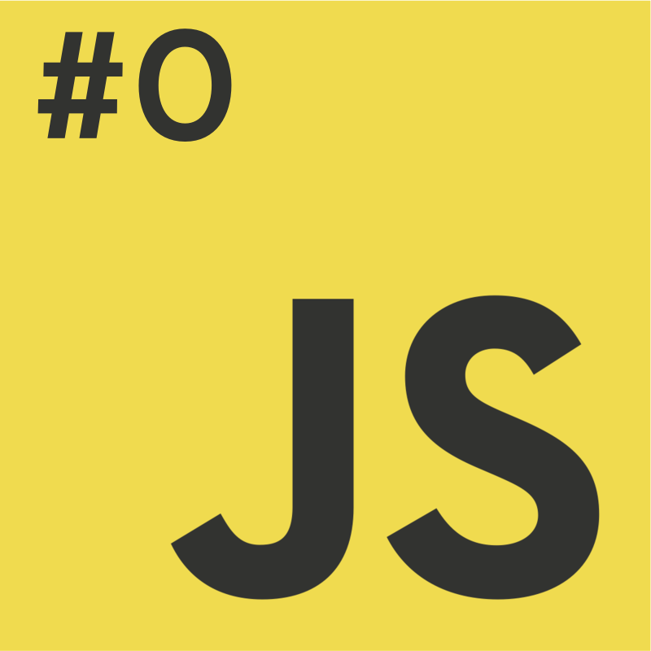
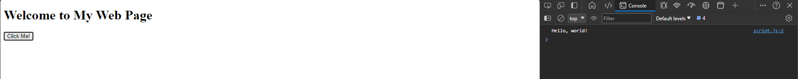
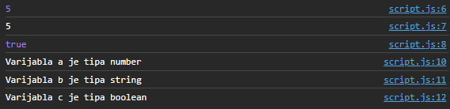

# Programiranje u skriptnim jezicima
**Nositelj**: doc. dr. sc. Nikola Tanković  
**Asistenti**:
- Luka Blašković, univ. bacc. inf.
- Alesandro Žužić, univ. bacc. inf.

**Ustanova**: Sveučilište Jurja Dobrile u Puli, Fakultet informatike u Puli

</img>

# [1] Naslov skripte
[comment]: <> (Ažurirati sliku - logojs/js0.png)
</img>
<p style="float: clear">Uvod od nekoliko rečenica ovdje </p>


## Sadržaj

<!-- TOC start (generated with https://github.com/derlin/bitdowntoc) -->

- [Programiranje u skriptnim jezicima](#programiranje-u-skriptnim-jezicima)
- [\[1\] Naslov skripte](#1-naslov-skripte)
  - [Sadržaj](#sadržaj)
  - [1.1 Uvod](#11-uvod)
  - [1.2 Primjer slike](#12-primjer-slike)
  - [1.2 Primjer koda](#12-primjer-koda)
    - [2.2.1 Primjer grananja naslova](#221-primjer-grananja-naslova)
      - [Naslov 4](#naslov-4)
      - [Naslov 4](#naslov-4-1)
      - [Naslov 4](#naslov-4-2)
  - [3. Primjer spoilera](#3-primjer-spoilera)
  - [Vježba 1](#vježba-1)
    - [Tekst zadatka, npr.](#tekst-zadatka-npr)
    - [Screenshot rezultata, npr.](#screenshot-rezultata-npr)
  - [Vježba 2](#vježba-2)
  - [3. Samostalni zadatak za vježbu (po koracima, s kombinacijama koda i teksta, npr.)](#3-samostalni-zadatak-za-vježbu-po-koracima-s-kombinacijama-koda-i-teksta-npr)

<br>

## 1.1 Uvod

## 1.2 Primjer slike



## 1.2 Primjer koda

```javascript
// script.js
function showMessage() {
  console.log("Hello JavaScript!");
}
```


### 2.2.1 Primjer grananja naslova

#### Naslov 4
#### Naslov 4
#### Naslov 4
## 3. Primjer spoilera
- kad se exporta u PDF ne radi, vec samo prikaze sadrzaj


<details>
  <summary>Primjer spoilera!</summary>
  <p>U prvom primjeru, JavaScript tretira 16 i 4 kao brojeve, dok ne dođe do "Volvo", rezultat će biti "20Volvo".  </p>
  <p>U drugom primjeru, budući da je prvi operand string, JavaScript će sve operande tretirati kao stringove, rezultat će biti "Volvo164".</p>
  
  ```javascript
  let x = 16 + 4 + "Volvo";
  console.log(x); // 20Volvo

let x = "Volvo" + 16 + 4;
console.log(x); // Volvo164
```
</details>

## Vježba 1

### Tekst zadatka, npr.
Idemo napraviti kratku vježbu onoga što smo dosad prošli. U `script.js` datoteci deklarirajte varijable `a`, `b` i `c` i dodijelite im vrijednosti `5`, `"5"` i true. Ispišite vrijednosti varijabli u konzolu i provjerite njihove tipove. Kod dodajte unutar funkcije `showMessage()`.  
Nakon toga, `typeof` operatorom provjerite tipove varijabli i u konzolu ispišite tvrdnju za svaku varijablu, npr. "Varijabla a je tipa number". Izraze u `console.log()` možete spojiti pomoću `+` operatora.  

Zašto `console.log(a == b)` vraća `true`? Objasnite.

### Screenshot rezultata, npr.
Rezultat:  


## Vježba 2
...

## 3. Samostalni zadatak za vježbu (po koracima, s kombinacijama koda i teksta, npr.)
1. Deklarirajte tri konstante i jednu promjenjivu varijablu. Konstante neka budu vaše `ime` i `prezime` i `godina_rodenja`. Promjenjivu varijablu nazovite `trenutno_vrijeme`.
2. U varijable `ime` i `prezime` pohranite svoje ime i prezime, a u varijablu `godina_rodenja` pohranite godinu rođenja kao cjelobrojnu vrijednost. U varijablu `trenutno_vrijeme` pohranite trenutno vrijeme koristeći `new Date()` objekt.
3. Napravite novu varijablu `godine` i u nju izračunajte koliko imate godina koristeći funkciju [`getFullYear()`](https://developer.mozilla.org/en-US/docs/Web/JavaScript/Reference/Global_Objects/Date/getFullYear) nad varijablom `trenutno_vrijeme` i varijablu `godina_rodenja`. Radi pojednostavljivanja, pretpostavljamo da je vaš rođendan već prošao ove godine.
4. Koristeći [`template literals`](https://developer.mozilla.org/en-US/docs/Web/JavaScript/Reference/Template_literals), u konzolu ispišite "Bok moje ime je __ __ i imam __ godina.".
5. Deklarirajte dvije nove konstante `ime_duljina` i `prezime_duljina` u koje ćete pohraniti broj slova u vašem imenu i prezimenu koristeći funkciju [`length`](https://developer.mozilla.org/en-US/docs/Web/JavaScript/Reference/Global_Objects/String/length) nad varijablama `ime` i `prezime`.
6. Ispišite u konzolu "Moje ime i prezime imaju __ i __ slova." koristeći `template literals`.
7. Ispišite u konzolu "It is __ that my name and surname are of the same length" koristeći `template literals` i operator `"je identično"`.
8. Pohranite u novu varijablu `x` kvadrat zbroja varijabli `ime_duljina` i `prezime_duljina`. Rezultat zbrojite s vašom godinom rođenja inkrementiranom za 1 koristeći operator `++` ispred varijable (uočite grešku, zašto nastaje, i napravite izmjenu!) te sve skupa podijelite s 2 . **Napomena**, sve navedeno definirajte u obliku <span style="color:red">jednog izraza u jednoj liniji koda</span>.
9. Upišite u novu varijablu `xsc` vrijednost varijable `x` u znanstvenom zapisu (napisati ručno!).
10. Provjerite i ispište u konzolu rezultat jednakosti varijabli `x` i `xsc`. 
