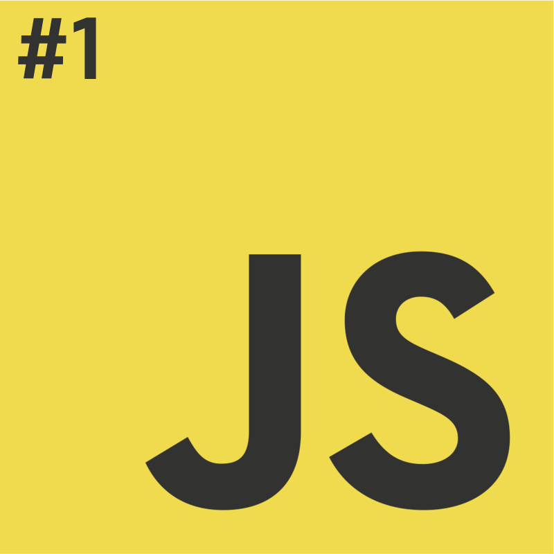
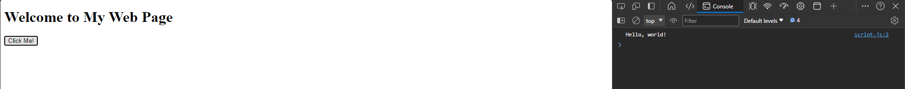
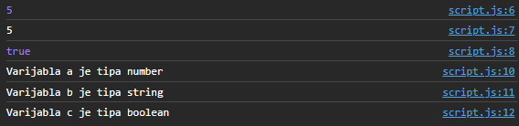
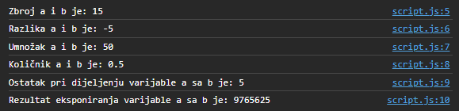
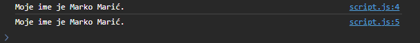
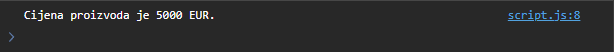

# Programiranje u skriptnim jezicima
**Nositelj**: doc. dr. sc. Nikola Tanković  
**Asistenti**:
- Luka Blašković, univ. bacc. inf.
- Alesandro Žužić, univ. bacc. inf.

**Ustanova**: Sveučilište Jurja Dobrile u Puli, Fakultet informatike u Puli

</img>

# [1] JavaScript osnove
</img>  
<p style="float: clear">JavaScript je programski jezik često korišten u web programiranju. Inicijalno je bio namijenjen kako bi učinio web stranice interaktivnijima. Međutim, danas se koristi i za izradu server-side aplikacija, desktop aplikacija, mobilnih aplikacija itd. </p>


## Sadržaj
- [Programiranje u skriptnim jezicima](#programiranje-u-skriptnim-jezicima)
- [\[1\] JavaScript osnove](#1-javascript-osnove)
  - [Sadržaj](#sadržaj)
  - [1.1 Uvod](#11-uvod)
  - [1.2 Gdje pisati JavaScript kod?](#12-gdje-pisati-javascript-kod)
  - [1.3 Gdje je taj "Hello World"?](#13-gdje-je-taj-hello-world)
  - [2. Varijable, tipovi podataka i operatori](#2-varijable-tipovi-podataka-i-operatori)
  - [2.1 Tipovi podataka](#21-tipovi-podataka)
  - [2.2 Operatori](#22-operatori)
    - [2.2.1 Konstante i blokovski opseg (engl. block scope)](#221-konstante-i-blokovski-opseg-engl-block-scope)
      - [Konstante se ne mogu ponovno deklarirati](#konstante-se-ne-mogu-ponovno-deklarirati)
      - [Konstante se moraju inicijalizirati prilikom deklaracije](#konstante-se-moraju-inicijalizirati-prilikom-deklaracije)
      - [Konstante imaju blokovski opseg](#konstante-imaju-blokovski-opseg)
    - [2.2.2 Typeof operator](#222-typeof-operator)
  - [Vježba 1](#vježba-1)
  - [Vježba 2](#vježba-2)
  - [2.3 Koncept varijable u JavaScriptu](#23-koncept-varijable-u-javascriptu)
    - [2.3.1 JavaScript Strings](#231-javascript-strings)
    - [2.3.2 Eksponencijalna (znanstvena) notacija](#232-eksponencijalna-znanstvena-notacija)
  - [Vježba 3](#vježba-3)
  - [Vježba 4](#vježba-4)
  - [3. Samostalni zadatak za vježbu](#3-samostalni-zadatak-za-vježbu)

<br>

## 1.1 Uvod

1. **Web stranice**: Zamislimo da je web stranica ljudsko tijelo.

   - **HTML** (Hypertext Markup Language) je kostur koji daje strukturu i podršku tijelu.
   - **CSS** (Cascading Style Sheets) je koža koja izgled tijelu.
   - **JavaScript** je skupina mišića i tetiva koji omogućuju kretanje tijela.

2. **Interaktivnost**: S JavaScriptom možemo izrađivati interaktivne komponente web stranice, poput:

   - formi koje reagiraju kada ih ispunjavamo,
   - izbornika koji se "spušta" kada kliknemo na njega ili
   - animacije koja se pokreće kada joj se približimo mišem.

3. **Running everywhere!**: Danas se JavaScript izvodi u raznim okruženjima, ne samo u web pregledniku! Može se izvoditi na:

   - serveru tj. poslužitelju
   - desktop aplikacijama
   - mobilnim uređajima

4. **Easy to learn, Hard to Master**: JavaScript je jedan od jednostavnijih jezika za naučiti. Ima jednostavnu sintaksu i rezultate izvođenja koda mođemo vidjeti gotovo odmah u web pregledniku.

5. **Bogat community**: JavaScript je jedan od najpopularnijih programskih jezika na svijetu. Ima veliku zajednicu developera, odlično je dokumentiran, ima puno biblioteka i razvojnih okruženja koja nam olakšavaju izradu aplikacija.

## 1.2 Gdje pisati JavaScript kod?

Pisanje JavaScripta na u web pregledniku (strana klijenta - engl. client side) možemo podijeliti na 3 načina:

1. **Inline JavaScript** - kod se piše direktno unutar HTML elementa, npr. u atributu `onclick`:

```html
<button onclick="console.log('Hello World!')">Hello World</button>
```

2. **Internal JavaScript** - kod se piše unutar HTML dokumenta, ali u odvojenom `<script>` elementu:

```html
<script>
  console.log("Hello World!");
</script>
```

3. **External JavaScript** - kod se piše u odvojenom JavaScript dokumentu, npr. `script.js`:

```html
<!--index.html-->
<!DOCTYPE html>
<html>
  <head>
    <title>My Web Page</title>
    <script src="script.js"></script>
  </head>
  <body>
    <h1>Welcome to My Web Page</h1>

    <button onclick="showMessage()">Click Me!</button>
  </body>
</html>
```

- Prednost ovog načina je što možemo koristiti isti kod na više stranica, a i sam HTML dokument je čišći i pregledniji.
- Na isti način kao u kodu iznad, `script.js` datoteku možemo uključiti i u druge HTML dokumente.

```javascript
// script.js
function showMessage() {
  console.log("Hello World!");
}
```

## 1.3 Gdje je taj "Hello World"?

Kada otvorimo HTML dokument u web pregledniku, možemo otvoriti konzolu (F12) i vidjeti poruku "Hello World!", tako jednostavno!



Idemo sada izmjeniti tekst koji nam ispisuje funkcija `showMessage()`. U `script.js` datoteci promijenimo tekst u `Hello JavaScript!`:

```javascript
// script.js
function showMessage() {
  console.log("Hello JavaScript!");
}
```

Možemo primjetiti da se ponovnim klikom na gumb tekst u konzoli nije promijenio. To je zato što je kod iz `script.js` datoteke izvršen samo jednom, prilikom učitavanja stranice. Da bi se promjena vidjela, moramo osvježiti stranicu (F5).

Naporno je svaki put osvježavati stranicu da bi vidjeli naše promjene. Iz tog razloga ćemo preuzeti [Live Server](https://marketplace.visualstudio.com/items?itemName=ritwickdey.LiveServer) ekstenziju za Visual Studio Code. Ona će nam omogućiti da otvorimo HTML dokument u web pregledniku i da se svaka promjena u kodu automatski osvježi u web pregledniku. Nakon što instaliramo ekstenziju, kliknemo desnim klikom na HTML dokument i odaberemo `Open with Live Server`.


## 2. Varijable, tipovi podataka i operatori

Varijable su mjesta u memoriji u koje spremamo podatke. Svaka varijabla ima svoje ime i vrijednost. Vrijednost varijable može se mijenjati tijekom izvođenja programa.
Varijable možemo deklarirati na 3 načina: `var`, `let` i `const`. Varijable deklarirane sa ključnim riječima `var` i `let` su varijable koje se mogu mijenjati, dok je `const` konstanta koja se ne može mijenjati.
U pravilu koristimo `const` za deklariranje varijabli, osim ako znamo da će se vrijednost varijable mijenjati, tada koristimo `let`. `var` u pravilu izbjegavamo, budući da ga je `let` zamijenio u ES6 standardu JavaScripta.

```javascript
let x = 5;
console.log(x); // 5

x = 10;
console.log(x); // 10

const y = 15;
console.log(y); // 15

y = 20; // TypeError: Assignment to constant variable.
console.log(y);
```

## 2.1 Tipovi podataka

JavaScript je slabo tipizirani jezik (engl. weakly typed), što znači da razlikuje različite tipove varijable, no ne moramo ih strogo navoditi prilikom deklaracije varijable. Tip podatka varijable određuje se automatski prilikom dodjele vrijednosti varijabli.
Za provjeru tipa podatka varijable koristimo `typeof` operator.

```javascript
let a = 5; // number
let b = "5"; // string
let c = true; // boolean

console.log(typeof a); // number
console.log(typeof b); // string
console.log(typeof c); // boolean
```

## 2.2 Operatori

Operatori su simboli koji se koriste za izvođenje operacija nad podacima. Ovisno o funkcionalnostima, operatori se mogu podijeliti u sljedeće kategorije:

- **Aritmetički operatori** - koriste se za izvođenje aritmetičkih operacija nad brojevima (npr. zbrajanje `+`, oduzimanje `-`, množenje `*`, dijeljenje `/`, ostatak pri dijeljenju `%`, increment `++`, decrement `-`, eksponiranje `**`)
- **Operatori pridruživanja** - koriste se za pridruživanje vrijednosti varijabli (npr. assignment `=`, Addition assignment `+=`, Subtraction assignment `-=`, Multiplication assignment `*=`, Division assignment `/=`, Remainder assignment `%=`, Exponentiation assignment `**==`)
- **Operatori usporedbe** - koriste se za usporedbu vrijednosti (npr. equal `==`, not equal `!=`, strict equal `===`, strict not equal `!==`, greater than `>`, greater than or equal `>=`, less than `<`, less than or equal `<=`)
- **Logički operatori** - koriste se za izvođenje logičkih operacija (npr. logical AND `&&`, logical OR `||`, logical NOT `!`)
- **Operatori tipa** - koriste se za provjeru tipa podatka (npr. `typeof` - vraća string tipa podatka, `instanceof` - vraća boolean ovisno o tome je li objekt danog tipa)

```javascript
const a = 5;
const b = 10;

console.log(a + b); // 15

// Vrijede ista pravila o prioritetu izvođenja operacija kao i u matematici 

console.log(a + b * 2); // 25
console.log((a + b) * 2); // 30

let c = 5;
c += 10;
console.log(c); // 15

console.log(a == b); // false
console.log(a != b); // true

const ocjena = "5";
console.log(ocjena == 5); // true
console.log(ocjena === 5); // false (Zašto? Googlaj JavaScript type coercion)
ocjena = 4; // TypeError: Assignment to constant variable.

let x = 100 + 50;
console.log(x); // 150

// Ili možemo koristiti varijable
x = a + b;

// Pa i izraze
x = (100 + 50) * a;
console.log(x); // 750

// Increment
x++;
console.log(x); // 751

// Decrement
x--;
console.log(x); // 750

// Remainder
x = 5 % 2;
console.log(x); // 1

// Exponentiation
x = 5 ** 2;
console.log(x); // 25

// Logical AND
console.log(true && true); // true

// Logical OR
console.log(true || false); // true

// Logical NOT
console.log(!true); // false
```

### 2.2.1 Konstante i blokovski opseg (engl. block scope)

Varijable definirane sa `const`:

- ne mogu se ponovno deklarirati (engl. **redeclare**)
- ne mogu se ponovno dodijeliti (engl. **reassign**)
- moraju se inicijalizirati prilikom deklaracije (engl **initialize**)
- imaju blokovski opseg (engl **block scope**)

#### Konstante se ne mogu ponovno deklarirati

```javascript
const PI = 3.141592653589793;
PI = 3.14; // Baca grešku!
PI = PI + 10; // Baca grešku!
```

#### Konstante se moraju inicijalizirati prilikom deklaracije

```javascript
const PI = 3.141592653589793; // Točno!

const PI; // Netočno!
```

#### Konstante imaju blokovski opseg

Deklariranje varijable sa `const` unutar bloka koda, stvara lokalnu varijablu koja se može koristiti samo unutar bloka koda, slično kao i varijable deklarirane sa `let`.

```javascript
const x = 10;
//Ovdje je x = 10
{
  const x = 2;
  //Ovdje je x = 2
}
//Ovdje je x = 10
```

Redeklariranje varijable sa `var` **dozvoljeno je** bilo gdje u programu, čak i izvan bloka koda:

```javascript
var x = 2;
console.log(x); //2
var x = 3;
console.log(x); //3

x = 4;
console.log(4); //4

{
  var x = 5;
  console.log(x); //5
}
```

Redeclare postojeće `let` ili `var` varijable u `const` nije dozvoljeno unutar bloka koda, ali je **dozvoljeno izvan** bloka koda:

```javascript
var x = 2; // Dozvoljeno
const x = 2; // Nije dozvoljeno

{
  let x = 2; // Dozvoljeno
  const x = 2; // Nije dozvoljeno
}

{
  const x = 2; // Dozvoljeno
  const x = 2; // Nije dozvoljeno
}
```

Ali... redeclare varijable sa `const` u drugom bloku koda **je dozvoljeno**:

```javascript
const x = 2; // Dozvoljeno
{
  const x = 2; // Dozvoljeno
}
{
  const x = 2; // Dozvoljeno
}
```

### 2.2.2 Typeof operator

**Primitivni tipovi** podataka u JavaScriptu predstavljaju vrijednosti koje se spremaju u memoriju bez dodatnih metoda i svojstava. Primitivni tipovi su:

- `string`
- `number`
- `boolean`
- `undefined`

`typeof` operator može vratiti jedan od tih primitivnih tipova.

```javascript
// typeof
console.log(typeof 5); // number
console.log(typeof "5"); // string
console.log(typeof true); // boolean
console.log(typeof undefined); // undefined
console.log(typeof null); // object
```

Zašto je typeof null objekt? U JavaScriptu, `null` doslovno predstavlja "ništa". Nažalost, typeof funkcija će vratiti da je tip podatka `null` objekt. Radi se o bugu koji je prisutan od samih početaka ovog jezika.

Kojeg će tipa biti sljedeća varijabla?

```javascript
const secret_number;
```
<details>
  <summary>Spoiler Warning!</summary>

Odgovor je `undefined`. `undefined` je tip podatka koji se koristi kada varijabla nije inicijalizirana, dok je `null` je tip podatka koji se koristi kada varijabla nema vrijednost.
</details>

## Vježba 1

Idemo napraviti kratku vježbu onoga što smo dosad prošli. U `script.js` datoteci deklarirajte varijable `a`, `b` i `c` i dodijelite im vrijednosti `5`, `"5"` i true. Ispišite vrijednosti varijabli u konzolu i provjerite njihove tipove. Kod dodajte unutar funkcije `showMessage()`.  
Nakon toga, `typeof` operatorom provjerite tipove varijabli i u konzolu ispišite tvrdnju za svaku varijablu, npr. "Varijabla a je tipa number". Izraze u `console.log()` možete spojiti pomoću `+` operatora.  

Zašto `console.log(a == b)` vraća `true`? Objasnite.

Rezultat:  


## Vježba 2

Idemo sada napraviti jednostavan kalkulator. U `script.js` datoteci deklarirajte varijable `a` i `b` i dodijelite im vrijednosti `5` i `10`. Izračunajte zbroj, razliku, umnožak i količnik varijabli `a` i `b` i ispišite ih u konzolu.
Dodatno, ispišite u konzolu ostatak pri dijeljenju varijabli `a` i `b` i rezultat eksponiranja varijable `a` na potenciju varijable `b`.

Rezultat:  


## 2.3 Koncept varijable u JavaScriptu

Varijable u JavaScriptu mogu sadržavati bilo koju vrijednost, neovisno o tipu podatka. To znači da varijabla može sadržavati broj, string, boolean, objekt, funkciju, itd.  
Ista varijabla može sadržavati i više različitih tipova podataka!
Važno je razumijeti što se dešava "ispod haube" kada deklariramo varijablu i dodijelimo joj vrijednost.
Bez tipova podataka, računalo neće znati interpretirati (na siguran način) sljedeće:

```javascript
let x = 16 + "Volvo";
```

Ima li smisla? Hoće li ovo biti broj ili string? Ili ćemo dobiti grešku?
Kada JavaScript vidi da se koristi operator `+` na broju i stringu, on će automatski pretvoriti broj u string i spojiti ih. Ovo se zove **implicitna konverzija**.

```javascript
let x = "16" + "Volvo";
```

Uzmimo za primjer sljedeći izraz?

```javascript
let x = 16 + 4 + "Volvo";
```

Koji će biti rezultat? `"164Volvo"` ili `"20Volvo"`?

A ovdje?

```javascript
let x = "Volvo" + 16 + 4;
```

<details>
  <summary>Spoiler Warning!</summary>
  <p>U prvom primjeru, JavaScript tretira 16 i 4 kao brojeve, dok ne dođe do "Volvo", rezultat će biti "20Volvo".  </p>
  <p>U drugom primjeru, budući da je prvi operand string, JavaScript će sve operande tretirati kao stringove, rezultat će biti "Volvo164".</p>
  
  ```javascript
  let x = 16 + 4 + "Volvo";
  console.log(x); // 20Volvo

let x = "Volvo" + 16 + 4;
console.log(x); // Volvo164

````
<p>Imajte na umu da prioritet i asocijativnost operatora utječu samo na redoslijed evaluacije <b>operatora</b>, ali ne i na redoslijed evaluacije <b>operanada</b>. <b><u>Operandi se uvijek evaluiraju s lijeva na desno!</b></u>, međutim njihovi rezultati se sastavljaju prema redoslijedu prioritera operatora!</p>

```javascript
   (1 + ( ( (2 ** 3) * 4 ) / 5) ) >> 6
// │    │ │ └─ 1. ─┘     │    │ │
// │    └─│─────── 2. ───│────┘ │
// └──────│───── 3. ─────│──────┘
//        └───── 4. ─────┘
```

</details>


<hr>
JavaScript tipovi su dinamički, što znači da se tip podatka varijable može promijeniti tijekom izvođenja programa.

```javascript
let x;
console.log(typeof x); // undefined
x = 5;
console.log(typeof x); // number
x = "Petar";
console.log(typeof x); // string
```

### 2.3.1 JavaScript Strings

String je tekstualni podatak, radi se o nizu znakova. String možemo definirati sa jednostrukim ili dvostrukim navodnicima.

```javascript
let x = "Petar";
let y = 'Petar';
```

Možemo koristiti i navodne znakove unutar stringa, ali moramo paziti da se ne podudaraju s vanjskim navodnicima.

```javascript
let x = "Petar je rekao: 'Dobar dan!'";
```

Možemo koristiti i varijable unutar stringa, ali onda moramo koristiti backtickse `` te `${}` za prikaz same varijable. Ovaj princip se zove [**template literals**](https://developer.mozilla.org/en-US/docs/Web/JavaScript/Reference/Template_literals).

```javascript
let ime = "Petar";
let predstavljanje = `Moje ime je ${ime}`;
console.log(predstavljanje); // Moje ime je Petar
```

Istu stvar možemo dobiti i sa `+` operatorom, ali ovaj princip je točan i puno čitljiviji!

```javascript
let ime = "Petar";
let predstavljanje1 = "Moje ime je " + ime;
let predstavljanje2 = `Moje ime je ${ime}`;

console.log(predstavljanje1 == predstavljanje2); // true
```

Još jedan primjer s brojevima!
```javascript
const a = 5;
const b = 10;
console.log(`Petnaest je ${a + b} a ne ${2 * a + b}.`);
// Petnaest je 15 a ne 20.
```

### 2.3.2 Eksponencijalna (znanstvena) notacija

Eksponencijalna notacija se koristi za prikazivanje jako velikih ili jako malih brojeva. Zapisujemo ju koristeći `e` ili `E`.

```javascript
let y = 123e5; // 12300000
let z = 123e-5; // 0.00123
```

Primjerice, broj 100 možemo zapisati kao:

```javascript
100 = 10e1 //čitaj 10 puta 10 na prvu
```
Broj 1 možemo zapisati kao:
```javascript
1 = 10e-1 //čitaj 10 puta 10 na minus prvu
```

Decimalni broj 200.5 možemo zapisati kao:
```javascript
200.5 = 2.005e2 //čitaj 2.005 puta 10 na drugu
```

**Random Fact**, ali nije loše za zapamtiti:
Većina programskih jezika ima različite tipove podataka za:

1. Cijele brojeve

- byte (8-bit)
- short (16-bit)
- int (32-bit)
- long (64-bit)

2. Brojeve s decimalnim zarezom

- float (32-bit)
- double (64-bit)

**Svi Javascript brojevi su uvijek istog tipa!** A to je `double` (64-bit floating point).

JavaScript, sa ES2020 standardom, dobiva novi tip podataka `BigInt` koji može prikazati brojeve veće od `Number.MAX_SAFE_INTEGER`, odnosno (2<sup>53</sup> - 1).

```javascript
const x = Number.MAX_SAFE_INTEGER + 1;
const y = Number.MAX_SAFE_INTEGER + 2;

console.log(Number.MAX_SAFE_INTEGER);
// Očekivani output: 9007199254740991

console.log(x);
// Očekivani output: 9007199254740992

console.log(x === y);
// Očekivani output: false ?

// Međutim, rezultat je true. x i y su isti brojevi jer ne možemo premašiti MAX_SAFE_INTEGER

// Koristimo BigInt
const z = BigInt(Number.MAX_SAFE_INTEGER) + BigInt(2);
console.log(z == y); // false
```

<br>

## Vježba 3

Deklarirajte dvije varijable `ime` i `prezime` i dodijelite im vrijednosti `Marko` i `Marić`. Ispišite dvaput u konzolu rečenicu `Moje ime je Marko Marić.`, jednom koristeći `+` operator, a drugi put koristeći `template literals`.

Rezultat:



## Vježba 4

Pohranite u varijablu `cijenaProizvoda` vrijednost 5e3, u drugu varijablu `valuta` pohranite vrijednost "EUR".
U konzolu ispišite rečenicu `Cijena proizvoda je 5000 EUR.` koristeći `template literals`.
Napomena, vrijednost u eksponencijalnom zapisu možete pretvoriti u broj koristeći `Number(value)` funkciju.

Rezultat:



## 3. Samostalni zadatak za vježbu
1. Deklarirajte tri konstante i jednu promjenjivu varijablu. Konstante neka budu vaše `ime` i `prezime` i `godina_rodenja`. Promjenjivu varijablu nazovite `trenutno_vrijeme`.
2. U varijable `ime` i `prezime` pohranite svoje ime i prezime, a u varijablu `godina_rodenja` pohranite godinu rođenja kao cjelobrojnu vrijednost. U varijablu `trenutno_vrijeme` pohranite trenutno vrijeme koristeći `new Date()` objekt.
3. Napravite novu varijablu `godine` i u nju izračunajte koliko imate godina koristeći funkciju [`getFullYear()`](https://developer.mozilla.org/en-US/docs/Web/JavaScript/Reference/Global_Objects/Date/getFullYear) nad varijablom `trenutno_vrijeme` i varijablu `godina_rodenja`. Radi pojednostavljivanja, pretpostavljamo da je vaš rođendan već prošao ove godine.
4. Koristeći [`template literals`](https://developer.mozilla.org/en-US/docs/Web/JavaScript/Reference/Template_literals), u konzolu ispišite "Bok moje ime je __ __ i imam __ godina.".
5. Deklarirajte dvije nove konstante `ime_duljina` i `prezime_duljina` u koje ćete pohraniti broj slova u vašem imenu i prezimenu koristeći funkciju [`length`](https://developer.mozilla.org/en-US/docs/Web/JavaScript/Reference/Global_Objects/String/length) nad varijablama `ime` i `prezime`.
6. Ispišite u konzolu "Moje ime i prezime imaju __ i __ slova." koristeći `template literals`.
7. Ispišite u konzolu "It is __ that my name and surname are of the same length" koristeći `template literals` i operator `"je identično"`.
8. Pohranite u novo varijablu `x` kvadrat zbroja varijabli `ime_duljina` i `prezime_duljina`. Rezultat zbrojite s vašom godinom rođenja inkrementiranom za 1 koristeći operator `++` ispred varijable (uočite grešku, zašto nastaje, i napravite izmjenu!) te sve skupa podijelite s 2 . **Napomena**, sve navedeno definirajte u obliku <span style="color:red">jednog izraza u jednoj liniji koda</span>.
9. Upišite u novu varijablu `xsc` vrijednost varijable `x` u znanstvenom zapisu (ručno!).
10. Provjerite i ispište u konzolu rezultat jednakosti varijabli `x` i `xsc`. 
