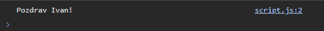

# Programiranje u skriptnim jezicima

**Nositelj**: doc. dr. sc. Nikola Tanković  
**Asistenti**:

- Luka Blašković, univ. bacc. inf.
- Alesandro Žužić, univ. bacc. inf.

**Ustanova**: Sveučilište Jurja Dobrile u Puli, Fakultet informatike u Puli

</img>

# [2] Funkcije, doseg varijabli i kontrolne strukture

</img>

<p style="float: clear"> <b>Funkcije</b> su jedan od temeljnih konstrukata u programiranju. One omogućuje grupiranje kȏda u logičke cjeline koje se mogu ponovno koristiti kroz cijeli program kao i apstrakciju složenih operacija, što nam olakšava razumijevanja i održavanje kȏda.</p>

<p><b>Kontrolne strukture</b> su konstrukti u programiranju koji odlučuju o toku izvršavanja programa. </p>

## Sadržaj

<!-- TOC start (generated with https://github.com/derlin/bitdowntoc) -->

- [Programiranje u skriptnim jezicima](#programiranje-u-skriptnim-jezicima)
- [\[2\] Funkcije, doseg varijabli i kontrolne strukture](#2-funkcije-doseg-varijabli-i-kontrolne-strukture)
  - [Sadržaj](#sadržaj)
- [1. Uvod u funkcije](#1-uvod-u-funkcije)
  - [1.1 Osnovna sintaksa funkcija](#11-osnovna-sintaksa-funkcija)
  - [1.2 Pozivanje funkcije](#12-pozivanje-funkcije)
  - [Vježba 1](#vježba-1)
  - [1.3 Funkcije možemo koristiti raznoliko](#13-funkcije-možemo-koristiti-raznoliko)
- [2. Doseg varijabli i funkcijski izrazi](#2-doseg-varijabli-i-funkcijski-izrazi)
  - [2.1 Blokovski opseg (eng. **_block scope_**)](#21-blokovski-opseg-eng-block-scope)
  - [2.2 Ponovno deklariranje funkcija](#22-ponovno-deklariranje-funkcija)
  - [2.3 Funkcijski izrazi](#23-funkcijski-izrazi)
  - [Vježba 2](#vježba-2)

<br>

# 1. Uvod u funkcije

Funkcije, kao što smo već spomenuli, omogućuju grupiranje kȏda u logičke cjeline koje se mogu ponovno koristiti kroz cijeli program kao i apstrakciju složenih operacija, što nam olakšava razumijevanja i održavanje kȏda. U JavaScriptu, funkcije ćemo deklarirati pomoću ključne riječi `function`, nakon koje slijedi:

- ime funkcije
- lista parametara funkcije, omeđena zagradama `()` i odvojena zarezima (ako ima više parametara)
- tijelo funkcije, omeđeno vitičastim zagradama `{}`

Na primjer, možemo definirati jednostavnu funkciju `kvadriraj` koja će kvadrirati broj koji joj proslijedimo kao argument.

```javascript
function kvadriraj(broj) {
  return broj * broj;
}
```

Funkcija kvadriraj prima jedan parametar `broj` i vraća kvadrat tog broja. Ključna riječ `return` označava vrijednost koju funkcija vraća. Ako funkcija ne vraća ništa, koristimo `return;` ili jednostavno izostavimo `return` naredbu.

Možemo primjetiti kako je funkcija `kvadriraj` zapravo vrlo slična matematičkoj funkciji `f(x) = x^2`. Funkcija `f` prima jedan parametar `x` i vraća kvadrat tog broja.

Ako povućemo paralelu sa `C` familijom jezika, možemo primjetiti da kȏd deklaracije funkcije u JavaScriptu, kao i varijabli, ne navodimo tip podataka parametara i povratne vrijednosti. Funkcija `kvadriraj` ekvivalentna je funkciji u C-u:

```c
int kvadriraj(int broj) {
  return broj * broj;
}
```

Kada se izvršavaju funkcije u JavaScriptu? Funkcije u JavaScriptu se izvršavaju kada "nešto" pozove tu funkcije, primjerice to može biti:

- kada se dogodi neki događaj (eng. _event_), npr. klik na gumb
- kada se pozove direktno iz Javascript kȏda
- automatski (eng. **_self-invoking_**)

## 1.1 Osnovna sintaksa funkcija

Kako smo već rekli, funkcije se deklariraju ključnom riječi `function`, nakon koje slijedi ime funkcije, lista parametara i tijelo funkcije.

Imena funkcije mogu sadržavati slova, brojeve, povlake `_` i dolar `$` znakove (ista pravila vrijede kao i za imena varijabli). Imena funkcija ne smiju počinjati brojem. Kȏd koji se izvršava pišemo unutar vitičastih zagrada `{}`.

```javascript
function imeFunkcije(parametar1, parametar2, parametar3) {
  // tijelo funkcije koje obavlja neku operaciju
}
```

Zapamtimo par pojmova:

- parametri funkcije (eng. **_function parameters_**) su navedeni unutar zagrada `()` u definiciji funkcije.
- argumenti funkcije (eng. **_function arguments_**) su vrijednosti koje se proslijeđuju funkciji kada se ona poziva.
- najvažnije, unutar funkcije, parametri (argumenti) se ponašaju kao **lokalne varijable**.

## 1.2 Pozivanje funkcije

Deklariranje funkcije neće pozvati funkciju, već samo definira funkciju. Da bismo pozvali funkciju, koristimo ime funkcije, operator `()` i unutar njih argumente koje proslijeđujemo funkciji. Primjerice, kako bi pozvali našu funkciju `kvadriraj` s arugmentom `5` i ispisali rezultat u konzolu, koristimo sljedeći kȏd:

```javascript
console.log(kvadriraj(5)); // 25
```

Deklarirajmo funkciju toCelsius koja će pretvoriti temperaturu iz Fahrenheit u Celzijevu temperaturu. Formula za pretvorbu je: `C = 5/9 * (F - 32)`.

Funkciju smo definirali ovako:

```javascript
function toCelsius(fahrenheit) {
  return (5 / 9) * (fahrenheit - 32);
}
```

Idemo pozvati funkciju s argumentom `77` i ispisati rezultat u konzolu:

```javascript
console.log(toCelsius(77)); // 25
```

Dobili smo rezultat `25`, odnosno 77°F je 25°C.
Što će ispisati sljedeći kȏd?

```javascript
let value = toCelsius();
console.log(value); // ?
```

Odgovor je `NaN` (eng. **_Not a Number_**). Zašto? Funkcija `toCelsius` očekuje jedan argument, a mi nismo proslijedili niti jedan argument. Kako bismo izbjegli ovakve situacije, možemo postaviti defaultnu vrijednost za parametar funkcije, na primjer:

```javascript
function toCelsius(fahrenheit = 0) {
  return (5 / 9) * (fahrenheit - 32);
}
```

Poziv funkcije `toCelsius()` sada će nam vratiti `0`, jer smo postavili defaultnu vrijednost za parametar `fahrenheit`.

Sada će nam `toCelsius()` vratiti `-17.777`, jer smo postavili defaultnu vrijednost za parametar `fahrenheit`.

<hr>

JavaScript nam neće dati grešku ako slučajno pozovemo funkciju bez `()` operatora, već će to tretirati kao referencu na samu funkciju. Ovo može biti korisno u nekim situacijama, ali u pravilu želimo ponašati.

```javascript
let value = toCelsius;
console.log(value); // [Function: toCelsius]
```

## Vježba 1

Napišite funkciju `pozdrav` koja će primati jedan argument `ime` te će ispisati poruku i vratiti string vrijednost "Pozdrav, `ime`!". Funkciju pozovite s argumentom `"Ivan"` i ispišite rezultat u konzolu. Kada to napravite dodajte defaultnu vrijednost za parametar `ime` koja će biti `"stranac"`.

Rezultat:



## 1.3 Funkcije možemo koristiti raznoliko

U JavaScriptu, funkcije se mogu koristiti na jednak način kao što koristimo varijable. To znači da ih možemo dodijeliti varijablama, proslijediti kao argumente drugim funkcijama, koristiti kao pridruživanje vrijednosti objektima i sl.
Primjerice, umjesto da koristimo varijablu za pohranu rezultata funkcije, možemo koristiti sam poziv funkcije!

```javascript
function kvadriraj(broj) {
  return broj * broj;
}

let rezultat = kvadriraj(5);
let text = "Rezultat kvadriranja broja 5 je: " + rezultat;
console.log(text); // Rezultat kvadriranja broja 5 je: 25
```

možemo napisati i ovako:

```javascript
let text2 = "Rezultat kvadriranja broja 5 je: " + kvadriraj(5);
console.log(text2); // Rezultat kvadriranja broja 5 je: 25
```

Što bi se dogodilo ako kȏd posložimo na ovaj način?

```javascript
let text3 = kvadriraj(5) + " je rezultat kvadriranja broja 5.";
function kvadriraj(broj) {
  return broj * broj;
}
console.log(text3); // ?
```

Primjetite da smo pozvali funkciju `kvadriraj` prije nego smo ju deklarirali. JavaScript će prvo pročitati sve deklaracije funkcija i varijabli prije nego počne izvršavati kȏd, tako da ovaj kȏd neće proizvesti grešku i ispisat će `25 je rezultat kvadriranja broja 5.`. Ovo ponašanje se zove **Function hoisting**.
Dakle prethodni kȏd je ekvivalentan:

```javascript
function kvadriraj(broj) {
  return broj * broj;
}
let text3 = kvadriraj(5) + " je rezultat kvadriranja broja 5.";
console.log(text3); // 25 je rezultat kvadriranja broja 5.
```

Napomena, navedeno ponašanje odnosi samo na deklaracije funkcija, ne i na funkcijske izraze (eng. **_function expressions_**). O funkcijskim izrazima više u nastavku skripte.

# 2. Doseg varijabli i funkcijski izrazi

Doseg varijabli (eng. **_variable scope_**) odnosi se na to gdje u kȏdu varijabla može biti korištena. U JavaScriptu, varijable deklarirane unutar funkcije su **lokalne varijable** i mogu se koristiti samo unutar te funkcije. Varijable deklarirane izvan funkcije su globalne varijable i mogu se koristiti bilo gdje u kȏdu.

```javascript
// Kȏd ovdje ne može koristiti varijablu x
function myFunction() {
  let x = 10;
  // Kȏd ovdje može koristiti varijablu x
  console.log(x); // 10
}
// Kȏd ovdje ne može koristiti varijablu x
console.log(x); // ReferenceError: x is not defined
```

Budući da se lokalne varijable prepoznaju samo unutar njihovih funkcija, varijable s istim imenom mogu postojati u različitim funkcijama.
Važno je napomenuti da se lokalne varijable stvaraju svaki put kada se funkcija pozove, a brišu kada se funkcija završi

```javascript
// Ove varijable definirane su u globalnom dosegu
const number_1 = 20;
const number_2 = 10;

// Ova funkcija definirana je u globalnom dosegu
function pomnozi() {
  return number_1 * number_2;
}

console.log(pomnozi()); // 200
```

Ovo je jasno, međutim hoće li sljedeći kȏd ispisati `100` ili dati grešku?

```javascript
const number_1 = 20;
const number_2 = 10;

function pomnozi() {
  const number_1 = 2;
  const number_2 = 50;
  return number_1 * number_2;
}

console.log(pomnozi()); // ?
```

<details>
  <summary>Odgovor!</summary>
  <p>Prvo smo deklarirali dvije konstante number_1 i number_2 u globalnom dosegu varijabli.</p>
  <p>Zatim smo deklarirali funkciju pomnozi koja vraća umnožak NOVIH lokalnih varijabli number_1 i number_2.</p>
  <p>Unutar tijela funkcije smo deklariramo nove konstante koje su lokalne za tu funkciju. Ove lokalne varijable "maskiraju" (eng. <b><i>shadowing</i></b>) globalne varijable s istim imenima.</p>
  <p>Stoga će funkcija vratiti rezultat 100.</p>
  
  ```javascript
  console.log(pomnozi()); // 100
```

</details>

### 2.1 Blokovski opseg (eng. **_block scope_**)

U JavaScriptu, varijable deklarirane s ključnim riječima `let` i `const` imaju blokovski opseg. To znači da su vidljive samo unutar bloka kȏda u kojem su deklarirane, slično kao lokalne deklarirane unutar funkcija, blok kȏda je definiran vitičastim zagradama `{}`.

```javascript
const x = 10;
// x ovdje iznosi 10
{
  const x = 2;
  // x ovdje iznosi 2
}
// x ovdje iznosi 10
console.log(x); // 10
```

Možemo primjetiti da se varijabla `x` deklarirana unutar bloka `{}` ponaša kao lokalna varijabla unutar bloka, a varijabla `x` deklarirana izvan bloka ponaša se kao globalna varijabla.

Ponovna deklaracija varijable s ključnom riječi `let` ili u varijablu `const`, unutar istog dosega, uzrokovat će grešku!

```javascript
let x = 10; // Okej
const x = 2; // SyntaxError: Identifier 'x' has already been declared

{
  let x = 2; // Okej
  const x = 2; // SyntaxError: Identifier 'x' has already been declared
}
{
  const x = 2; //Okej
  const x = 2; // SyntaxError: Identifier 'x' has already been declared
}
```

Uočimo i ovaj primjer: Ponovna deklaracija `const` varijable, unutar istog dosega, uzrokovat će grešku!

```javascript
const x = 10; // Okej
x = 2; // TypeError: Assignment to constant variable.
let x = 2; // SyntaxError: Identifier 'x' has already been declared
const x = 2; // SyntaxError: Identifier 'x' has already been declared

{
  const x = 2; // Okej
  x = 2; // TypeError: Assignment to constant variable.
  let x = 2; // SyntaxError: Identifier 'x' has already been declared
  const x = 2; // SyntaxError: Identifier 'x' has already been declared
}
```

Međutim, ponovna deklaracija `const` varijable, unutar različitih dosega, neće uzrokovati grešku!

```javascript
const x = 10; // Okej
{
  const x = 2; // Okej
}
{
  const x = "Pas"; // Okej
}
```

Kao što je već rečeno u prethodnoj skripti, varijable deklarirane s ključnom riječi `var` nemaju blokovski opseg već funkcionalni, što znači da su vidljive unutar funkcija u kojoj su deklarirane, kao i unutar svih blokova i podunkcija. Ovo ponašanje može dovesti do neočekivanih rezultata i grešaka, stoga se toplo preporučuje korištenje ključnih riječi `let` i `const` koje imaju blokovski opseg, umjesto `var`.

```javascript
var x = 1;
{
  var x = 2;
}
console.log(x); // 2 - neočekivano! Zadržimo se na ključnim riječima let i const
```

```javascript
let x = 1;
const y = 2;
{
  let x = 2;
  const y = 3;
}
console.log(x, y); // 1 2 - očekivano!
```

Za one koji žele naučiti više o blokovskom opsegu, i function hoistingu, link [ovdje](https://developer.mozilla.org/en-US/docs/Web/JavaScript/Reference/Statements/function).

### 2.2 Ponovno deklariranje funkcija

Ponovno deklariranje funkcija u JavaScriptu s ključnom riječi `function` dozvoljeno je ovisno o dosegu gdje se funkcija deklarira.
Deklaracije funkcija sa ključnom riječi `function` ponašaju se slično kao `var` i mogu se ponovno deklarirati s još jednom `function` ili `var` deklaracijom, ali ne sa `let`, `const` ili `class` deklaracijom.

```javascript
function a(b) {}
function a(b, c) {}
console.log(a.length); // 2 - broj parametara zadnje deklarirane funkcije
let a = 2; // SyntaxError: Identifier 'a' has already been declared
```

A ako overrideamo funkciju s `var` deklaracijom, to će raditi, ali još jednom, nije preporučljivo.

```javascript
var a = 1;
function a() {}
console.log(a); // 1
```

### 2.3 Funkcijski izrazi

Funkcijski izrazi (eng. **_function expressions_**) su način definiranja funkcija kao vrijednosti varijable. Mogu se koristiti kako bi definirali funkciju unutar izraza.
Funkcijski izrazi također se definiraju s ključnom riječi `function`, ali se razlikuju od deklaracija funkcija po tome što se mogu dodijeliti varijablama, proslijediti kao argumenti drugim funkcijama, koristiti kao pridruživanje vrijednosti objektima i sl. Sintaksa je vrlo slična kao i kod klasične `function` deklaracije.

```javascript
const izracunaj_povrsinu_pravokutnika = function (duzina, sirina) {
  return duzina * sirina;
};
console.log(izracunaj_povrsinu_pravokutnika(5, 3)); // 15 - funkciju pozivamo na isti način kao i deklarirane funkcije
```

Kako razlikovati u kodu deklaraciju funkcije i funkcijske izraze? Uzmimo za primjer funkciju `zbroji` koja zbraja dva broja.

Deklaracija funkcije izgleda ovako:

```javascript
function zbroji(a, b) {
  return a + b;
}
```

Funkcijski izraz izgleda ovako:

```javascript
const zbroji = function (a, b) {
  return a + b;
};
```

Možemo primjetiti da se kod funkcijskog izraza funkcija izrađuje s desne strane operatora dodjeljivanja `=`.

Kako smo ranije spomenuli, u poglavlju 1.3, **function hoisting** ponašanje dovodi do toga da se deklaracije funkcija mogu pozvati prije nego su deklarirane. Međutim, to se ne odnosi na funkcijske izraze. Funkcijski izrazi se ponašaju kao bilo koja druga varijabla, i ne mogu se pozvati prije nego su deklarirane.

```javascript
zbroji(2, 3); // 5
function zbroji(a, b) {
  console.log(a + b);
  return a + b;
}
```

Funkcijski izraz:

```javascript
zbroji(2, 3); // TypeError: zbroji is not a function
let zbroji = function (a, b) {
  console.log(a + b);
  return a + b;
};
```

Možemo li deklarirati funkciju unutar funkcije? Naravno!

```javascript
function vanjskaFunkcija() {
  function unutarnjaFunkcija() {
    console.log("Pozdrav iz unutarnje funkcije!");
  }
  console.log("Pozdrav iz vanjske funkcije!");
  unutarnjaFunkcija();
}
vanjskaFunkcija();
// Ispis:
// Pozdrav iz vanjske funkcije!
// Pozdrav iz unutarnje funkcije!
```

Isto tako, možemo deklarirati i funkcijski izraz unutar funkcije.

```javascript
function vanjskaFunkcija() {
  const unutarnjaFunkcija = function () {
    console.log("Pozdrav iz unutarnje funkcije!");
  };
  console.log("Pozdrav iz vanjske funkcije!");
  unutarnjaFunkcija();
}
vanjskaFunkcija();
// Ispis:
// Pozdrav iz vanjske funkcije!
// Pozdrav iz unutarnje funkcije!
```

Svaka funkcija ima svoj svoj lokalni doseg varijabli, što znači da varijable deklarirane unutar unutarnje funkcije nisu vidljive vanjskoj funkciji?

```javascript
function vanjskaFunkcija() {
  const unutarnjaFunkcija = function () {
    const x = 5;
    console.log("Pozdrav iz unutarnje funkcije!");
  };
  console.log("Pozdrav iz vanjske funkcije!");
  unutarnjaFunkcija();
  console.log(x); // ReferenceError: x is not defined
}
vanjskaFunkcija();
```

Međutim, kako svaka funkcija može vratiti vrijednost putem `return` naredbe, tako unutarnja funkcija može vratiti vrijednost vanjskoj funkciji.

```javascript
function vanjskaFunkcija() {
  const unutarnjaFunkcija = function () {
    return "Pozdrav iz unutarnje funkcije!";
  };
  console.log("Pozdrav iz vanjske funkcije!");
  const poruka = unutarnjaFunkcija();
  console.log(poruka); // Pozdrav iz unutarnje funkcije!
}
vanjskaFunkcija();
```

## Vježba 2

Napišite funkciju `sve_o_krugu(r)` s jednim parametrom `r` koji predstavlja radijus kruga. Funkcija treba sadržavati dvije unutarnje funkcije `povrsina` i `opseg` koje će računati površinu i opseg kruga i vraćati vanjskoj funkciji rezultate. Jedna od dvije unutarnje funkcije treba koristiti funkcijski izraz, a druga deklaraciju funkcije. Vanjska funkcija treba ispisati rezultate unutarnjih funkcija u konzolu. Za vrijednost broja π koristite `Math.PI`. Vanjska funkcija treba lokalnu varijablu `zbroj` pohraniti zbroj površine i opsega kruga i vratiti tu vrijednost. Rezultat funkcije `sve_o_krugu(r)` pohranite u globalnu varijablu zbroj te ju ispišite u konzolu.

Rezultat:

```javascript
function sve_o_krugu(r) {
  function povrsina(r) {
    return r * r * Math.PI;
  }
  let opseg = function (r) {
    return 2 * r * Math.PI;
  };
  console.log("Površina kruga je: " + povrsina(r));
  console.log("Opseg kruga je: " + opseg(r));
  let zbroj = povrsina(r) + opseg(r);
  return zbroj;
}
let zbroj = sve_o_krugu(5);
```

# 3. Kontrolne strukture

Kontrolne strukture su konstrukti koji odlučuju o toku izvršavanja programa na temelju određenih uvjeta. Ako je uvjet ispunjen tada se izvršava određeni blok radnji, inače će se izvršavati drugi blok radnji koji zadovoljava taj uvjet. Kontrolne strukture možemo podijeliti u dvije kateogrije: