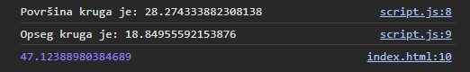
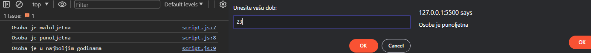
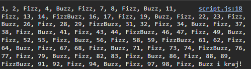

# Programiranje u skriptnim jezicima

**Nositelj**: doc. dr. sc. Nikola Tanković  
**Asistenti**:

- Luka Blašković, univ. bacc. inf.
- Alesandro Žužić, univ. bacc. inf.

**Ustanova**: Sveučilište Jurja Dobrile u Puli, Fakultet informatike u Puli

</img>

# [2] Funkcije, doseg varijabli i kontrolne strukture

</img>

<p style="float: clear"> <b>Funkcije</b> su jedan od temeljnih konstrukata u programiranju. One omogućuje grupiranje kȏda u logičke cjeline koje se mogu ponovno koristiti kroz cijeli program kao i apstrakciju složenih operacija, što nam olakšava razumijevanja i održavanje kȏda.</p>

<p><b>Kontrolne strukture</b> su konstrukti u programiranju koji odlučuju o toku izvršavanja programa. </p>

## Sadržaj

<!-- TOC start (generated with https://github.com/derlin/bitdowntoc) -->

- [Programiranje u skriptnim jezicima](#programiranje-u-skriptnim-jezicima)
- [\[2\] Funkcije, doseg varijabli i kontrolne strukture](#2-funkcije-doseg-varijabli-i-kontrolne-strukture)
  - [Sadržaj](#sadržaj)
- [1. Uvod u funkcije](#1-uvod-u-funkcije)
  - [1.1 Osnovna sintaksa funkcija](#11-osnovna-sintaksa-funkcija)
  - [1.2 Pozivanje funkcije](#12-pozivanje-funkcije)
  - [Vježba 1](#vježba-1)
  - [1.3 Funkcije možemo koristiti raznoliko](#13-funkcije-možemo-koristiti-raznoliko)
- [2. Doseg varijabli i funkcijski izrazi](#2-doseg-varijabli-i-funkcijski-izrazi)
    - [2.1 Blokovski opseg (eng. **_block scope_**)](#21-blokovski-opseg-eng-block-scope)
    - [2.2 Ponovno deklariranje funkcija](#22-ponovno-deklariranje-funkcija)
    - [2.3 Funkcijski izrazi](#23-funkcijski-izrazi)
  - [Vježba 2](#vježba-2)
- [Samostalni zadatak za vježbu 2](#samostalni-zadatak-za-vježbu-2)
- [3. Kontrolne strukture](#3-kontrolne-strukture)
  - [3.1 Selekcije (eng. **_Conditional statements_**)](#31-selekcije-eng-conditional-statements)
    - [3.1.1 `if` selekcija](#311-if-selekcija)
    - [3.1.2 `else` selekcija](#312-else-selekcija)
    - [3.1.3 `else if` selekcija](#313-else-if-selekcija)
    - [3.1.4 `switch` selekcija](#314-switch-selekcija)
  - [3.2 Selekcije s logičkim operatorima](#32-selekcije-s-logičkim-operatorima)
    - [Primjer 1 - Selekcija vremena u danu (operator `&&` + `if-else` selekcija)](#primjer-1---selekcija-vremena-u-danu-operator---if-else-selekcija)
    - [Primjer 2 - Provjera prihvatljivosti za zajam (operator `||`, `&&` + `if-else` selekcija)](#primjer-2---provjera-prihvatljivosti-za-zajam-operator----if-else-selekcija)
  - [Vježba 3](#vježba-3)
  - [3.3 Iteracije/Petlje (eng. **_Iterations/Loops_**)](#33-iteracijepetlje-eng-iterationsloops)
    - [3.3.1 Klasična `for` petlja](#331-klasična-for-petlja)
      - [Primjer 3 - Ispis ispis brojeva od 1 do 100 koji su djeljivi s 3](#primjer-3---ispis-ispis-brojeva-od-1-do-100-koji-su-djeljivi-s-3)
    - [3.3.2 `while` petlja](#332-while-petlja)
      - [3.3.2.1 `do-while` petlja](#3321-do-while-petlja)
    - [3.3.3 Prekidanje petlji - `break` | `continue`](#333-prekidanje-petlji---break--continue)
    - [3.3.4 Petlje nad nizom znakova (eng. **_String_**)](#334-petlje-nad-nizom-znakova-eng-string)
    - [3.3.5 Ugniježđene petlje](#335-ugniježđene-petlje)
    - [Primjer 4 - Ispis tablice množenja](#primjer-4---ispis-tablice-množenja)
  - [Vježba 4](#vježba-4)
- [Samostalni zadatak za vježbu 3](#samostalni-zadatak-za-vježbu-3)

<br>

# 1. Uvod u funkcije

Funkcije, kao što smo već spomenuli, omogućuju grupiranje kȏda u logičke cjeline koje se mogu ponovno koristiti kroz cijeli program kao i apstrakciju složenih operacija, što nam olakšava razumijevanja i održavanje kȏda. U JavaScriptu, funkcije ćemo deklarirati pomoću ključne riječi `function`, nakon koje slijedi:

- ime funkcije
- lista parametara funkcije, omeđena zagradama `()` i odvojena zarezima (ako ima više parametara)
- tijelo funkcije, omeđeno vitičastim zagradama `{}`

Na primjer, možemo definirati jednostavnu funkciju `kvadriraj` koja će kvadrirati broj koji joj proslijedimo kao argument.

```javascript
function kvadriraj(broj) {
  return broj * broj;
}
```

Funkcija kvadriraj prima jedan parametar `broj` i vraća kvadrat tog broja. Ključna riječ `return` označava vrijednost koju funkcija vraća. Ako funkcija ne vraća ništa, koristimo `return;` ili jednostavno izostavimo `return` naredbu.

Možemo primjetiti kako je funkcija `kvadriraj` zapravo vrlo slična matematičkoj funkciji `f(x) = x^2`. Funkcija `f` prima jedan parametar `x` i vraća kvadrat tog broja.

Ako povućemo paralelu sa `C` familijom jezika, možemo primjetiti da kȏd deklaracije funkcije u JavaScriptu, kao i varijabli, ne navodimo tip podataka parametara i povratne vrijednosti. Funkcija `kvadriraj` ekvivalentna je funkciji u C-u:

```c
int kvadriraj(int broj) {
  return broj * broj;
}
```

Kada se izvršavaju funkcije u JavaScriptu? Funkcije u JavaScriptu se izvršavaju kada "nešto" pozove tu funkcije, primjerice to može biti:

- kada se dogodi neki događaj (eng. _event_), npr. klik na gumb
- kada se pozove direktno iz Javascript kȏda
- automatski (eng. **_self-invoking_**)

## 1.1 Osnovna sintaksa funkcija

Kako smo već rekli, funkcije se deklariraju ključnom riječi `function`, nakon koje slijedi ime funkcije, lista parametara i tijelo funkcije.

Imena funkcije mogu sadržavati slova, brojeve, povlake `_` i dolar `$` znakove (ista pravila vrijede kao i za imena varijabli). Imena funkcija ne smiju počinjati brojem. Kȏd koji se izvršava pišemo unutar vitičastih zagrada `{}`.

```javascript
function imeFunkcije(parametar1, parametar2, parametar3) {
  // tijelo funkcije koje obavlja neku operaciju
}
```

Zapamtimo par pojmova:

- parametri funkcije (eng. **_function parameters_**) su navedeni unutar zagrada `()` u definiciji funkcije.
- argumenti funkcije (eng. **_function arguments_**) su vrijednosti koje se proslijeđuju funkciji kada se ona poziva.
- najvažnije, unutar funkcije, parametri (argumenti) se ponašaju kao **lokalne varijable**.

## 1.2 Pozivanje funkcije

Deklariranje funkcije neće pozvati funkciju, već samo definira funkciju. Da bismo pozvali funkciju, koristimo ime funkcije, operator `()` i unutar njih argumente koje proslijeđujemo funkciji. Primjerice, kako bi pozvali našu funkciju `kvadriraj` s arugmentom `5` i ispisali rezultat u konzolu, koristimo sljedeći kȏd:

```javascript
console.log(kvadriraj(5)); // 25
```

Deklarirajmo funkciju toCelsius koja će pretvoriti temperaturu iz Fahrenheit u Celzijevu temperaturu. Formula za pretvorbu je: `C = 5/9 * (F - 32)`.

Funkciju smo definirali ovako:

```javascript
function toCelsius(fahrenheit) {
  return (5 / 9) * (fahrenheit - 32);
}
```

Idemo pozvati funkciju s argumentom `77` i ispisati rezultat u konzolu:

```javascript
console.log(toCelsius(77)); // 25
```

Dobili smo rezultat `25`, odnosno 77°F je 25°C.
Što će ispisati sljedeći kȏd?

```javascript
let value = toCelsius();
console.log(value); // ?
```

Odgovor je `NaN` (eng. **_Not a Number_**). Zašto? Funkcija `toCelsius` očekuje jedan argument, a mi nismo proslijedili niti jedan argument. Kako bismo izbjegli ovakve situacije, možemo postaviti defaultnu vrijednost za parametar funkcije, na primjer:

```javascript
function toCelsius(fahrenheit = 0) {
  return (5 / 9) * (fahrenheit - 32);
}
```

Poziv funkcije `toCelsius()` sada će nam vratiti `0`, jer smo postavili defaultnu vrijednost za parametar `fahrenheit`.

Sada će nam `toCelsius()` vratiti `-17.777`, jer smo postavili defaultnu vrijednost za parametar `fahrenheit`.

<hr>

JavaScript nam neće dati grešku ako slučajno pozovemo funkciju bez `()` operatora, već će to tretirati kao referencu na samu funkciju. Ovo može biti korisno u nekim situacijama, ali u pravilu želimo ponašati.

```javascript
let value = toCelsius;
console.log(value); // [Function: toCelsius]
```

## Vježba 1

Napišite funkciju `pozdrav` koja će primati jedan argument `ime` te će ispisati poruku i vratiti string vrijednost "Pozdrav, `ime`!". Funkciju pozovite s argumentom `"Ivan"` i ispišite rezultat u konzolu. Kada to napravite dodajte defaultnu vrijednost za parametar `ime` koja će biti `"stranac"`.

Rezultat:


## 1.3 Funkcije možemo koristiti raznoliko

U JavaScriptu, funkcije se mogu koristiti na jednak način kao što koristimo varijable. To znači da ih možemo dodijeliti varijablama, proslijediti kao argumente drugim funkcijama, koristiti kao pridruživanje vrijednosti objektima i sl.
Primjerice, umjesto da koristimo varijablu za pohranu rezultata funkcije, možemo koristiti sam poziv funkcije!

```javascript
function kvadriraj(broj) {
  return broj * broj;
}

let rezultat = kvadriraj(5);
let text = "Rezultat kvadriranja broja 5 je: " + rezultat;
console.log(text); // Rezultat kvadriranja broja 5 je: 25
```

možemo napisati i ovako:

```javascript
let text2 = "Rezultat kvadriranja broja 5 je: " + kvadriraj(5);
console.log(text2); // Rezultat kvadriranja broja 5 je: 25
```

Što bi se dogodilo ako kȏd posložimo na ovaj način?

```javascript
let text3 = kvadriraj(5) + " je rezultat kvadriranja broja 5.";
function kvadriraj(broj) {
  return broj * broj;
}
console.log(text3); // ?
```

Primjetite da smo pozvali funkciju `kvadriraj` prije nego smo ju deklarirali. JavaScript će prvo pročitati sve deklaracije funkcija i varijabli prije nego počne izvršavati kȏd, tako da ovaj kȏd neće proizvesti grešku i ispisat će `25 je rezultat kvadriranja broja 5.`. Ovo ponašanje se zove **Function hoisting**.
Dakle prethodni kȏd je ekvivalentan:

```javascript
function kvadriraj(broj) {
  return broj * broj;
}
let text3 = kvadriraj(5) + " je rezultat kvadriranja broja 5.";
console.log(text3); // 25 je rezultat kvadriranja broja 5.
```

Napomena, navedeno ponašanje odnosi samo na deklaracije funkcija, ne i na funkcijske izraze (eng. **_function expressions_**). O funkcijskim izrazima više u nastavku skripte.

# 2. Doseg varijabli i funkcijski izrazi

Doseg varijabli (eng. **_variable scope_**) odnosi se na to gdje u kȏdu varijabla može biti korištena. U JavaScriptu, varijable deklarirane unutar funkcije su **lokalne varijable** i mogu se koristiti samo unutar te funkcije. Varijable deklarirane izvan funkcije su globalne varijable i mogu se koristiti bilo gdje u kȏdu.

```javascript
// Kȏd ovdje ne može koristiti varijablu x
function myFunction() {
  let x = 10;
  // Kȏd ovdje može koristiti varijablu x
  console.log(x); // 10
}
// Kȏd ovdje ne može koristiti varijablu x
console.log(x); // ReferenceError: x is not defined
```

Budući da se lokalne varijable prepoznaju samo unutar njihovih funkcija, varijable s istim imenom mogu postojati u različitim funkcijama.
Važno je napomenuti da se lokalne varijable stvaraju svaki put kada se funkcija pozove, a brišu kada se funkcija završi

```javascript
// Ove varijable definirane su u globalnom dosegu
const number_1 = 20;
const number_2 = 10;

// Ova funkcija definirana je u globalnom dosegu
function pomnozi() {
  return number_1 * number_2;
}

console.log(pomnozi()); // 200
```

Ovo je jasno, međutim hoće li sljedeći kȏd ispisati `100` ili dati grešku?

```javascript
const number_1 = 20;
const number_2 = 10;

function pomnozi() {
  const number_1 = 2;
  const number_2 = 50;
  return number_1 * number_2;
}

console.log(pomnozi()); // ?
```

<details>
  <summary>Odgovor!</summary>
  <p>Prvo smo deklarirali dvije konstante number_1 i number_2 u globalnom dosegu varijabli.</p>
  <p>Zatim smo deklarirali funkciju pomnozi koja vraća umnožak NOVIH lokalnih varijabli number_1 i number_2.</p>
  <p>Unutar tijela funkcije smo deklariramo nove konstante koje su lokalne za tu funkciju. Ove lokalne varijable "maskiraju" (eng. <b><i>shadowing</i></b>) globalne varijable s istim imenima.</p>
  <p>Stoga će funkcija vratiti rezultat 100.</p>
  
  ```javascript
  console.log(pomnozi()); // 100
```

</details>

### 2.1 Blokovski opseg (eng. **_block scope_**)

U JavaScriptu, varijable deklarirane s ključnim riječima `let` i `const` imaju blokovski opseg. To znači da su vidljive samo unutar bloka kȏda u kojem su deklarirane, slično kao lokalne deklarirane unutar funkcija, blok kȏda je definiran vitičastim zagradama `{}`.

```javascript
const x = 10;
// x ovdje iznosi 10
{
  const x = 2;
  // x ovdje iznosi 2
}
// x ovdje iznosi 10
console.log(x); // 10
```

Možemo primjetiti da se varijabla `x` deklarirana unutar bloka `{}` ponaša kao lokalna varijabla unutar bloka, a varijabla `x` deklarirana izvan bloka ponaša se kao globalna varijabla.

Ponovna deklaracija varijable s ključnom riječi `let` ili u varijablu `const`, unutar istog dosega, uzrokovat će grešku!

```javascript
let x = 10; // Okej
const x = 2; // SyntaxError: Identifier 'x' has already been declared

{
  let x = 2; // Okej
  const x = 2; // SyntaxError: Identifier 'x' has already been declared
}
{
  const x = 2; //Okej
  const x = 2; // SyntaxError: Identifier 'x' has already been declared
}
```

Uočimo i ovaj primjer: Ponovna deklaracija `const` varijable, unutar istog dosega, uzrokovat će grešku!

```javascript
const x = 10; // Okej
x = 2; // TypeError: Assignment to constant variable.
let x = 2; // SyntaxError: Identifier 'x' has already been declared
const x = 2; // SyntaxError: Identifier 'x' has already been declared

{
  const x = 2; // Okej
  x = 2; // TypeError: Assignment to constant variable.
  let x = 2; // SyntaxError: Identifier 'x' has already been declared
  const x = 2; // SyntaxError: Identifier 'x' has already been declared
}
```

Međutim, ponovna deklaracija `const` varijable, unutar različitih dosega, neće uzrokovati grešku!

```javascript
const x = 10; // Okej
{
  const x = 2; // Okej
}
{
  const x = "Pas"; // Okej
}
```

Kao što je već rečeno u prethodnoj skripti, varijable deklarirane s ključnom riječi `var` nemaju blokovski opseg već funkcionalni, što znači da su vidljive unutar funkcija u kojoj su deklarirane, kao i unutar svih blokova i podunkcija. Ovo ponašanje može dovesti do neočekivanih rezultata i grešaka, stoga se toplo preporučuje korištenje ključnih riječi `let` i `const` koje imaju blokovski opseg, umjesto `var`.

```javascript
var x = 1;
{
  var x = 2;
}
console.log(x); // 2 - neočekivano! Zadržimo se na ključnim riječima let i const
```

```javascript
let x = 1;
const y = 2;
{
  let x = 2;
  const y = 3;
}
console.log(x, y); // 1 2 - očekivano!
```

Za one koji žele naučiti više o blokovskom opsegu, i function hoistingu, link [ovdje](https://developer.mozilla.org/en-US/docs/Web/JavaScript/Reference/Statements/function).

### 2.2 Ponovno deklariranje funkcija

Ponovno deklariranje funkcija u JavaScriptu s ključnom riječi `function` dozvoljeno je ovisno o dosegu gdje se funkcija deklarira.
Deklaracije funkcija sa ključnom riječi `function` ponašaju se slično kao `var` i mogu se ponovno deklarirati s još jednom `function` ili `var` deklaracijom, ali ne sa `let`, `const` ili `class` deklaracijom.

```javascript
function a(b) {}
function a(b, c) {}
console.log(a.length); // 2 - broj parametara zadnje deklarirane funkcije
let a = 2; // SyntaxError: Identifier 'a' has already been declared
```

A ako overrideamo funkciju s `var` deklaracijom, to će raditi, ali još jednom, nije preporučljivo.

```javascript
var a = 1;
function a() {}
console.log(a); // 1
```

### 2.3 Funkcijski izrazi

Funkcijski izrazi (eng. **_function expressions_**) su način definiranja funkcija kao vrijednosti varijable. Mogu se koristiti kako bi definirali funkciju unutar izraza.
Funkcijski izrazi također se definiraju s ključnom riječi `function`, ali se razlikuju od deklaracija funkcija po tome što se mogu dodijeliti varijablama, proslijediti kao argumenti drugim funkcijama, koristiti kao pridruživanje vrijednosti objektima i sl. Sintaksa je vrlo slična kao i kȏd klasične `function` deklaracije.

```javascript
const izracunaj_povrsinu_pravokutnika = function (duzina, sirina) {
  return duzina * sirina;
};
console.log(izracunaj_povrsinu_pravokutnika(5, 3)); // 15 - funkciju pozivamo na isti način kao i deklarirane funkcije
```

Kako razlikovati u kȏdu deklaraciju funkcije i funkcijske izraze? Uzmimo za primjer funkciju `zbroji` koja zbraja dva broja.

Deklaracija funkcije izgleda ovako:

```javascript
function zbroji(a, b) {
  return a + b;
}
```

Funkcijski izraz izgleda ovako:

```javascript
const zbroji = function (a, b) {
  return a + b;
};
```

Možemo primjetiti da se kod funkcijskog izraza funkcija "izrađuje" s desne strane operatora dodjeljivanja `=`.

Kako smo ranije spomenuli, u poglavlju 1.3, **function hoisting** ponašanje dovodi do toga da se deklaracije funkcija mogu pozvati prije nego su deklarirane. Međutim, to se ne odnosi na funkcijske izraze. Funkcijski izrazi se ponašaju kao bilo koja druga varijabla, i ne mogu se pozvati prije nego su deklarirane.

```javascript
zbroji(2, 3); // 5
function zbroji(a, b) {
  console.log(a + b);
  return a + b;
}
```

Funkcijski izraz:

```javascript
zbroji(2, 3); // TypeError: zbroji is not a function
let zbroji = function (a, b) {
  console.log(a + b);
  return a + b;
};
```

Možemo li deklarirati funkciju unutar funkcije? Naravno!

```javascript
function vanjskaFunkcija() {
  function unutarnjaFunkcija() {
    console.log("Pozdrav iz unutarnje funkcije!");
  }
  console.log("Pozdrav iz vanjske funkcije!");
  unutarnjaFunkcija();
}
vanjskaFunkcija();
// Ispis:
// Pozdrav iz vanjske funkcije!
// Pozdrav iz unutarnje funkcije!
```

Isto tako, možemo deklarirati i funkcijski izraz unutar funkcije.

```javascript
function vanjskaFunkcija() {
  const unutarnjaFunkcija = function () {
    console.log("Pozdrav iz unutarnje funkcije!");
  };
  console.log("Pozdrav iz vanjske funkcije!");
  unutarnjaFunkcija();
}
vanjskaFunkcija();
// Ispis:
// Pozdrav iz vanjske funkcije!
// Pozdrav iz unutarnje funkcije!
```

Svaka funkcija ima svoj svoj lokalni doseg varijabli, što znači da varijable deklarirane unutar unutarnje funkcije nisu vidljive vanjskoj funkciji?

```javascript
function vanjskaFunkcija() {
  const unutarnjaFunkcija = function () {
    const x = 5;
    console.log("Pozdrav iz unutarnje funkcije!");
  };
  console.log("Pozdrav iz vanjske funkcije!");
  unutarnjaFunkcija();
  console.log(x); // ReferenceError: x is not defined
}
vanjskaFunkcija();
```

Međutim, kako svaka funkcija može vratiti vrijednost putem `return` naredbe, tako unutarnja funkcija može vratiti vrijednost vanjskoj funkciji.

```javascript
function vanjskaFunkcija() {
  const unutarnjaFunkcija = function () {
    return "Pozdrav iz unutarnje funkcije!";
  };
  console.log("Pozdrav iz vanjske funkcije!");
  const poruka = unutarnjaFunkcija();
  console.log(poruka); // Pozdrav iz unutarnje funkcije!
}
vanjskaFunkcija();
```

## Vježba 2

Napišite funkciju `sve_o_krugu(r)` s jednim parametrom `r` koji predstavlja radijus kruga. Funkcija treba sadržavati dvije unutarnje funkcije `povrsina` i `opseg` koje će računati površinu i opseg kruga i vraćati vanjskoj funkciji rezultate. Jedna od dvije unutarnje funkcije treba koristiti funkcijski izraz, a druga deklaraciju funkcije. Vanjska funkcija treba ispisati rezultate unutarnjih funkcija u konzolu. Za vrijednost broja π koristite `Math.PI`. Vanjska funkcija treba lokalnu varijablu `zbroj` pohraniti zbroj površine i opsega kruga i vratiti **tu vrijednost**. Rezultat funkcije `sve_o_krugu(3)` pohranite u globalnu varijablu zbroj te ju ispišite u konzolu.

Rezultat:



# Samostalni zadatak za vježbu 2

Napomena: Ne predaje se i ne boduje se. Zadatak možete i ne morate rješavati u [EduCoder](https://fipu-educoder.netlify.app/) aplikaciji.

1. Napišite **funkciju** `provjera_parnosti` koja će provjeravati je li broj paran ili neparan. Funkcija treba primiti jedan parametar `broj` i vratiti boolean vrijednosti "true" za parnost ili "false" za neparnost. Funkciju napišite **bez** upotrebe selekcija (if, else, switch) Funkciju pozovite s argumentom `5` i ispišite rezultat u konzolu.
2. Napišite **funkcijski izraz** `izrazunaj_povrsinu` koji računa površinu pravokutnika. U varijablu `povrsina` pohranite taj funkcijski izraz. Ispišite vrijednost `povrsina(8,6)` u konzolu.
3. Napišite **funkcijski izraz** `BMI` koji računa BMI (Body Mass Index) osobe. BMI se računa prema formuli `BMI = težina / (visina * visina)`. Ispišite u konzolu BMI osobe koja ima težinu 75 kg i visinu 1.75 m.
4. Napišite **funkciju** `heron()` koja će računati površinu trokuta prema Heronovoj formuli. Funkcija treba primiti tri parametra `a`, `b` i `c` koji predstavljaju duljine stranica trokuta.
   - Heronova formula: `P = √(p * (p - a) * (p - b) * (p - c))` gdje je `p` poluopseg trokuta, a računa se prema formuli `p = (a + b + c) / 2`. Koristite funkciju `Math.sqrt()` za računanje korijena.
   - Napišite funkcijsi izraz `poluopseg` koji će primiti tri parametra `a`, `b` i `c` te vratiti poluopseg trokuta prema danoj formuli. Funkcijski izraz mora biti definiran unutar funkcije `heron()`.
   - Deklarirajte novu konstantu `p` koja će pohraniti vrijednost funkcijskog izraza `poluopseg(a, b, c)`.
   - Rezultat funkcije `heron(3, 4, 5)` pohranite u varijablu `povrsina_trokuta` te ispišite u konzolu: `Trokut s duljinama stranica _, _ i _ ima površinu: povrsina_trokuta(_, _, _)` koristeći `template_literals`.
5. Sljedeći JavaScript kȏd sadrži nekoliko grešaka. Pronađite i ispravite greške kako bi kȏd radio ispravno. Provjerite s pozivom funkcije `izracunaj(x, y, z);` koji mora ispisati `17` i `3`. 

```javascript
  const x = 10;
  const y = 5;
  const z = 2;
  
  function izracunaj(x, y, z) {
    let x = 5;
    let y = 3;
    let z = 2;

    function = zbroji() {
      return x + y + z;
    }
    console.log(function(zbroji(x,y,z)))

    const oduzmi = function () = {
      return y - x - z;
    }
    console.log(oduzmi());
  }
  // Provjera: izracunaj(x, y, z); mora ispisati sljedeće:
  // 17
  // 3
```
# 3. Kontrolne strukture

Kontrolne strukture su konstrukti koji odlučuju o toku izvršavanja programa na temelju određenih uvjeta. Ako je uvjet ispunjen tada se izvršava određeni blok radnji, inače će se izvršavati drugi blok radnji koji zadovoljava taj uvjet. Kontrolne strukture možemo podijeliti u dvije kateogrije:

1. Selekcije (eng. **_Conditional statements_**) - odlučuju o toku izvršavanja bloka kȏda na temelju logičkog izraza koji se evaluira u `true` ili `false`.
2. Iteracije/Petlje (eng. **_Iterations_**) - omogućuju izvršavanje bloka kȏda više puta dok se ne ispuni uvjet definiran logičkim izrazom.

## 3.1 Selekcije (eng. **_Conditional statements_**)

U JavaScriptu, kao i u većini programskih jezika, selekcije se ostvaruju pomoću ključnih riječi `if`, `else if` i `else` te `switch`. Kada koristimo koju selekciju ovisi o tome koliko uvjeta želimo provjeriti:

- `if` selekciju koristimo kako bi specificirali blok kȏda koji se izvršava ako je evaluirani logički izraz `true`
- `else` selekciju koristimo kako bi specificirali blok kȏda koji se izvršava ako je evaluirani logički izraz `false`
- `else if` selekciju koristimo kako bi provjerili novi logički izraz ako je prethodni bio `false`
- `switch` selekciju koristimo kada imamo puno alternativnih uvjeta (logičkih izraza) koje želimo provjeriti

### 3.1.1 `if` selekcija

Koristimo `if` selekciju kako bi specificirali blok kȏda koji se izvršava ako je evaluirani logički izraz `true`. Sintaksa je sljedeća:

```javascript
if (logicki_izraz) {
  // blok kȏda koji se izvršava ako je logicki_izraz = true
}
```

Pripazite da je blok kȏda uvučen unutar vitičastih zagrada `{}`. Ako je logički izraz `true`, izvršava se blok kȏda unutar vitičastih zagrada `{}`. Ako je logički izraz `false`, blok kȏda se preskače. Primjer:

```javascript
let x = 10;
if (x < 5) {
  console.log("x je veći od 5"); // neće se ispisati
}
```

Ako izostavimo vitičaste zagrade `{}`, JavaScript će izvršiti samo prvu liniju kȏda nakon `if` selekcije. Ovo ponašanje može dovesti do neočekivanih rezultata i grešaka, stoga se preporučuje korištenje vitičastih zagrada `{}`.

### 3.1.2 `else` selekcija

Koristimo `else` selekciju kako bi specificirali blok kȏda koji se izvršava ako je evaluirani logički izraz `false`. Sintaksa je sljedeća:

```javascript
if (logicki_izraz) {
  // blok kȏda koji se izvršava ako je logicki_izraz = true
} else {
  // blok kȏda koji se izvršava ako je logicki_izraz = false
}
```

Primjer:

```javascript
let x = 10;
if (x < 5) {
  console.log("x je manji od 5"); // neće se ispisati
} else {
  console.log("x je veći ili jednak 5"); // ispisat će se
}
```

### 3.1.3 `else if` selekcija

Koristimo `else if` selekciju kako bi provjerili novi logički izraz ako je prethodni bio `false`. Sintaksa je sljedeća:

```javascript
if (logicki_izraz_1) {
  // blok kȏda koji se izvršava ako je logicki_izraz_1 = true
} else if (logicki_izraz_2) {
  // blok kȏda koji se izvršava ako je logicki_izraz_2 = true
} else {
  // blok kȏda koji se izvršava ako su svi prethodni logicki izrazi (logicki_izraz_1 && logicki_izraz_2) = false
}
```

Primjer:

```javascript
let x = 10;
if (x < 5) {
  console.log("x je manji od 5"); // neće se ispisati
} else if (x === 5) {
  console.log("x je jednak 5"); // neće se ispisati
} else {
  console.log("x je veći od 5"); // ispisat će se
}
```

### 3.1.4 `switch` selekcija

`switch` selekcija koristi se kada imamo puno alternativnih uvjeta (logičkih izraza) koje želimo provjeriti. Selekcija se sastoji od ključnih riječi `switch`, `case` i `default`, gdje `switch` predstavlja izraz koji se provjerava, `case` predstavlja moguće vrijednosti izraza, a `default` predstavlja blok kȏda koji se izvršava ako niti jedan od prethodnih uvjeta nije ispunjen. Sintaksa je sljedeća:

```javascript
switch (izraz) {
  case vrijednost_1:
    // blok kȏda koji se izvršava ako je izraz = vrijednost_1
    break;
  case vrijednost_2:
    // blok kȏda koji se izvršava ako je izraz = vrijednost_2
    break;
  default:
  // blok kȏda koji se izvršava ako niti jedan od prethodnih uvjeta nije ispunjen
}
```

Kao i u C jezicima, nakon svakog bloka kȏda u `case` selekciji koristimo ključnu riječ `break` kako bi prekinuli izvršavanje selekcije. Ako izostavimo `break` naredbu, JavaScript će izvršiti sve blokove kȏda nakon prvog koji zadovoljava uvjet, što može dovesti do neočekivanih rezultata i grešaka, stoga se gotovo uvijek koristi `break` naredba.

Primjer:

```javascript
let dan = "srijeda";
switch (dan) {
  case "ponedjeljak":
    console.log("Danas je ponedjeljak");
    break;
  case "utorak":
    console.log("Danas je utorak");
    break;
  case "srijeda":
    console.log("Danas je srijeda");
    break;
  case "četvrtak":
    console.log("Danas je četvrtak");
    break;
  case "petak":
    console.log("Danas je petak");
    break;
  default:
    console.log("Vikend je!");
}
```

## 3.2 Selekcije s logičkim operatorima

Selekcije s logičkim operatorima koriste se kako bi provjerili više uvjeta istovremeno. U JavaScriptu, kao i u većini programskih jezika, primarno koristimo logičke operatore `&&` (i), `||` (ili) i `!` (negacija) kako bi provjerili više uvjeta istovremeno. Logički operatori vraćaju `true` ili `false` ovisno o rezultatu provjere uvjeta.

Najlakše je objasniti logičke operatore kroz konkretne primjere:

### Primjer 1 - Selekcija vremena u danu (operator `&&` + `if-else` selekcija)

Prije nego što krenemo sa samim kȏdom, zapisat ćemo nekoliko tvrdnji koje ćemo provjeravati logičkim operatorima:

- Ako je vrijeme između 6 i 12 sati, pozdravit ćemo s "Dobro jutro!"
- Ako je vrijeme između 12 i 18 sati, pozdravit ćemo s "Dobar dan!"
- Inaće ćemo pozdraviti s "Dobra večer!"

Idemo prvo ugrubo definirati strukturu kȏda:

```javascript
let sat = 10;

if (uvjet) {
  izraz;
} else if (drugiUvjet) {
  izraz;
} else {
  izraz;
}
```

Krenimo s popunjavanjem onim redoslijedom kako smo naveli tvrdnje:
Prvi uvjet: Ako je vrijeme između 6 i 12 sati, pozdravit ćemo s "Dobro jutro!" - `if (sat >= 6 && sat < 12)` - koristimo logički operator `&&` (i) kako bi provjerili oba uvjeta istovremeno. Ako je `sat` veći ili jednak `6` i manji od `12`, odnosno, `(6 <= sat < 12)` ispisat ćemo `"Dobro jutro!"`.

```javascript
let sat = 10;
if (sat >= 6 && sat < 12) {
  console.log("Dobro jutro!");
} else if (drugiUvjet) {
  izraz;
} else {
  izraz;
}
```

Nastavljamo dalje, drugi uvjet: Ako je vrijeme između 12 i 18 sati, pozdravit ćemo s "Dobar dan!" - `else if (sat >= 12 && sat < 18)` - koristimo logički operator `&&` (i) kako bi provjerili oba uvjeta istovremeno. Ako je `sat` veći ili jednak `12` i manji od `18`, odnosno, `(12 <= sat < 18)` ispisat ćemo `"Dobar dan!"`.

```javascript
let sat = 10;
if (sat >= 6 && sat < 12) {
  console.log("Dobro jutro!");
} else if (sat >= 12 && sat < 18) {
  console.log("Dobar dan!");
} else {
  izraz;
}
```

I na kraju, treći uvjet: Inaće ćemo pozdraviti s "Dobra večer!" - `else` - ako niti jedan od prethodnih uvjeta nije ispunjen, ispisat ćemo `"Dobra večer!"`.

```javascript
let sat = 10;
if (sat >= 6 && sat < 12) {
  console.log("Dobro jutro!");
} else if (sat >= 12 && sat < 18) {
  console.log("Dobar dan!");
} else {
  console.log("Dobra večer!");
}
```

### Primjer 2 - Provjera prihvatljivosti za zajam (operator `||`, `&&` + `if-else` selekcija)

U ovom primjeru simulirati ćemo provjeru prihvatljivosti klijenta za zajam temeljem nekoliko kriterija, koristeći logičke operatore `||` (ili) i `&&` (i).
Izmislit ćemo nekoliko tvrdnji koje ćemo provjeravati logičkim operatorima:

- Ako je klijent zaposlen i ima stabilne prihode veće od 7000 novčanih jedinica, može dobiti zajam.
- Ako je klijent samostalni obrtnik ili ima visoku kreditnu ocjenu, može dobiti zajam.
- Ako klijent ima barem 2 godine radnog iskustva ili je stariji od 25 godina i ima mjesečne prihode iznad 5000 novčanih jedinica, može dobiti zajam.

_Svaka od tvrdnji je neovisna o drugima, odnosno barem jedna mora biti ispunjena kako bi klijent bio prihvatljiv za zajam!_

Koje varijable možemo iščitati iz ovih tvrdnji?

- zaposlen - `boolean`
- obrtnik - `boolean`
- kreditnaOcjenaVisoka - `boolean`
- godineRadnogIskustva - `number`
- dob - `number`
- mjesecniPrihodi - `number`

Krenimo s popunjavanjem onim redoslijedom kako smo naveli tvrdnje:

**Prvi uvjet**: Ako je klijent zaposlen i ima stabilne prihode veće od 7000 novčanih jedinica, može dobiti zajam - `if (zaposlen == true && mjesecniPrihodi > 7000)` - koristimo logički operator `&&` (i) kako bi provjerili oba uvjeta istovremeno. Ako je `zaposlen` i `mjesecniPrihodi` veći od `7000`, odnosno, `(zaposlen == true && mjesecniPrihodi > 7000)` klijent može dobiti zajam.

```javascript
let zaposlen = true;
let mjesecniPrihodi = 8000;

if (zaposlen == true && mjesecniPrihodi > 7000) {
  console.log("Čestitamo! Možete dobiti zajam!");
} else {
  console.log("Nažalost, ne možete dobiti zajam.");
}
```

Prisjetimo se kratko kako JavaScript evaluira tvrdnje (eng. _expressions_) unutar kontrolnih struktura.
Što će vratiti (u što će se evaluirati), u kȏdu iznad izraz `zaposlen == true`? Odgovor je `true`.
Ako smo sigurni da je varijabla `zaposlen` uvijek tipa `boolean`, možemo izostaviti `== true` i napisati samo `if (zaposlen && mjesecniPrihodi > 7000)`.

```javascript
let zaposlen = true;
let mjesecniPrihodi = 8000;

if (zaposlen && mjesecniPrihodi > 7000) {
  //Ovakav zapis je dovoljan, pa i čitljiviji
  console.log("Čestitamo! Možete dobiti zajam!");
} else {
  console.log("Nažalost, ne možete dobiti zajam.");
}
```

Drugi uvjet: Ako je klijent samostalni obrtnik ili ima visoku kreditnu ocjenu, može dobiti zajam - `else if (obrtnik || kreditnaOcjenaVisoka)` - koristimo logički operator `||` (ili) kako bi provjerili jedan od dva uvjeta. Ako je `obrtnik` ili `kreditnaOcjenaVisoka` istinita tvrdnja, odnosno, `(obrtnik || kreditnaOcjenaVisoka)` klijent može dobiti zajam. Primjetite da smo izostavili `== true` jer su `obrtnik` i `kreditnaOcjenaVisoka` tipa `boolean`.

```javascript
let zaposlen = true;
let mjesecniPrihodi = 8000;

let obrtnik = true;
let kreditnaOcjenaVisoka = false;

if ((zaposlen && mjesecniPrihodi > 7000) || obrtnik || kreditnaOcjenaVisoka) {
  console.log("Čestitamo! Možete dobiti zajam!");
} else {
  console.log("Nažalost, ne možete dobiti zajam.");
}
```

Treći uvjet: Ako klijent ima barem 2 godine radnog iskustva ili je stariji od 25 godina i ima stabilne mjesečne prihode, može dobiti zajam - `(godineRadnogIskustva >= 2 || (dob > 25 && mjesecniPrihodi > 5000))` - koristimo logički operator `||` (ili) kako bi provjerili jedan od dva uvjeta. Ako je `godineRadnogIskustva` veće ili jednako `2` ili je `dob` veći od `25` i `mjesecniPrihodi` veći od `5000`, odnosno, `(godineRadnogIskustva >= 2 || (dob > 25 && mjesecniPrihodi > 5000))` klijent može dobiti zajam.

```javascript
let zaposlen = true;
let mjesecniPrihodi = 8000;

let obrtnik = true;
let kreditnaOcjenaVisoka = false;

let godineRadnogIskustva = 3;
let dob = 28;

if ((zaposlen && mjesecniPrihodi > 7000) || (obrtnik || kreditnaOcjenaVisoka) || (godineRadnogIskustva >= 2 || (dob > 25 && mjesecniPrihodi > 5000))) {
  console.log("Čestitamo! Možete dobiti zajam!");
} else {
  console.log("Nažalost, ne možete dobiti zajam.");
}
```

Kako su uvjeti neovisni jedan o drugome, odnosno barem jedan uvjet mora biti ispunjen, možemo komplicirani izraz unutar `if` selekcije podijeliti u više manjih izraza kako bi kȏd bio čitljiviji.

```javascript
// Varijable ostaju iste

if (zaposlen && mjesecniPrihodi > 7000) {
  console.log("Čestitamo! Možete dobiti zajam!");
}
else if (obrtnik || kreditnaOcjenaVisoka) {
  console.log("Čestitamo! Možete dobiti zajam!");
}
else if (godineRadnogIskustva >= 2 || (dob > 25 && mjesecniPrihodi > 5000)) {
  console.log("Čestitamo! Možete dobiti zajam!");
}
else {
  console.log("Nažalost, ne možete dobiti zajam.");
}
```
## Vježba 3

Napiši funkciju `provjeriDob(dob)` koja vraća poruku ovisno o dobi korisnika. Za dob manju od `18` godina, funkcija vraća poruku `"Osoba je maloljetna."`. Za dob između 18 i 65 godina, funkcija vraća poruku `"Osoba je punoljetna."`. Za dob veću od `65` godina, funkcija vraća poruku `"Osoba je u zlatnim godinama."`. Pozovite `provjeriDob(15)`, `provjeriDob(25)` i `provjeriDob(70)` te ispišite rezultate u konzolu. Kada to napravite, umjesto da ručno mjenjate dob, koristite [`prompt`](https://developer.mozilla.org/en-US/docs/Web/API/Window/prompt) funkciju kako bi korisnik unio dob, sintaksa je sljedeće: `let x = prompt(text, defaultText);`, gdje je `text` poruka koja se prikazuje korisniku, a `defaultText` je opcionalni argument koji predstavlja zadani tekst u polju za unos. Kada to napravite, zamjenite `console.log` sa [`alert`](https://developer.mozilla.org/en-US/docs/Web/API/Window/alert) funkcijom, sintaksa je sljedeća: `alert(poruka);`, gdje je `poruka` poruka koja se prikazuje korisniku.

Rezultat:



## 3.3 Iteracije/Petlje (eng. **_Iterations/Loops_**)

Petlje su konstrukti koji omogućuju izvršavanje bloka kȏda više puta dok se ne ispuni uvjet definiran logičkim izrazom. U JavaScriptu, kao i u većini programskih jezika, petlje se ostvaruju pomoću ključnih riječi `for` i `while`.

Petlje su korisne kada želimo određeni dio koda izvršavati više puta, svaki put s različitim ulaznim podacima. Na primjer, kada želimo ispisati brojeve od `1` do `10`, možemo koristiti petlju umjesto da svaki broj ispišemo ručno.
```javascript
console.log(1);
console.log(2);
console.log(3);
console.log(4);
console.log(5);
console.log(6);
console.log(7);
console.log(8);
console.log(9);
console.log(10);
```
možemo napisati jednostavno:
```javascript
for (let i = 1; i <= 10; i++) {
  console.log(i);
}
```
Postoji više vrsta `for` petlji u JavaScriptu, ali u pravilu sve rade istu stvar - ponavljaju radnu određeni broj puta (ili nijednom). Koju petlju koristimo zaključujemo ovisno o ulaznim podacima, početku i kraju petlje, te koracima. Ova for petlja slična je for petljama u C i Java jezicima.

### 3.3.1 Klasična `for` petlja

Klasična `for` petlja koristi se kada znamo koliko puta želimo ponoviti blok kȏda. Sastoji se od `initialization`, `condition` i `afterthought`. Sintaksa je sljedeća:
  
```javascript
for (initialization; condition; afterthought) {
  statement // blok kȏda koji se izvršava dok je uvjet = true
}
```
1. `initialization` - izvršava se jednom prije početka petlje, ako postoji. Često inicijalizira varijable koje se koriste u petlji, npr. `let i = 0`, ali sintaksa dozvoljava bilo koji izraz.
2. `condition` izraz se evaluira prije svakog ponavljanja petlje. Ako je `true`, petlja i egezekucija `statement` izraza se nastavlja. Ako je `false`, petlja se prekida.
3. `statement` izraz se izvršava svaki put kada je `condition` = `true`.
4. `afterthought` izraz se izvršava nakon svakog ponavljanja petlje, ako postoji. Često se koristi za inkrementiranje ili dekrementiranje varijabli, npr. `i++`, ali sintaksa dozvoljava bilo koji izraz.

Primjer, želimo ispisati brojeve od `1` do `10`:
```javascript
for (let i = 1; i <= 10; i++) {
  console.log(i); // ispisuje brojeve od 1 do 10 -> 1, 2, 3, 4, 5, 6, 7, 8, 9, 10
}
```
Možemo i za nazad:
```javascript
for (let i = 10; i >= 1; i--) {
  console.log(i); // ispisuje brojeve od 10 do 1 -> 10, 9, 8, 7, 6, 5, 4, 3, 2, 1
}
```

Kako možemo upotrijebiti `for` petlju za ispis svih parnih brojeva od `1` do `10`?
```javascript
for (let i = 2; i <= 10; i += 2) {
  console.log(i); // ispisuje parne brojeve od 1 do 10 -> 2, 4, 6, 8, 10
}
```

Kako smo rekli da `initialization` dozvoljava bilo koji izraz pa i prazan, možemo koristiti `for` petlju i na sljedeće načine:
```javascript
let i, j;
for (i = 0, j = 1; i < 10; i++, j++) {
  console.log(`${i} je manji za 1 od ${j}.`);
}
```
Uočite da smo varijable `i` i `j` inicijalizirali izvan petlje, ali smo ih koristili unutar petlje. Međutim, varijable je moguće deklarirati i unutar petlje, u tom slučaju ćemo ključnu riječ `let` koristiti samo jednom.
```javascript
for (let i = 0, j = 1; i < 10; i++, j++) {
  console.log(`${i} je manji za 1 od ${j}.`);
}
```

Možemo pustiti `initialization` prazan, ali moramo imati `;` separator.
```javascript
let i = 0;
for (; i < 10; i++) {
  console.log(i);
}
```

Izostavljanjem nekih od dijelova `for` petlje, možemo dobiti beskonačnu petlju:
Oprez, beskonačne petlje mogu dovesti do crashanja web preglednika ili vaše aplikacije koja izvodi JavaScript kȏd. Poželjno je izbjegavati beskonačne petlje.
```javascript
// Navedene petlje će vrlo vjerojatno srušiti vaš web preglednik
for (;;) {
  console.log("Beskonačna petlja!"); // Nema inicijalizacije, uvjeta niti afterthoughta
}

for (let i = 0; ; i++) {
  console.log(i); // Nema uvjeta za prekid petlje
}

for (let i = 0; i < 10; ) {
  console.log(i); // Nema afterthoughta, petlja će beskonačno ispisivati 0
}
```

#### Primjer 3 - Ispis ispis brojeva od 1 do 100 koji su djeljivi s 3
Izračunajte sumu svih brojeva od `1` do `100` koji su djeljivi s 3. Koristite `for` petlju. Ovaj zadatak zahtjeva korištenje petlje za iteriranje kroz brojeve od 1 do 100, uvjetne izjave za provjeru je li broj djeljiv sa 3 i varijablu za praćenje ukupne sume.

Prvo ćemo napisati kȏd koji ispisuje sve brojeve od `1` do `100`.
```javascript
for (let i = 1; i <= 100; i++) {
  console.log(i);
}
```
Dodat ćemo provjeru je li broj djeljiv s 3. To radimo s operatorom `%` koji vraća ostatak dijeljenja dva broja. Ako je ostatak dijeljenja nekog broja s `3` jednak `0`, to znači da je broj djeljiv s 3.
```javascript
for (let i = 1; i <= 100; i++) {
  if (i % 3 === 0) {
    console.log(i);
  }
}
```
Konačno, dodat ćemo varijablu `suma` koja će pohraniti sumu svih brojeva od `1` do `100` koji su djeljivi s 3.
```javascript
let suma = 0;
for (let i = 1; i <= 100; i++) {
  if (i % 3 === 0) {
    console.log(i);
    suma += i;
  }
}
console.log(suma); // ispisuje sumu svih brojeva od 1 do 100 koji su djeljivi s 3 -> 1683
```

### 3.3.2 `while` petlja
while petlja koristi se kada u pravilu ne znamo koliko puta želimo ponoviti blok kȏda. Sastoji se od `condition`. Sintaksa je sljedeća:
```javascript
while (condition) {
  statement // blok kȏda koji se izvršava dok je uvjet = true
}
```
Ako je `condition` = `true`, izvršava se `statement`. Ako je `condition` = `false`, petlja se prekida. Kao i kod `for` petlje, `statement` izraz se izvršava svaki put kada je `condition` = `true`.

`condition` se evaluira prije statement izraza, stoga je moguće da se `statement` izraz nikada ne izvrši ako je condition = `false`.

Primjer, sljedeća petlja će iterirati dokle god je `n` manji od 3. Primjetite da u ovom slučaju, `n` mora biti deklariran izvan petlje.
```javascript
let n = 0;
let x = 0;
while (n < 3) {
  n++;
  x += n;
}
```
Sa svakom iteracijom, `n` se inkrementira za `1` i dodaje se na `x`. Kada je `n` = `3`, petlja se prekida. Tako da će se izvršiti `3` puta, a `x` i `n` će biti:
1. prolazak: `n` = `1`, `x` = `1`
2. prolazak: `n` = `2`, `x` = `3`
3. prolazak: `n` = `3`, `x` = `6`

Već smo rekli da beskonačne petlje želimo izbjegavati. Moramo pripaziti da uvjet u `while` petlji kad tad postane `false`. Ako uvjet nikad ne postane `false`, petlja će se izvršavati beskonačno. Na primjer, sljedeća petlja će se izvršavati beskonačno:
```javascript
while (true) {
  console.log("Beskonačna petlja!");
}
```

Dalje, pogledajmo sljedeći primjer:
```javascript
let i = 0;
while (i < 10) {
  let text = "";
  text += "Broj " + i;
  i++;
  console.log(text); // ispisuje "Broj 0", "Broj 1", "Broj 2", "Broj 3", "Broj 4", "Broj 5", "Broj 6", "Broj 7", "Broj 8", "Broj 9"
}
```
Primjetimo da je varijabla `text` deklarirana unutar petlje. To znači da će se svaki put kada se petlja izvrši, varijabla `text` ponovno inicijalizirati. Kod petlji vrijede ista pravila o dosegu varijabli kao i kod funkcija - varijabla deklarirana unutar petlje neće biti dostupna izvan petlje.

Što ako je `i` = `11`? Petlja se neće izvršiti niti jednom, jer je uvjet `i < 10` odmah `false`. Kako bismo ispisali "Broj 10", možemo koristiti varijantu `while` petlje -  `do-while` petlju.

#### 3.3.2.1 `do-while` petlja

`do-while` petlja koristi se kada želimo da se blok kȏda izvrši barem jednom, a zatim se ponavlja dok je uvjet = `true`. Sastoji se od `condition`. Sintaksa je sljedeća:
```javascript
do {
  statement // blok kȏda koji se izvršava barem jednom, a zatim se ponavlja dok je uvjet = true
} while (condition);
```
Prebacimo prethodni primjer u `do-while` petlju. Možemo primjetiti da se `statement` blok izvrši točno jednom, budući da je uvjet `i < 10` odmah `false`.
```javascript
let i = 11;
do {
  let text = "";
  text += "Broj " + i;
  i++;
  console.log(text); // ispisuje "Broj 11"
} while (i < 10);
```
`do-while` petlja ima svoje prednosti, ali se u praksi koristi rjeđe od `for` i `while` petlji.

### 3.3.3 Prekidanje petlji - `break` | `continue`

Kako bismo "naglo" prekinuli izvršavanje petlje, koristimo ključnu riječ `break`. Kada se `break` naredba izvrši, petlja se prekida i izvršavanje se nastavlja s prvim redom kȏda nakon petlje. Na primjer, želimo prekinuti petlju kada dođemo do broja `15` u petlji koja ispisuje brojeve od `1` do `100`.
```javascript
for (let i = 1; i <= 100; i++) {
  if (i === 15) {
    break; // Prekida petlju kada je i = 15, dakle neće se ispisati brojevi od 15 do 100
  }
  console.log(i); // ispisuje brojeve od 1 do 14
}
```
Kako bismo preskočili trenutnu iteraciju petlje, koristimo ključnu riječ `continue`. Kada se `continue` naredba izvrši, trenutna iteracija petlje se prekida i izvršavanje se nastavlja s idućom iteracijom petlje. Na primjer, želimo ispisati sve brojeve od `1` do `100` osim brojeva koji su djeljivi s 3.
```javascript
for (let i = 1; i <= 100; i++) {
  if (i % 3 === 0) {
    continue; // Preskače trenutnu iteraciju petlje kada je i djeljiv s 3
  }
  console.log(i); // ispisuje sve brojeve od 1 do 100 osim brojeva koji su djeljivi s 3
}
```

`break` i `continue` naredbe možemo koristiti kod svih vrsta petlji - `for`, `while` i `do-while`. 

`break` naredbu koristimo i unutar `switch` selekcija kako bi prekinuli izvršavanje selekcije, međutim `continue` naredbu ne koristimo.

### 3.3.4 Petlje nad nizom znakova (eng. **_String_**)

Do sad smo koristili petlje za iteriranje kroz brojeve, ali možemo koristiti petlje i za iteriranje kroz nizove znakova. Na primjer, možemo ispisati svaki znak u nizu znakova. Kako bismo to postigli, koristimo `for` petlju i svojstvo `length` niza znakova koje nam govori koliko znakova niz sadrži.
```javascript
let grad = "Pula";
for (let i = 0; i < grad.length; i++) {
  console.log(grad[i]); // ispisuje svaki znak u nizu znakova -> P, u, l, a
}
```

Idemo upotrijebiti svo znanje o petljama, selekcijama i funkcijama kako bismo napisali funkciju koja će zbrojiti ponavljanja određenog znaka u nizu znakova. Funkcija `brojPonavljanjaZnaka()` prima dva argumenta - niz znakova `niz` i znak `znak`. Funkcija vraća broj ponavljanja znaka `znak` u nizu znakova `niz`.

```javascript
function brojPonavljanjaZnaka(niz, znak) {
  let brojac = 0;
  for (let i = 0; i < niz.length; i++) {
    if (niz[i] === znak) { // Provjerava je li trenutni znak u nizu znakova jednak znaku koji tražimo
      brojac++;
    }
  }
  return brojac;
}
console.log(brojPonavljanjaZnaka("Pula", "a")); // ispisuje broj ponavljanja znaka `a` u nizu znakova Pula -> 1
console.log(brojPonavljanjaZnaka("JavaScript", "a")); // ispisuje broj ponavljanja znaka `a` u nizu znakova JavaScript -> 2
console.log(brojPonavljanjaZnaka("JavaScript", "z")); // ispisuje broj ponavljanja znaka `z` u nizu znakova JavaScript -> 0
```

### 3.3.5 Ugniježđene petlje

Ugniježđene petlje koriste se kada želimo iterirati kroz više dimenzija podataka. Na primjer, kada želimo ispisati sve parove `(i, j)` brojeva u rasponu od `1` do `3`:

```javascript
for (let i = 1; i <= 3; i++) {
  for (let j = 1; j <= 3; j++) {
    console.log(i, j); // ispisuje sve kombinacije brojeva od 1 do 3 -> 1 1, 1 2, 1 3, 2 1, 2 2, 2 3, 3 1, 3 2, 3 3
  }
}
```

Ugnjezditi možemo i kombinirati različite vrste petlji, na primjer, `for` i `while` petlje:
```javascript
let i = 1;
while (i <= 3) {
  for (let j = 1; j <= 3; j++) {
    console.log(i, j); // ispisuje sve kombinacije brojeva od 1 do 3 -> 1 1, 1 2, 1 3, 2 1, 2 2, 2 3, 3 1, 3 2, 3 3
  }
  i++;
}
```
`break` i `continue` naredbe u ugniježđenim petljama ponašaju se kao i kod jednostavnih petlji - prekidaju petlju ili preskaču trenutnu iteraciju petlje u kojoj se izvršavaju.
```javascript
for (let i = 1; i <= 3; i++) {
  for (let j = 1; j <= 3; j++) {
    if (i === 2 && j === 2) {
      continue; // Preskače iteraciju gdje je i = 2 i j = 2
    } else {
        console.log(i, j); // ispisuje sve kombinacije brojeva od 1 do 3 osim 2 2 -> 1 1, 1 2, 1 3, 2 1, 2 3, 3 1, 3 2, 3 3
    }
  }
}
```

### Primjer 4 - Ispis tablice množenja 

Primjenjujući ugniježdene petlje možemo jednostavno ispisati tablicu množenja. U ovom primjeru implementirat ćemo funkciju za ispis tablice množenja za brojeve od `1` do `10`. Funkcija će ispisati sve kombinacije brojeva od `1` do `10` i njihovih umnožaka.

Prvo definirajmo funkciju `tablicaMnozenja()` i unutar nje for petlju koja prolazi kroz brojeve od `1` do `10`.
```javascript
function tablicaMnozenja() {
  for (let i = 1; i <= 10; i++) {
    console.log(i);
  }
}
tablicaMnozenja();
```
Dalje, želimo svaki broj `i` pomnožiti s brojevima od `1` do `10`. To ćemo jednostavno postići ugniježđenom `for` petljom.
```javascript
function tablicaMnozenja() {
  for (let i = 1; i <= 10; i++) {
    for (let j = 1; j <= 10; j++) {
      console.log(i, j, i * j); // ispisuje sve kombinacije brojeva od 1 do 10 i njihove umnožke
    }
  }
}
tablicaMnozenja()
```
Kako bismo dobili tablicu, možemo dodati i formatiranje ispisa. Na primjer, možemo koristiti tabulator `\t` kako bi razdvojili brojeve.
U varijablu `red` spremamo sve umnoške brojeva `i` i `j` od `1` do `10`, odvajamo ih tabulatorom, a zatim ispisujemo napunjeni `red` u vanjskoj petlji.

Rješenje:

```javascript
function tablicaMnozenja() {
  for (let i = 1; i <= 10; i++) {
    let red = "";
    for (let j = 1; j <= 10; j++) {
      red += i * j + '\t';
    }
    console.log(red);
  }
}
tablicaMnozenja()
```

## Vježba 4

Napišite program koji će ispisati sve brojeve od `1` do `100`. No, za brojeve koji su djeljivi s 3 umjesto broja ispišite  `Fizz`, za brojeve koji su djeljivi s 5 ispišite `Buzz` i za brojeve koji su djeljivi i sa 3 i sa 5 ispišite `FizzBuzz`. Ne ispisujte svaku vrijednost koristeći `console.log()`, već pohranjujte vrijednosti u varijablu `output` i na kraju ispišite niz koristeći `console.log(output)`. Nakon svake vrijednosti dodajte zarez i razmak (`, `), osim nakon posljednje vrijednosti, nakon koje dodajte ` i kraj!`.

Rezultat:



# Samostalni zadatak za vježbu 3

Napomena: Ne predaje se i ne boduje se. Zadatak možete i ne morate rješavati u [EduCoder](https://fipu-educoder.netlify.app/) aplikaciji.

1. Napišite funkciju reverseString koja prima znakovni niz (string) kao argument i vraća obrnuti string. Na primjer, ako je ulaz "hello", vaša funkcija treba vratiti "olleh". Funkcija mora vratiti "Not a string!" ako je ulazni argument različitog tipa od stringa. Funkciju pozovite s argumentima "hello", "JavaScript" i 123.
2. Napišite funkciju `prost_broj` koja prima broj kao argument i vraća `true` ako je broj prost, odnosno `false` ako nije. Broj je prost ako je djeljiv samo s 1 i samim sobom. Funkciju pozovite s argumentima 7, 10 i 13.
3. Nadogradite prethodni zadatak na način da ćete ispisati sve proste brojeve od 1 do 100. Funkciju `prost_broj` koristite unutar petlje. Ispis mora izgledati ovako: `Prosti brojevi od 1 do 100 su: 2, 3, 5, 7, itd.`
4. Napišite funkciju `pronadi_najduzu_rijec()` koja prima rečenicu kao argument i vraća najdužu riječ u rečenici. Rečenicu morate razložiti koristeći petlju, bez pomoćnih funkcija.
   - Ako se funkciji proslijedi tip podatka koji nije string, funkcija vraća "Nije rečenica!". 
   - Ako je rečenica prazna, funkcija vraća "Rečenica je prazna!". 
   - Ako se rečenica sastoji od samo jedne riječi, funkcija vraća tu riječ.
   - Ako se rečenica sastoji od više riječi iste duljine, funkcija vraća prvu riječ koja je pronađena.
