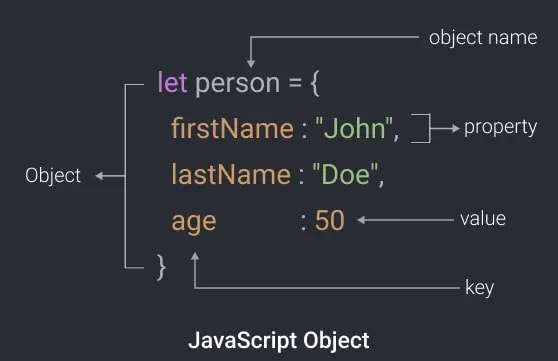

# Programiranje u skriptnim jezicima

**Nositelj**: doc. dr. sc. Nikola Tanković  
**Asistenti**:

- Luka Blašković, univ. bacc. inf.
- Alesandro Žužić, univ. bacc. inf.

**Ustanova**: Sveučilište Jurja Dobrile u Puli, Fakultet informatike u Puli

</img>

# [3] Strukture podataka - objekti i polja

[comment]: <> (Ažurirati sliku - logojs/js0.png)
</img>

Strukture podataka su specijalizirani formati podataka namijenjeni efikasnijoj pohrani, organizaciji, dohvatu i obradi podataka. U JavaScriptu, objekti i polja predstavljaju glavne gradivne elemente. **Objekti** su kontejneri koji omogućuju pohranu podataka u obliku proizvoljnog broja parova `"ključ:vrijednost"`, dok **polja** predstavljaju kolekciju različitih elemenata organiziranih u linearni niz. Kombinacija ovih struktura omogućuje efikasno manipuliranje i pristup podacima u JavaScriptu.

## Sadržaj

<!-- TOC start (generated with https://github.com/derlin/bitdowntoc) -->

- [Programiranje u skriptnim jezicima](#programiranje-u-skriptnim-jezicima)
- [\[3\] Strukture podataka - objekti i polja](#3-strukture-podataka---objekti-i-polja)
  - [Sadržaj](#sadržaj)
- [1. Objekti (eng. **_objects_**)](#1-objekti-eng-objects)
  - [1.1 Osnovna sintaksa objekata](#11-osnovna-sintaksa-objekata)
    - [1.1.1 Svojstva objekta](#111-svojstva-objekta)
    - [1.1.2 Metode objekta](#112-metode-objekta)
  - [1.2 Ključna riječ `this`](#12-ključna-riječ-this)
  - [1.3 Ažuriranje objekta](#13-ažuriranje-objekta)
  - [1.4 Konstruktori](#14-konstruktori)
    - [Primjer 1 - Stvaranje objekta pomoću funkcije](#primjer-1---stvaranje-objekta-pomoću-funkcije)
    - [Primjer 2 - Stvaranje objekta pomoću konstruktora](#primjer-2---stvaranje-objekta-pomoću-konstruktora)
  - [Vježba 1](#vježba-1)
- [2. Standardni ugrađeni objekti (eng. **_built-in objects_**)](#2-standardni-ugrađeni-objekti-eng-built-in-objects)
  - [2.1 `String` objekt](#21-string-objekt)
  - [Vježba 2](#vježba-2)
    - [2.1.1 Escape znakovi (eng. **_escape characters_**) (DODATNO)](#211-escape-znakovi-eng-escape-characters-dodatno)
  - [2.2 `Number` objekt](#22-number-objekt)
    - [2.2.1 `NaN` (Not a Number)](#221-nan-not-a-number)
    - [2.2.2 `Infinity` i `-Infinity`](#222-infinity-i--infinity)
  - [2.3 `Math` objekt](#23-math-objekt)
  - [Vježba 3](#vježba-3)
  - [2.4 `Date` objekt](#24-date-objekt)
  - [Vježba 4](#vježba-4)
  - [2.4 Usporedba JavaScript objekata](#24-usporedba-javascript-objekata)
- [Samostalni zadatak za vježbu 4](#samostalni-zadatak-za-vježbu-4)
- [3. Polja (eng. ***Arrays***)](#3-polja-eng-arrays)
  - [3.1 Sintaksa polja](#31-sintaksa-polja)
    - [3.1.1 Pristup elementima polja](#311-pristup-elementima-polja)
    - [3.1.2 Veličina polja](#312-veličina-polja)
    - [3.1.3 Izmjene u polju](#313-izmjene-u-polju)
    - [3.1.4 `Array` objekt sintaksa](#314-array-objekt-sintaksa)
    - [3.2 Zašto `Array` objekt?](#32-zašto-array-objekt)
    - [Primjer 1](#primjer-1)

<br>

# 1. Objekti (eng. **_objects_**)

Objekti su osnovna struktura podataka koja omogućavaju organizaciju i pohranu informacija. Objekt je skup povezanih podataka i/ili funkcionalnosti. Obično se sastoje od nekoliko varijabli i funkcija (koji se nazivaju **svojstvima** (eng. _property_) i **metodama** (eng. _methods_) kada se nalaze unutar definicije objekata).

Objekti se koriste za modeliranje stvarnih stvari, kao što su automobili, uloge, ljudi, hrana, knjige, itd.

Prije nego definiramo objekte, važno je razumijeti što su primitivni tipovi podataka u JavaScriptu. Najjednostavnije rečeno, primitivni tipovi podataka, ili primitivi, su jednostavni podaci koji **nemaju svojstva i metode**, za razliku od objekata. JavaScript ima 7 primitivnih tipova podataka:

- `string`,
- `number`,
- `boolean`,
- `null`,
- `undefined`,
- `symbol` i
- `bigint`.

Primitivne vrijednosti su nepromjenjive (eng. _immutable_). Kako ovo razumjeti?
Na primjer, ako imamo `x = 3.14`, mi možemo promijeniti vrijednost varijable `x` u što god hoćemo, ali ne možemo promijeniti vrijednost `3.14`.
Drugi primjer, boolean vrijednosti `true` i `false` su uvijek `true` i `false`, kao i `null` i `undefined`. Takve vrijednosti su nepromjenjive!

Objekte stvaramo koristeći objektne literale, koji se sastoje od parova `ključ:vrijednost` (eng. _key-value_) odvojenih zarezima `,` i okruženih vitičastim zagradama `{}`. Svaki par `ključ:vrijednost` može biti svojstvo ili metoda objekta.

> Možemo reći da je JavaScript objekt varijabla koja se sastoji od jednog ili više `ključ:vrijednost` parova.

Definirajmo prazan objekt `auto`. Postoji praksa da se objekti definiraju pomoću konstante `const`.

```javascript
const auto = {};
```

Ovime smo stvorili prazan objekt `auto` koji ne sadrži nikakve podatke. Možemo ga ispisati u konzolu koristeći `console.log(auto)` i dobiti ćemo prazan objekt `{}`.

```javascript
console.log(auto); // {}
```

## 1.1 Osnovna sintaksa objekata

U JavaScriptu, objekt se sastoji od više članova, od kojih svaki ima ključ (npr. _godina_proizvodnje_ i _boja_) i vrijednost (npr. _2020_ i _"Crna"_). Svaki par `ključ:vrijednost` mora biti odvojen zarezom `,`, a ključ i vrijednost u svakom slučaju odvojeni su dvotočjem `:`. Sintaksa uvijek slijedi ovaj uzorak:

```javascript
const imeObjekta = {
  ključ_1: vrijednost_1,
  ključ_2: vrijednost_2,
  ključ_3: vrijednost_3,
};
```



> Izvor: https://dev.to/himanshudevgupta/javascript-most-important-thing-object-2hm1

### 1.1.1 Svojstva objekta

Primjer objekta `auto` s 4 svojstava (`marka`, `model`, `godina_proizvodnje` i `boja`):

```javascript
const auto = {
  marka: "Ford",
  model: "Mustang",
  godina_proizvodnje: 2020,
  boja: "Crna",
};
```

Što će sada vratiti `console.log(auto)`?

```javascript
console.log(auto); // { marka: "Ford", model: "Mustang", godina_proizvodnje: 2020,  boja: "Crna" }
```

Možemo pristupiti svojstvima objekta koristeći notaciju točke `.`:

```javascript
console.log(auto.godina_proizvodnje); // 2020
console.log(auto.marka); // Ford
console.log(auto.boja); // Crna
```

Par `ključ/vrijednost` može se deklarirati i na način da se `ključ` stavi unutar navodnika `""`:

```javascript
const auto = {
  "godina_proizvodnje": 2020,
};
console.log(auto.godina_proizvodnje); // 2020
```

Ovaj način deklariranja također omogućuje dodavanje `ključa` s **razmacima** što nije preporučljivo jer se tim varijablama može pristupati samo pomoću notacije uglatih zagrada `[]`:

```javascript
const auto = {
  "godina proizvodnje": 2020,
};
console.log(auto["godina proizvodnje"]); // Dohvaća vrijednost ključa "godina proizvodnje" koristeći notaciju uglatih zagrada
```

Možemo li dodati broj kao ključ objekta? Odgovor je **da**. Međutim, JavaScript će automatski pretvoriti broj u string.
U tom slučaju za pristupanje svojstvu koristimo notaciju uglatih zagrada `[]`:

```javascript
const auto = {
  1: "Ford", // JavaScript će automatski pretvoriti broj 1 u string "1"
};
console.log(auto[1]); // Ford
console.log(auto.1); // SyntaxError: Unexpected number
```

**Zaključak**: svojstvima objekata možemo pristupati koristeći notaciju točke `.` ili notaciju uglatih zagrada `[]`. Notacija točke je češće korištena i preporučljiva jer je jednostavnija i čitljivija. Notacija uglatih zagrada koristi se kada ključ sadrži razmake ili kada se ključ sastoji od varijable.

### 1.1.2 Metode objekta

Već smo spomenuli da objekti mogu sadržavati i **funkcije**. Funkcije unutar objekta nazivaju se **metode**. Metode su funkcije koje su vezane uz objekt kojemu pripadaju i koriste definirana svojstva unutar objekta za izvršavanje određenih zadataka.
Primjerice, kako bismo izračunali starost automobila, možemo dodati metodu `izracunajStarost` u objekt `auto`.

Funkcije ćemo definirati unutar objekta koristeći već poznatu sintaksu:

```javascript
const auto = {
  marka: "Ford",
  model: "Mustang",
  godina_proizvodnje: 2020,
  boja: "Crna",
  izracunajStarost: function () {
    return new Date().getFullYear() - this.godina_proizvodnje; // this se odnosi na trenutni objekt u kojem je metoda definirana
  },
};
```

Međutim postoji i kraći način - jednostavnim izostavljanjem ključne riječ `function`:

```javascript
const auto = {
  marka: "Ford",
  model: "Mustang",
  godina_proizvodnje: 2020,
  boja: "Crna",
  izracunajStarost() {
    return new Date().getFullYear() - this.godina_proizvodnje;
  },
};
```

Metodu `izracunajStarost` možemo pozvati koristeći notaciju točke:

```javascript
console.log(auto.izracunajStarost()); // 4
```


U tablici su navedene metode i svojstva objekta `auto`:
|                                                                                                                       Objekt                                                                                                                        |                                               Svojstva                                                |         Metode          |
| :-------------------------------------------------------------------------------------------------------------------------------------------------------------------------------------------------------------------------------------------------: | :---------------------------------------------------------------------------------------------------: | :---------------------: |
| <div style="text-align:center;">auto<br></div> | auto.marka = "Ford"<br>auto.model = "Mustang"<br>auto.godina_proizvodnje = 2020<br>auto.boja = "Crna" | auto.izracunajStarost() |

## 1.2 Ključna riječ `this`

Ključna riječ `this` odnosi se na trenutni objekt u kojem se koristi. U kontekstu metoda objekta, `this` se odnosi na objekt koji sadrži metodu. U gornjem primjeru, `this` se odnosi na objekt `auto` jer je metoda `izracunajStarost` definirana unutar objekta `auto`.

`this` se koristi za pristup svojstvima i metodama objekta unutar samog objekta. Na primjer, u metodi `izracunajStarost`, `this.godina_proizvodnje` koristi se za pristup svojstvu `godina_proizvodnje` objekta `auto`.

Idemo dodati novu metodu `opisiAuto` u objekt `auto` koja će ispisati sve informacije o automobilu u jednoj rečenici, koristeći svojstva objekta `auto`.
Primjetite da se u metodi `opisiAuto` koristi ključna riječ `this` za pristup svojstvima objekta `auto`.

```javascript
const auto = {
  marka: "Ford",
  model: "Mustang",
  godina_proizvodnje: 2020,
  boja: "Crna",
  izracunajStarost: function () {
    return new Date().getFullYear() - this.godina_proizvodnje;
  },
  opisiAuto: function () {
    return `Auto je ${this.marka} ${this.model} boje ${this.boja} iz ${this.godina_proizvodnje}.`;
  },
};
```

Sada možemo pozvati metodu `opisiAuto` koristeći notaciju točke:

```javascript
console.log(auto.opisiAuto()); // Auto je Ford Mustang boje Crna iz 2020.
```

## 1.3 Ažuriranje objekta

Što ako želimo dodati, izbrisati ili ažurirati svojstva objekta? To možemo učiniti na nekoliko načina, u ovoj lekciji ćemo proći kroz najjednostavniji. Definirajmo objekt `grad` s nekoliko svojstava:

- `ime`: Pula
- `velicina`: 51.65 km²

```javascript
const grad = {
  ime: "Pula",
  velicina: 51.65, // km²
};
```

Recimo da hoćemo ažurirati svojstvo `velicina` na `52` i dodati novo svojstvo `broj_stanovnika` s vrijednošću `56540`. To možemo učiniti na sljedeći način koristeći notaciju točke:

```javascript
grad.velicina = 50;
grad.broj_stanovnika = 56540;
```

Isto je moguće postići koristeći notaciju uglatih zagrada `[]`:

```javascript
grad["velicina"] = 50;
grad["broj_stanovnika"] = 56540;
```

Sada možemo ispisati objekt `grad` koristeći `console.log(grad)` i dobiti ćemo ažurirani objekt.
Na jednak način objektu možemo dodati i metode. Primjerice, hoćemo dodati novu metodu `gustocaNaseljenosti()` kojom želimo prikazati broj stanovnika po kvadratnom kilometru.

```javascript
grad.gustocaNaseljenosti = function () {
  return this.broj_stanovnika / this.velicina;
};

console.log(grad.gustocaNaseljenosti()); // 1130.8 stanovnika/km²
```

Postoji još jedna korist upotrebe notacije uglatih zagrada `[]` - omogućuje nam pristup svojstvima objekta koristeći varijable. Na primjer, ako imamo varijablu `svojstvo` koja sadrži ime svojstva objekta, možemo koristiti tu varijablu za pristupanje svojstvu objekta:

```javascript
const svojstvo = "ime";
console.log(grad[svojstvo]); // Pula
```

Navedeno je korisno kada imamo dinamički generirane ključeve. Međutim, isto nije moguće napraviti koristeći notaciju točke `.`.

```javascript
const svojstvo = "ime";
console.log(grad.svojstvo); // undefined - neće raditi
```

Kako možemo izbrisati svojstvo objekta? Ključnom riječi `delete`!
Recimo da hoćemmo izbrisati svojstvo `velicina` iz objekta `grad`:

```javascript
delete grad.velicina;
console.log(grad); // { ime: "Pula", broj_stanovnika: 56540, gustocaNaseljenosti: [Function: gustocaNaseljenosti] }
```

Ako upišete `delete grad.velicina` u konzolu primjetit ćete da će konzola vratiti `true` što znači da je svojstvo uspješno obrisano.

## 1.4 Konstruktori

Objekte smo do sad stvarali ručno, što je u redu ako ih trebamo stvoriti samo nekoliko. Međutim, što ako trebamo stvoriti stotine ili čak tisuće objekata? U tom slučaju, ručno stvaranje objekata postaje nepraktično i vremenski zahtjevno. Do sad smo naučili koristiti funkcije, zašto ne bi koristili funkciju za stvaranje novog objekta?

### Primjer 1 - Stvaranje objekta pomoću funkcije

Želimo stvoriti objekt `korisnik` s tri svojstva: `ime`, `prezime` i `godina_rodenja`.

```javascript
const korisnik = {
  ime: "Ana",
  prezime: "Anić",
  godina_rodenja: 1990,
};
```

Što ako želimo stvoriti još jednog korisnika? Moramo ponoviti cijeli postupak:

```javascript
const korisnik2 = {
  ime: "Marko",
  prezime: "Marić",
  godina_rodenja: 1985,
};
```

Kako možemo automatizirati proces? Idemo pokušati stvoriti funkciju `stvoriKorisnika()` koja će stvoriti novog korisnika svaki put kada je pozovemo:

```javascript
function stvoriKorisnika(ime, prezime, godina_rodenja) {
  const obj = {}; // stvori prazan objekt
  obj.ime = ime; // dodaj svojstvo ime
  obj.prezime = prezime; // dodaj svojstvo prezime
  obj.godina_rodenja = godina_rodenja; // dodaj svojstvo godina_rodenja

  obj.predstaviSe = function () {
    console.log(
      `Bok! Ja sam ${this.ime} ${this.prezime}. Rođen/a sam ${this.godina_rodenja} godine.`
    );
  };

  return obj; // vrati objekt
}
```

Sada možemo jednostavnije stvoriti nove korisnike koristeći novu funkciju `stvoriKorisnika()`:

```javascript
const ana = stvoriKorisnika("Ana", "Anić", 1990);
const marko = stvoriKorisnika("Marko", "Marić", 1985);
const petar = stvoriKorisnika("Petar", "Petrović", 2001);

ana.predstaviSe(); // "Bok! Ja sam Ana Anić. Rođen/a sam 1990 godine."
marko.predstaviSe(); // "Bok! Ja sam Marko Marić. Rođen/a sam 1985 godine."
petar.predstaviSe(); // "Bok! Ja sam Petar Petrović. Rođen/a sam 2001 godine."
```

### Primjer 2 - Stvaranje objekta pomoću konstruktora

Ovo radi dobro, ali zašto moramo svaki put stvarati novi objekt `obj` i vraćati ga na kraju funkcije? U JavaScriptu postoji posebna vrsta funkcije koja se zove **konstruktor** (eng. **_constructor_**). Konstruktori su posebne funkcije koje se koriste za stvaranje novih objekata. Konstruktori rade na sljedeći način:

1. Stvaraju prazan objekt
2. Dodaju svojstva i metode objektu
3. Automatski vraćaju objekt

Konstruktori, po konvenciji, se pišu velikim početnim slovom i nazivaju po objektu kojeg stvaraju. Dakle, prijašnju funkciju `stvoriKorisnika` možemo preoblikovati u konstruktor `Korisnik`. Kako ne stvaramo prazan objekt, već ga automatski vraćamo, ne moramo koristiti ključnu riječ `return`. Također, za dodavanje svojstava i metoda objektu koristimo ključnu riječ `this`, gdje se `this` odnosi na novi objekt koji se stvara.

```javascript
function Korisnik(ime, prezime, godina_rodenja) {
  this.ime = ime;
  this.prezime = prezime;
  this.godina_rodenja = godina_rodenja;
  this.predstaviSe = function () {
    console.log(
      `Bok! Ja sam ${this.ime} ${this.prezime}. Rođen/a sam ${this.godina_rodenja} godine.`
    );
  };
}
```

Kako bi JavaScript znao da je funkcija `Korisnik` konstruktor, moramo koristiti ključnu riječ `new` prije poziva konstruktora.

```javascript
const ana = new Osoba("Ana", "Anić", 1990);
const marko = new Osoba("Marko", "Marić", 1985);
const petar = new Osoba("Petar", "Petrović", 2001);

ana.predstaviSe(); // "Bok! Ja sam Ana Anić. Rođen/a sam 1990 godine."
marko.predstaviSe(); // "Bok! Ja sam Marko Marić. Rođen/a sam 1985 godine."
petar.predstaviSe(); // "Bok! Ja sam Petar Petrović. Rođen/a sam 2001 godine."
```

Na ovaj način definiramo i stvaramo nove objekte koristeći konstruktor.

## Vježba 1

1. Definirajte konstruktor `Automobil`. U konstruktor postavite sljedeća svojstva automobilu: `marka`, `model`, `godina_proizvodnje`, `boja` i `cijena`. Kada to napravite, izradite nekoliko objekata tipa `Automobil` koristeći vaš konstruktor.
2. Dodajte metodu `azurirajCijenu(novaCijena)` u konstruktor `Automobil` koja će ažurirati cijenu automobila.
3. Dodajte metodu `detalji()` u konstruktor `Automobil` koja će u jednoj rečenici ispisati sva svojstva automobila.
4. Pozovite za svaki automobil metodu `detalji()` i metodu `azurirajCijenu()`.

Primjer rezultata:

```javascript
Marka: Toyota
Model: Corolla
Godina proizvodnje: 2019
Boja: siva
Cijena: 15000


Marka: Volkswagen
Model: Golf
Godina proizvodnje: 2015
Boja: crna
Cijena: 11500
```

# 2. Standardni ugrađeni objekti (eng. **_built-in objects_**)

JavaScript nudi mnoštvo ugrađenih (eng. **_built-in_**) objekata koji modeliraju mnoštvo stvari iz stvarnog svijeta, ali i obogaćuju primitivne tipove podataka brojnim korisnim metodama. Ugrađeni objekti pružaju razne metode i svojstva za rad s podacima, poput manipulacije nizovima znakova `String`, rad s datumima `Date`, matematičke operacije `Math`, itd.

Do sad smo se već susreli s nekoliko ugrađenih objekata, poput `Date` i `Math`, a narednim poglavljima upoznat ćemo se detaljnije s ugrađenim objektima: `String`, `Number`, `Math` i `Date`.

## 2.1 `String` objekt

`String` objekt predstavlja tekstualne podatke, odnosno niz znakova (`string`). Nudi razne korisne metode za manipulaciju i analizu nizova znakova.

Ako postoji ugrađeni `String` objekt, to znači da možemo pozvati i njegov konstruktor `String()` kako bismo stvorili novi `String` objekt. Međutim, to rijetko radimo jer je moguće stvoriti `String` objekt koristeći objektne literale, tj. navodnike `""` ili apostrofe `''`.

>**Važno je naglasiti** da kod svih primitivnih tipova podataka (npr. `string`, `number`, `boolean`) možemo koristiti metode i svojstva kao da su objekti. JavaScript automatski za nas pretvara primitivne tipove u objekte kada koristimo metode i svojstva nad njima.

```javascript
const ime = "Ana"; // stvara se primitivni tip podataka string
const prezime = new String("Anić"); // stvara se objekt String pozivanjem konstruktora

console.log(typeof ime); // string
console.log(typeof prezime); // object - stvoren je objekt String


console.log(prezime); // [String: 'Anić']
```

>Uočite da se primitivni tipovi podataka pišu malim početnim slovom, a objekti velikim početnim slovom.

Pitanje? Što će vratiti `===` operator za x i y?

```javascript
let x = "Pas";
let y = new String("Pas");
console.log(x === y); ?
```

<details>
  <summary>Spoiler!</summary>
  <p>Vratit će false. Operator 'je identično' će usporediti i tipove podataka, ne samo primitivnu vrijednost - koja je ista!</p>

  ```javascript
  let x = "Pas";
  let y = new String("Pas");
  console.log(x === y); false
  console.log(typeof x); // string
  console.log(typeof y); // object
  console.log(x == y); true
```
</details>

<hr>

Ispod su navedene neke od najčešće korištenih metoda `String` objekta. Ima ih još [mnogo](https://developer.mozilla.org/en-US/docs/Web/JavaScript/Reference/Global_Objects/String), ali ove su najpoznatije.

| Metoda          | Objašnjenje                                                                                                                                                                                                                                                                                                                                                     | Sintaksa                                                | Primjer                                                                                                                                                                                                  | Output                                                                     |
| --------------- | --------------------------------------------------------------------------------------------------------------------------------------------------------------------------------------------------------------------------------------------------------------------------------------------------------------------------------------------------------------- | ------------------------------------------------------- | -------------------------------------------------------------------------------------------------------------------------------------------------------------------------------------------------------- | -------------------------------------------------------------------------- |
| `charAt()`      | Vraća znak na određenom indeksu u nizu znakova. Indeks prvog znaka je `0`.                                                                                                                                                                                                                                                                                      | `string.charAt(index)`                                  | `'hello'.charAt(1)`                                                                                                                                                                                      | `'e'`                                                                      |
| `concat()`      | Spaja dva ili više nizova znakova te vraća novi niz, slično kao operator `+` nad nizovima.                                                                                                                                                                                                                                                                      | `string.concat(substring1, substring2 ... substringN)`  | `'hello'.concat(' world')`                                                                                                                                                                               | `'hello world'`                                                            |
| `indexOf()`     | Vraća indeks prvog pojavljivanja podniza (eng. **_substring_**) u nizu                                                                                                                                                                                                                                                                                          | `string.indexOf(substring)`                             | `'hello'.indexOf('lo')`                                                                                                                                                                                  | `3`                                                                        |
| `lastIndexOf()` | Vraća indeks zadnjeg pojavljivanja podniza u nizu                                                                                                                                                                                                                                                                                                               | `string.lastIndexOf(substring)`                         | `'hello'.lastIndexOf('l')`                                                                                                                                                                               | `3`                                                                        |
| `toUpperCase()` | Pretvara cijeli niz znakova u velika slova                                                                                                                                                                                                                                                                                                                      | `string.toUpperCase()`                                  | `'hello'.toUpperCase()`                                                                                                                                                                                  | `'HELLO'`                                                                  |
| `toLowerCase()` | Pretvara cijeli niz znakova u mala slova                                                                                                                                                                                                                                                                                                                        | `string.toLowerCase()`                                  | `'HELLO'.toLowerCase()`                                                                                                                                                                                  | `'hello'`                                                                  |
| `substring()`   | Izdvaja podskup niza znakova i vraća novi niz bez izmjene originalnog niza. Metoda će izdvojiti podskup `[indexStart, indexEnd)`, dakle `indexEnd` neće biti uključen. Ako je `indexStart > indexEnd`, `substring()` će ih zamjeniti. Ako su indeksi negativni brojevi, interpretirat će se kao `0`.                                                            | `string.substring(indexStart, indexEnd)`                | `let novi = 'Novigrad'.substring(0, 4)`                                                                                                                                                                  | `novi === 'Novi'`                                                          |
| `slice()`       | Izdvaja podskup niza znakova i vraća novi niz bez izmjene originalnog niza. Metoda će izdvojiti podskup `[indexStart, indexEnd)`, dakle `indexEnd` neće biti uključen. Za razliku od `substring()` metode, ako je `indexStart > indexEnd`, `slice()` će vratiti prazan string `""`. Ako su indeksi negativni brojevi, brojat brojat će mjesta počevši od kraja. | `string.slice(indexStart, indexEnd)`                    | `let noviNiz = 'Novigrad'.slice(-4)`                                                                                                                                                                     | `noviNiz === 'grad'`                                                       |
| `replace()`     | Metoda prvo pretražuje zadani `pattern` u stringu koji može biti drugi niz znakova ili [regExp](https://regexr.com/). Ako ga pronađe, zamjenjuje sve `pattern` podskupove s `replacement`. Metoda vraća novi uređeni znakovni niz bez izmjene originalnog.                                                                                                      | `string.replace(pattern, replacement)`                  | `'Hello, world!'.replace('world', 'JavaScript')`                                                                                                                                                         | `'Hello, JavaScript!'`                                                     |
| `split()`       | Razdvaja znakovni niz prema danom `separator` argumentu i dobivene podnizove sprema u polje. Vraća polje podnizova bez izmjene originalnog znakovnog niza. Metoda ima i opcionalni separator limit koji označava limit broja podnizova koji se mogu spremiti u polje.                                                                                           | `string.split(separator, limit)`                        | `'The quick brown fox jumps over the lazy dog.'.split(' ')`                                                                                                                                              | `['The', 'quick', 'brown', 'fox', 'jumps', 'over', 'the', 'lazy', 'dog.']` |
| `trim()`        | Uklanja razmake s početka i kraja niza. Vraća novi niz bez izmjene originalnog.                                                                                                                                                                                                                                                                                 | `string.trim()`                                         | `'  hello  '.trim()`                                                                                                                                                                                     | `'hello'`                                                                  |
| `match()`       | Pronalazi podudaranja u znakovnom nizu uz pomoć regularnih izraza (regExp). Vraća polje podskupa niza koji odgovaraju `regExp` izrazu.                                                                                                                                                                                                                          | `string.match(regExp)`                                  | Hoćemo pronaći sve brojeve u rečenici: `'Godina je 2024 i mjesec je 3'.match(/\d+/g)`. `\d` - broj `[0-9]`, `\d+` - traži poklapanje jednog ili više broja `g` - regex oznaka za globalno pretraživanje. | `['2024', '3']`                                                            |
| `repeat()`      | Ponavlja niz određeni broj (`count`) puta.                                                                                                                                                                                                                                                                                                                      | `string.repeat(count)`                                  | `'hello'.repeat(3)`                                                                                                                                                                                      | `'hellohellohello'`                                                        |
| `startsWith()`  | Provjerava počinje li niz nekim podnizom. Opcionalno ima parametar `position` koji definira poziciju gdje se provjerava podniz, `0` po defaultu. Vraća `boolean` vrijednost ovisno o pronalasku.                                                                                                                                                                | `string.startsWith(substring, position=0)`              | `'To be, or not to be, that is the question.'.startsWith('To be')`                                                                                                                                       | `true`                                                                     |
| `endsWith()`    | Provjerava završava li niz nekim podnizom. Opcionalno ima parametar `endPosition` koji definira krajnju poziciju gdje se očekuje substring, `string.length` tj. zadnji indeks u stringu po defaultu. Vraća `boolean` vrijednost ovisno o pronalasku.                                                                                                            | `string.endsWith(substring, endPosition=string.length)` | `'Cats are the best!'.endsWith('best!')`                                                                                                                                                                 | `true`                                                                     |
| `includes()`    | Provjerava postoji li određeni podniz u nizu. Metoda je case-sensitive te vraća `boolean` vrijednost ovisno o tome postoji li podniz. Dodatno, tu je opcionalni `position` argument koji započinje pretragu na određenoj poziciji, `0` po defaultu - dakle pretraživanje od početka                                                                             | `string.includes(substring)`                            | `'The quick brown fox jumps over the lazy dog.'.includes('fox')`                                                                                                                                         | `true`                                                                     |

Iz tablice možete iščitati razlike između metoda `substring()` i `slice()`. Oba metode vraćaju podniz niza, ali se razlikuju u načinu rada s negativnim indeksima i indeksima koji su izvan granica niza. Preporuka je koristiti `slice()` jer je fleksibilniji i ima jasnije ponašanje, osim ako nemate koristi od specifičnog ponašanja `substring()` - najčešće je to zamjena index argumenata.

**Zašto je dobro naučiti koristiti ove metode?**

Većina ovih metoda koristi se svakodnevno u programiranju. Na primjer, `split()` metoda koristi se za razdvajanje niza znakova na riječi, `toUpperCase()` i `toLowerCase()` metode koriste se za normalizaciju teksta, `replace()` metoda koristi se za zamjenu dijelova teksta, itd. Ne želimo gubiti vrijeme i ručno raditi stvari nad znakovnim nizovima, za koje već postoje gotove metode.

Primjerice, imamo potrebu izvući sve riječi iz neke rečenice. Ispod je primjer kako bismo to ručno napravili:

```javascript
const recenica = "Pula je grad u Istri.";
const rijeci = []; // prazno polje za spremanje riječi (nismo još prošli polja)
let trenutnaRijec = ""; // prazan string za spremanje trenutne riječi
for (let i = 0; i < recenica.length; i++) {
  // prolazimo kroz svaki znak u rečenici
  if (recenica[i] !== " ") {
    // ako trenutni znak nije razmak
    trenutnaRijec += recenica[i]; // dodaj trenutni znak u trenutnu riječ
  } else {
    rijeci.push(trenutnaRijec); // dodaj trenutnu riječ u polje riječi
    trenutnaRijec = ""; // resetiraj trenutnu riječ
  }
}
rijeci.push(trenutnaRijec); // dodaj zadnju riječ u polje riječi
console.log(rijeci); // ["Pula", "je", "grad", "u", "Istri."]
```

To je 10-tak linija kȏda za vrlo jednostavnu i učestalu radnju! Isto možemo postići koristeći `String.split()` metodu:

```javascript
const recenica = "Pula je grad u Istri.";
const rijeci = recenica.split(" ");
console.log(rijeci); // ["Pula", "je", "grad", "u", "Istri."]
```

## Vježba 2

1. Napišite funkciju `brojSamoglasnikaISuglasnika` koja prima ulazni string i vraća objekt s dva svojstva: `samoglasnici:broj_samoglasnika` i `suglasnici:broj_suglasnika`.

   - Koristi metodu `match()` za pronalaženje samoglasnika (`regex = /[aeiou]/g`) i suglasnika (`regex = /[^aeiou\W]/g`) u ulaznom stringu ili koristi `indexOf()` metodu za provjeru podudaranja svakog znaka s nizom samoglasnika.
   - Koristi `toUpperCase()` ili `toLowerCase()` za normalizaciju slova.
   - Na primjer:
     ```javascript
     console.log(brojSamoglasnikaISuglasnika("Hello World"));
     // { samoglasnici: 3, suglasnici: 7 }
     ```

2. Napiši funkciju `duljinaRijeci` koja prima rečenicu te ispisuje sve riječi iz rečenice i njihovu duljinu. Funkcija ne mora vraćati ništa.
   - Na primjer:
     ```javascript
     duljinaRijeci("   JavaScript je zabavan   ");
     // JavaScript: 10
     // je: 2
     // zabavan: 7
     ```

### 2.1.1 Escape znakovi (eng. **_escape characters_**) (DODATNO)

Escape znakovi su posebni znakovi koji se koriste za označavanje posebnih znakova u nizovima znakova. Na primjer, ako želimo koristiti znak navodnika `"` unutar niza znakova, moramo ga označiti escape znakom `\`.
Primjerice, kako bismo pokušali na ovaj način pohraniti sljedeći tekst, naišli bi na problem:
  
```javascript
const tekst = "We are the so-called "Vikings" from the north."; // SyntaxError: Unexpected identifier
```
JavaScript će ovaj string presjeći na `"We are the so-called"`.
Ovaj problem možemo riješiti pisanjem jednostrukih navodnika `'` umjesto dvostrukih `"`:

```javascript
const tekst = 'We are the so-called "Vikings" from the north.';
```
No escape znakovi nam omogućavaju rješavanje ovog, i još brojnih sličnih problema s nizovima znakova.
Možemo ubaciti escape znak `\` prije svakog znaka navodnika `"`:

```javascript
const tekst = "We are the so-called \"Vikings\" from the north."; // We are the so-called "Vikings" from the north.
```

Kako možemo jednostavno ispisati znak `\` u nizu znakova? Koristimo dva escape znaka `\\`:

```javascript
console.log("C:\\Users\\Ana\\Desktop\\file.txt"); // C:\Users\Ana\Desktop\file.txt
```
ili ako želimo tekst ispisivati u više linije, koristimo escape znakove `\n`:

```javascript
console.log("Prva linija\nDruga linija\nTreća linija");
// Prva linija
// Druga linija
// Treća linija
```

Ispod je tablica escape znakova:

| Code      | Result |
| ----------- | ----------- |
| \\"      | "       |
| \\`   | `        |
| \\\   | \        |
| \b   | Backspace        |
| \f   | Form Feed        |
| \n   | New line        |
| \r   | Carriage return        |
| \t   | Horizontal Tabulator        |
| \v   | Vertical Tabulator        |

Ne morate ih sve znati napamet, ali je dobro znati da postoje. Ovi tabulatori nastali su u doba pisačih strojeva, teleprintera i fax uređaja. U HTML-u ih nema potrebe koristiti jer se tekst formatira pomoću CSS-a.


## 2.2 `Number` objekt

Number objekt predstavlja numeričke podatke, odnosno brojeve. Nudi razne korisne metode za rad s brojevima u JavaScriptu. Isto kao i `String` objekt, `Number` objekt ima svoj konstruktor `Number()` koji se rijetko koristi jer je moguće stvoriti `Number` objekt koristeći objektne literale odnosno same brojeve.

```javascript
const broj = 5; // primitivni broj
const brojObjekt = new Number(5); // objekt broj - nemojte ovo raditi (samo komplicira kod)

console.log(typeof broj); // number - uočite malo početno slovo
console.log(typeof brojObjekt); // object - Number objekt
```

Prisjetimo se kratko gradiva iz prve skripte. JavaScript će pokušati evaluirati "string brojeve", npr. `5` u primitivni tip `number`.
  
```javascript
console.log(5 + 5); // 10
let x = "10";
let y = "2";
console.log(x - y); // 8
console.log(x * y); // 20
console.log(x / y); // 5
```
Ali...
  
```javascript
console.log(x + y); // "102" - konkatenacija stringova
```
U primjeru `x+y` JavaScript neće koristiti matematičku logiku operatora `+` već će spojiti dva stringa u jedan, jer je `+` operator nad stringovima operator konkatenacije.
Iz ovog razloga, poželjno je izbjegavati spajanje stringova `+` operatorom, već koristiti metodu `String.concat()` s kojom smo se upoznali u prethodnom poglavlju.

Ispod se nalazi tablica s nekoliko najčešće korištenih metoda `Number` objekta:

| Metoda          | Objašnjenje                                                                                                                                                                              | Sintaksa                         | Primjer                                       | Output                 |
| --------------- | ---------------------------------------------------------------------------------------------------------------------------------------------------------------------------------------- | -------------------------------- | --------------------------------------------- | --------------------- |
| `toFixed()`     | Zaokružuje broj na zadani broj (`digits`) decimalnih mjesta. Vraća string (zbog decimalne točke).                                                                                        | `number.toFixed(digits)`         | `(5.56789).toFixed(2)`                        | `"5.57"`              |
| `toPrecision()` | Za dani broj metoda vraća njegovu string reprezentaciju na zadani broj značajnih znamenki: `precision` parametar koja mora biti između `1` i `100`.                                      | `number.toPrecision(2)`          | `(5.123456).toPrecision(2)`                   | `"5.1"`               |
| `toString()`    | Vraća string reprezentaciju broja. Opcionalni `radix` parametar, može biti između `2` i `36` i specificira bazu koja se koristi za reprezentaciju broja. Default je 10 (dekadski zapis) | `number.toString(radix=10)`      | `(123).toString()` ; `(100).toString(2)`      | `"123"` ; `"1100100"` |
| `parseInt()`    | Metoda pretvara dani string u cjelobrojni ekvivalent. Kao i kod `toString()`, sadrži opcionalni `radix` parametar.                                                                       | `Number.parseInt(string, radix)` | `parseInt("10.456")` ; `parseInt("40 years")` | `10` ; `40`           |
| `parseFloat()`  | Metoda pretvara dani string u floating-point ekvivalent.                                                                                                                                 | `Number.parseFloat(string)`      | `parseFloat("10.456")`                        | `10.456`              |
| `isInteger()`   | Provjerava je li dana vrijednost `value` integer. Vraća `boolean` vrijednost ovisno o tome.                                                                                              | `Number.isInteger(value)`        | `isInteger(5.2)`                              | `false`               |
| `isNaN()`       | Provjerava je li vrijednost dana vrijednost `NaN` (Not a Number). Vraća `boolean` vrijednost ovisno o tome.                                                                              | `Number.isNaN(value)`            | `isNaN("string")`                             | `true`                |

### 2.2.1 `NaN` (Not a Number)

`NaN` je rezervirana riječ u JavaScriptu koja označava "Not a Number". `NaN` je povratna vrijednsot nakon evaluacije neuspješnog matematičkog izraza. Na primjer, ako želimo podijeliti broj 100 s jabukom.

```javascript
let x = 100 / "jabuka";
console.log(x); // NaN
```
Naravno, ako se radi o numeričkom stringu, rezultat će biti broj.

```javascript
let y = 100 / "10";
console.log(y); // 10
```

Ironično, `typeof(NaN)` vraća `number`! 😁

### 2.2.2 `Infinity` i `-Infinity`

`Infinity` je rezervirana riječ u JavaScriptu koja označava beskonačnost. `Infinity` je povratna vrijednost nakon evaluacije matematičkog izraza koji rezultira beskonačnošću. Na primjer, ako podijelimo bilo koji broj s nulom, rezultat će biti `Infinity`.

```javascript
let x = 100 / 0;
console.log(x); // Infinity
```

`typeof(Infinity)` također vraća `number`.

## 2.3 `Math` objekt

`Math` objekt sadrži matematičke konstante i funkcije. Ovaj objekt je statički, što znači da se ne može instancirati. Sve metode i konstante `Math` objekta su statičke (eng. **_static_**), što znači da se pozivaju direktno na objektu, a ne na instanci objekta. `Math` objekt sadrži mnoge korisne metode i konstante za rad s brojevima. Mogu se koristiti samo s Number tipom, s `BigInt` tipom neće raditi.

Ispod su navedene neke od najčešće korištenih konstanti i statičnih metoda `Math` objekta.

| Metoda       | Objašnjenje                                                    | Rezultat           |
| ------------ | ------------------------------------------------------- | ------------------ |
| `Math.PI`    | Vraća vrijednost konstante `π` (pi)                     | 3.141592653589793  |
| `Math.E`     | Vraća vrijednost konstante `e` (Eulerov broj)           | 2.718281828459045  |
| `Math.SQRT2` | Vraća vrijednost `√2`                                   | 1.4142135623730951 |
| `Math.LN2`   | Vraća vrijednost prirodnog (ln) `logaritma` broja `2` - | 0.6931471805599453 |
| `Math.LN10`  | Vraća vrijednost prirodnog (ln) `logaritma` broja `10`  | 2.302585092994046  |

| Metoda           | Objašnjenje                                                                                                                                                                 | Sintaksa                   | Primjer                 | Output                        |
| ---------------- | --------------------------------------------------------------------------------------------------------------------------------------------------------------------------- | -------------------------- | ----------------------- | ---------------------------- |
| `Math.abs(x)`    | Vraća apsolutnu vrijednost broja `x`.                                                                                                                                       | `Math.abs(x)`             | `Math.abs(-4.5)`        | `4.5`                        |
| `Math.ceil(x)`   | Zaokružuje broj `x` na najmanji veći cijeli broj.                                                                                                                           | `Math.ceil(x)`             | `Math.ceil(4.3)`        | `5`                          |
| `Math.floor(x)`  | Zaokružuje broj `x` na najveći manji cijeli broj.                                                                                                                           | `Math.floor(x)`            | `Math.floor(4.9)`       | `4`                          |
| `Math.max(x, y)` | Vraća veći od dva broja `x` i `y`. Moguće je navesti i više od 2 parametara, metoda će uvijek vratiti najveći.                                                              | `Math.max(x, y, .. N)`     | `Math.max(5, 10)`       | `10`                         |
| `Math.min(x, y)` | Vraća manji od dva broja `x` i `y`. Moguće je navesti i više od 2 parametara, metoda će uvijek vratiti najmanji.                                                            | `Math.min(x, y, .. N)`     | `Math.min(5, 10)`       | `5`                          |
| `Math.pow(x, y)` | Vraća rezultat potenciranja broja `x` na potenciju `y`.                                                                                                                     | `Math.pow(base, exponent)` | `Math.pow(2, 3)`        | `8`                          |
| `Math.sqrt(x)`   | Računa kvadratni korijen broja `x`.                                                                                                                                         | `Math.sqrt(x)`             | `Math.sqrt(9)`          | `3`                          |
| `Math.round(x)`  | Zaokružuje broj `x` na najbliži cijeli broj.                                                                                                                                | `Math.round(x)`            | `Math.round(4.3)`       | `4`                          |
| `Math.random()`  | Generira pseudoslučajan broj između 0 i 1. Funkcija koristi pribliŽno uniformnu distribuciju. Ne pruža kriptografski sigurne slučajne brojeve pa se za te svrhe ne koristi. | `Math.random()`            | `Math.random()`         | (slučajni broj između 0 i 1) |
| `Math.log(x)`    | Računa prirodni logaritam (po bazi e) broja `x`.                                                                                                                            | `Math.log(x)`              | `Math.log(Math.E)`      | `1`                          |
| `Math.exp(x)`    | Računa e na potenciju `x`.                                                                                                                                                  | `Math.exp(x)`              | `Math.exp(1)`           | `2.718281828459045`          |
| `Math.sin(x)`    | Računa sinus broja `x` (u radijanima).                                                                                                                                      | `Math.sin(x)`              | `Math.sin(Math.PI / 2)` | `1`                          |
| `Math.cos(x)`    | Računa kosinus broja `x` (u radijanima).                                                                                                                                    | `Math.cos(x)`              | `Math.cos(Math.PI)`     | `-1`                         |
| `Math.tan(x)`    | Računa tangens broja `x` (u radijanima).                                                                                                                                    | `Math.tan(x)`              | `Math.tan(Math.PI / 4)` | `1`                          |

## Vježba 3

1. Napišite funkciju `hipotenuza(duzinaA, duzinaB)` koja prima dužine dvije katete pravokutnog trokuta. Funkcija treba izračunati i vratiti dužinu hipotenuze primjenjujući Pitagorin poučak, koji glasi: `c=√(a²+b²)`, gdje su `a` i `b` dužine kateta, a `c` dužina hipotenuze. Ispiši rezultat u formatu `"Dužina hipotenuze je: [hipotenuza]"`. Za implementaciju koristite metode iz `Math` objekta.

Rezultat:

```javascript
console.log(hipotenuza(3, 4)); // Output: Dužina hipotenuze je: 5.00
```

2. Napišite funkciju proizvoljnog naziva koja prima broj `n`. Funkcija provjerava je li `n` broj, ako nije vraća poruku `"Nije broj!"`. Ako je broj, funkcija vraća 10 brojeva većih od `n` u formatu: `"Broj 1: [n+1], Broj 2: [n+2], ..., Broj 10: [n+10]"`. Ako su `[Broj 1 - Broj 10]` decimalni brojevi, zaokružite ih na dvije decimale i ispišite ih u tom formatu u konzolu. Ako su `[Broj 1 - Broj 10]` cijeli brojevi, pretvorite ih u binarni oblik i ispišite ih u konzolu.

Rezultat:

```javascript
console.log(fun(5));
// Output: 110, 111, 1000, 1001, 1010, 1011, 1100, 1101, 1110, 1111

console.log(fun(5.5));
// Output: 6.5, 7.5, 8.5, 9.5, 10.5, 11.5, 12.5, 13.5, 14.5, 15.5
```

3. Napišite funkciju `izracunajSinKos()` koja računa sinus i kosinus kuta `d` (u stupnjevima) te vraća objekt s 2 svojstva: `sinus: sinsusVrijednost, kosinus: kosinusVrijednost` Za implementaciju koristite metode iz `Math` objekta. Stupnjeve pretvorite u radijane koristeći formulu: `radijani = stupnjevi * (π / 180)`. Dobivene vrijednosti zaokružite na 2 decimale.

Rezultat:

```javascript
console.log(izracunajSinKos(30));
// Output: { sinus: 0.5, kosinus: 0.87 }
```

## 2.4 `Date` objekt

`Date` objekt reprezentira trenutak u vremenu. Ovaj objekt koristi se za rad s datumima i vremenima. `Date` objekt može se koristiti za stvaranje datuma i vremena, te za njihovu manipulaciju i prikaz. `Date` objekt enkapsulira broj milisekundi od 1. siječnja 1970. godine, poznat kao UNIX vremenska oznaka (eng. **_UNIX timestamp_**).

Generalno, u JavaScriptu postoje 3 načina definiranja datuma:

| Tip      | Primjer |
| ----------- | ----------- |
| ISO Date      | `"2015-03-25"` (The International Standard)       |
| Short Date   | `"03/25/2015"`        |
| Long Date   | ``"Mar 25 2015"` ili `"25 Mar 2015"`        |

Od ovih standarda, ISO format je najčešće korišten i preporučen. ISO 8601 sintaksa izgleda ovako: `YYYY-MM-DDTHH:mm:ss.sssZ`, gdje `YYYY` predstavlja godinu, `MM` mjesec, `DD` dan, `T` literal koji odvaja datum i vrijeme, `HH` sat, `mm` minute, `ss` sekunde, `sss` milisekunde i `Z` je offset vremenske zone. Primjerice, 27. rujna 2023. godine u 18:00 sati izgleda ovako: `2023-09-27 18:00:00`.

> *Mala napomena* - `Date` objekt u JavaScriptu je vrlo opširan, nekima možda i nezgrapan budući da ima veliki broj zastarjelih metoda i konvencija. U modernom JavaScriptu, preporučuje se korištenje `moment.js` biblioteke za rad s datumima i vremenima. To možete proučiti sami, za potrebe ovog kolegija proći ćemo samo osnove `Date` objekta. `TC39` grupa (koja razvija JavaScript) radi na [novom standardu](https://tc39.es/proposal-temporal/docs/index.html) za rad s datumima i vremenima, koji će zamijeniti `Date` objekt.

Novi datum možemo stvoriti koristeći `new Date()` konstruktor. Konstruktor može primiti različite argumente, ukupno njih 9, mi ćemo proći samo nekoliko:

| Sintaksa      | Objašnjenje | Primjer |  
| ----------- | ----------- | ----------- |
| `new Date()`      | stvara novi `Date` objekt s **trenutnim datumom i vremenom**     | `const d = new Date();`       |
| `new Date(date string)`    | stvara novi `Date` objekt iz [**date stringa**](https://www.w3schools.com/js/js_date_formats.asp)     | `new Date("October 13, 2014 11:13:00");` ili `new Date("2022-03-25");`  |
| `new Date(year, month, ...)`    | stvara novi `Date` objekt sa specificiranim datumom i vremenom. **JavaScript broji mjesece od 0**! Dakle 0 = Siječanj, 11 = Prosinac      |`const d = new Date(2019, 3, 24, 10, 33, 30);` `d = Wed Apr 24 2019 10:33:30` |
| `new Date()`      | stvara novi `Date` objekt s **trenutnim datumom i vremenom**     | `const d = new Date();`       |
| `new Date(milliseconds)`    | stvara novi `Date` objekt s **brojem milisekundi od 1. siječnja 1970.** odnosno `unix oznakom`     | `const d = new Date(1708436235000);`

Primjetite da kod ispisa `Date` objekta, u konzolu nećemo dobiti klasičan ispis objekta, kao što je slučaj kod `String` i `Number` objekata. Umjesto toga, dobit ćemo ispis u formatu koji podsjeća na string reprezentaciju datuma budući da JavaScript automatski poziva `toString()` metodu prilikom ispisa objekta.

Nakon što izradimo `Date` objekt, možemo koristiti razne metode za dohvaćanje i manipulaciju datuma i vremena. Ispod se nalazi tablica s nekoliko najčešće korištenih metoda `Date` objekta:

| Metoda                 | Objašnjenje                                                                       | Sintaksa | Primjer                               | Output                                                                  |
| ---------------------- | --------------------------------------------------------------------------------- | --------------------------------------------------------------------------------- |------------------------------------- | ---------------------------------------------------------------------- |
| `getDate()`            | Za dani datum, vraća **dan** u mjesecu kao broj (1-31).                                              | `Date.getDate()` |`const rodendan = new Date("April 13, 2000");` ; `rodendan.getDate() == 13`                    | `13`                                                                   |
| `getDay()`             | za dani datum vraća **dan u tjednu** (0 za nedjelju, 1 za ponedjeljak, itd.).     | `Date.getDay()` |`const rodendan = new Date("April 13, 2000");` ; `rodendan.getDay() == 4`                      | `4`                                                                    |
| `getFullYear()`        | Za dani datum vraća godinu. **Izbjegavajte** metodu `getYear()` budući da je izgubila podršku i radi pogrešno.                                                  | `Date.getFullYear()` |`moonLanding = new Date("July 20, 69 00:20:18");` ; `moonLanding.getFullYear() == 1969`                | `1969`                                                                 |
| `getMonth()`           | Za dani datum vraća mjesec (0 - Siječanj, 11 - Prosinac)                | `Date.getMonth()` |`const moonLanding = new Date('July 20, 69 00:20:18');`                   | `6`                                                                    |
| `getHours()`           | Za dani datum vraća sate.                                                    | `Date.getHours()` |`const xmas95 = new Date("1995-12-25T23:15:30");` ; `xmas95.getHours() == 23`                   | `23`                                                                   |
| `getMinutes()`         | Za dani datum vraća minute.                                                 | `Date.getMinutes();`  | `const xmas95 = new Date("1995-12-25T23:15:30");` ; `xmas95.getMinutes() == 15`                | `15`                                                                   |
| `getSeconds()`         | Za dani datum vraća sekunde.                                                 | `Date.getSeconds();`   | `const xmas95 = new Date("1995-12-25T23:15:30");` ; `xmas95.getSeconds() == 30`               | `30`                                                                   |
| `getTime()`            | Za dani datum vraća vraća koliko je prošlo milisekundi od 1. siječnja 1970, UTC. Ako je dani datum bio prije, vraća negativan broj.                                         | `Date.getTime()` |`const moonLanding = new Date('July 20, 69 20:17:40 GMT+00:00');` ; `moonLanding.getTime() == -14182940000`                    | `-14182940000`                                                        |
| `toLocaleDateString()` | Za dani datum vraća string prikaz datuma u definiranom lokalnom formatu. Prima opcionalne argumente [`locales`](https://developer.mozilla.org/en-US/docs/Web/JavaScript/Reference/Global_Objects/Intl/DateTimeFormat/DateTimeFormat#locales) i [`options`](https://developer.mozilla.org/en-US/docs/Web/JavaScript/Reference/Global_Objects/Intl/DateTimeFormat/DateTimeFormat#options). Npr. ako hoćemo datum napisati po hrvatskom standardu, postavljamo `locales='hr'`. Ako želimo i datum i vrijeme, postoji varijanta - `toLocaleString()`.                                            | `Date.toLocaleDateString();` | `let bozic23 = new Date("December 25, 23"); bozic23.toLocaleDateString("hr") == '25. 12. 2023.'`         |   `'25. 12. 2023.'`                                                       |
| `toLocaleTimeString()` | Za dani datum vraća string prikaz vremena u definiranom lokalnom formatu. Prima opcionalne argumente [`locales`](https://developer.mozilla.org/en-US/docs/Web/JavaScript/Reference/Global_Objects/Date/toLocaleTimeString#locales) i [`options`](https://developer.mozilla.org/en-US/docs/Web/JavaScript/Reference/Global_Objects/Date/toLocaleTimeString#options). Npr. ako hoćemo datum napisati po američkom standardu, postavljamo `locales='en-US'`. Ako želimo i datum i vrijeme, postoji varijanta - `toLocaleString()`.                                               | `Date.toLocaleTimeString();` |`const event = new Date('August 19, 1975 23:15:30 GMT+00:00'); event.toLocaleTimeString('en-US') == '1:15:30 AM'`         | `'1:15:30 AM'`                                                           |                                          |
| `toString()`           | Pretvara dani `Date` objekt u string format lokalne vremenske zone. Ova metoda poziva se automatski kod ispisavanja datuma.                                                | `Date.toString();`  | `const event = new Date('August 19, 1975 23:15:30');` ; `event.toString() == 'Tue Aug 19 1975 23:15:30 GMT+0100 (Central European Standard Time)'`                    | `'Tue Aug 19 1975 23:15:30 GMT+0100 (Central European Standard Time)'` |
| `Date.now()`           | Statična metoda koja vraća unix timestamp trenutno vremena prošlog od 1. siječnja 1970, UTC. Budući da je metoda statična, ne stvaramo novi objekt s konstruktorom `new Date()`.                        | `Date.now();` |`let upravo_sada = Date.now();`                         | `1708686440160`                                                        |
| `Date.parse()`         | Parsira string reprezentaciju datuma i vraća broj milisekundi od 1. siječnja 1970, UTC. Budući da je metoda statična, ne stvaramo novi objekt s konstruktorom `new Date()`.  | `Date.parse(dateString)` |`Date.parse("2024-02-20T14:37:15Z");` | `1645265835000` (ovisno o vremenskoj zoni, može se razlikovati)        |

Tablica se većinom sastoji od `get` metoda za dohvaćanje pojedinih dijelova datuma i vremena. Popis vrlo sličnog skupa `set` metoda za postavljanje dijelova datuma i vremena možete pronaći [ovdje](https://www.w3schools.com/js/js_date_methods_set.asp).

## Vježba 4

1. Napišite funkciju hrDatum() koja vraća današanji datum u formatu `dd.mm.yyyy.`. Funkcija ne prima argumente. Za implementaciju koristite metode iz `Date` objekta. Ispis ne smije sadržavati razmake. Regex izraz za pronalaženje svih razmaka u stringu je `/\s/g`.

Rezultat:

```javascript
console.log(hrDatum()); // Output: 23.02.2024. (ovisno o trenutnom datumu)
```

2. Napišite funkciju `hrVrijeme()` koja vraća trenutno vrijeme u formatu `hh:mm:ss`. Funkcija ne prima argumente. Za implementaciju koristite metode iz `Date` objekta. Ispis ne smije sadržavati razmake.

Rezultat:

```javascript
console.log(hrVrijeme()); // Output: 13:08:27 (ovisno o trenutnom vremenu)
```

3. Napišite funkciju `isWeekend()` koja provjerava je li uneseni datum vikend. Funkcija prima jedan argument `datum` koji je tipa `Date`. Funkcija vraća `true` ako je uneseni datum vikend, inače vraća `false`. Za implementaciju koristite metode iz `Date` objekta.

Rezultat:

```javascript
console.log(isWeekend(new Date('2024-01-01'))); // Output: false
console.log(isWeekend(new Date('2024-03-31'))); // Output: true
```

## 2.4 Usporedba JavaScript objekata

Naučili smo što su primitivni tipovi podataka, koji su i kako se koriste. Također smo prošli kroz osnovne ugrađene objekte te samu teoriju iza objekata. Također smo naučili da postoje ugrađeni objekti za već postojeće primitivne tipove, poput `String` i `Number` objekata.

Rekli smo da nema smisla komplicirati kôd instanciranjem nekih primitivnih tipova kao objekte, zbog automatske pretvorbe. Na primjer:
```javascript
let x = "Hello"; // primitivni string
let y = new String("Hello"); // String objekt
```
Ili
```javascript
let x = 5; // primitivni broj
let y = new Number(5); // Number objekt
```

Također smo zaključili da će operator `==` uspoređivati primitivne tipove podataka, a operator `===` uspoređivati objekte. No, što ako želimo usporediti dva objekta? Po toj logici, sljedeći primjer bi trebao vratiti `true`:

```javascript
let a = new String("Hello");
let b = new String("Hello");
console.log(x == y); // true ?
console.log(x === y); // true ?
```
No to nije slučaj! Odgovor je jednostavan, objekte nema smisla uspoređivati operatorima `==` i `===` jer će se uspoređivati njihove reference, a ne vrijednosti koje oni sadrže.
> **Objekti su referentni tipovi podataka, a primitivni tipovi su vrijednosni tipovi podataka**.

Usporedba objekata na spomenuti način će uvijek rezultirati s `false`, jer uspoređujemo memorijske lokacije gdje su objekti pohranjeni, a one će naravno biti različite.

```javascript
let pet = new Number(5);
let isto_pet = new Number(5);
console.log(pet == isto_pet); // false
console.log(pet === isto_pet); // false

let auto = { marka: "Ford", model: "Mustang" };
let isti_auto = { marka: "Ford", model: "Mustang" };
console.log(auto == isti_auto); // false
console.log(auto === isti_auto); // false
```

> Zbog jedinstvenih karakteristika objekata u JavaScriptu postoji i `Object` konstruktor koji se koristi za izradu objekata! No, o tome više na sljedećem predavanju.

# Samostalni zadatak za vježbu 4

1. Napišite konsturktor za objekt `Grad` koji prima 3 argumenta: `ime`, `brojStanovnika` i `drzava`. Konstruktor treba stvoriti objekt s tim svojstvima. Napišite metodu `ispisi()` koja ispisuje informacije o gradu u formatu: `Ime: [ime], Broj stanovnika: [brojStanovnika], Država: [drzava]`. U objekt dodajte metodu `azurirajBrojStanovnika()`. Kada to napravite, dodajte konstruktoru svojstvo `velicina` te ažurirajte metodu `ispisi()` da ispisuje i veličinu grada. 
2. Napiši funkciju `izbaciSamoglasnike()` koja prima rečenicu kao argument i vraća novu rečenicu bez samoglasnika. Za implementaciju koristite metode iz `String` objekta. 
3. Napiši funkciju `zaokruziBroj()` koja prima dva argumenta: `broj` i `decimale`. Funkcija vraća broj zaokružen na `decimale` decimala. Za implementaciju možete koristiti metode iz `Number` i `Math` objekata. Ako je proslijeđeni argument `broj` već cijeli, funkcija vraća string `Broj je već cijeli!`. Ako je proslijeđeni argument `decimale` manji ili jednak 0, funkcija vraća string `Pogrešno definirane decimale! Unijeli ste {decimale}, a očekuje se broj veći od 0.`. 
4. Napiši funkciju `daniOdPocetkaGodine()` koja vraća koliko je dana prošlo od početka godine do trenutnog datuma. Za implementaciju koristite metode iz `Date` objekta. Ako je trenutni datum 1. siječnja, funkcija vraća `Danas je 1. siječnja!`.
5. Definirajte objekt `UNIPUKorisnik` s 3 svojstva: `korisnicko_ime`, `email` i `lozinka`. Napravite konstruktor za objekt `UNIPUKorisnik`. Uz spomenuta svojstva, implementirajte u konstruktor i sljedeće metode:
   - `promijeniEmail()` - prima novi email kao argument i mijenja email korisnika. U metodi morate provjeravati sadrži završava li novi email s `@unipu.hr`, ako ne metoda ispisuje u konzolu: `Email mora završavati s '@unipu.hr'!`. Ako je email ispravan, metoda ispisuje u konzolu poruku: `Email uspješno promijenjen!`. Ako korisnik pokuša promijeniti email na trenutni (`novi_email == this.email`), metoda ispisuje u konzolu: `Novi email je isti kao stari!`.
   - `promijeniLozinku()` - prima novu lozinku kao argument i mijenja lozinku korisnika. Nova lozinka korisnika mora sadržavati barem 8 znakova, od tog jedan broj i jedan specijalan znak (npr `!`). Za svaki od uvjeta koji nije zadovoljen, metoda mora ispisati odgovarajuću poruku u konzolu. Ako korisnik pokuša promijeniti lozinku na trenutnu (`nova_lozinka == this.lozinka`), metoda ispisuje u konzolu: `Unijeli ste postojeću lozinku!`.
   - u objekt dodajte novo svojstvo `datum_registracije` koje će pohraniti datum i vrijeme registracije korisnika, odnosno u našem slučaju datum i vrijeme izrade objekta. Datum i vrijeme pohranite u formatu `dd.mm.yyyy. hh:mm:ss` koristeći metodu iz `Date` objekta.

# 3. Polja (eng. ***Arrays***)

Polja (eng. ***Arrays***) su strukture podataka koje, kao i u drugim programskim jezicima, omogućuju pohranu kolekcije podataka pod varijablom jednog naziva.
JavaScript polja se razlikuju po tome što mogu sadržavati različite tipove podataka, a ne samo jedan tip, kao što je slučaj u nekim drugim jezicima poput C i C++. Polja u JavaScriptu su dinamičke strukture podataka, što znači da se mogu proširivati i smanjivati tijekom izvođenja programa.

U JavaScriptu, kao i večina elemenata, tako su i polja objekti. Polja su ustvari specijalni tip objekata `Array` koji se koristi za pohranu više vrijednosti u jednoj varijabli. Ne možemo li to i s objektima? Možemo, ali polja su specijalizirana za pohranu više vrijednosti, dok su objekti specijalizirani za pohranu više parova ključ-vrijednost.

**Polja nisu primitivi**! Polja su `Array` objekti s nekoliko ključnih karakteristika:
- Polja su **indeksirana** struktura podataka, što znači da svaki element polja ima svoj indeks. Indeksi počinju od 0, zadnji element je indeksiran s `length - 1`.
- Polja su **dinamička** struktura podataka, što znači da se mogu proširivati i smanjivati tijekom izvođenja programa.
- Polja mogu sadržavati **različite tipove podataka**, primjerice brojeve, stringove, objekte, druga polja, funkcije, itd.
- Polja nisu asocijativna, što znači da nemaju ključeve, već samo indekse koji su nenegativni cijeli brojevi.


> Izvor: https://bugfender.com/blog/javascript-arrays-guide/

## 3.1 Sintaksa polja

Polja deklariramo koristeći uglate zagrade `[]`. Elementi polja se odvajaju zarezom. Polja mogu sadržavati različite tipove podataka, uključujući i druga polja. 

Sintaksa:
```javascript
let ime_polja = [element1, element2, element3, ...];
```
Razmaci i novi redovi nisu bitni, ali se preporučuje formatiranje kôda radi bolje čitljivosti. Moguće je polje deklarirati i ovako:
```javascript
let ime_polja = [
    element1,
    element2,
    element3,
];
```

### 3.1.1 Pristup elementima polja

Moguće je napraviti prazno polje, i onda elemente dodavati naknadno. Elementima polja pristupamo preko indeksa, koji se nalazi u uglatim zagradama. Indeksi počinju od 0, a zadnji element je indeksiran s `length - 1`. Dodavanje novog elementa u polje možemo napraviti na jednak način kao dodavanje novog svojstva u objekt, samo što se u ovom slučaju koristi indeks umjesto ključa.

```javascript
let namirnice = [];
namirnice[0] = "kruh";
namirnice[1] = "mlijeko";
namirnice[2] = "sir";
```

Ispis polja u konzolu možemo napraviti koristeći `console.log()` metodu. Ispis polja u konzolu će rezultirati ispisom svih elemenata polja, odvojenih zarezom.

```javascript
console.log(namirnice); // Output: ["kruh", "mlijeko", "sir"] //Primjetite uglate zagrade, to je ispis polja

console.log(namirnice[0]); // Output: "kruh"
console.log(namirnice[1]); // Output: "mlijeko"
console.log(namirnice[2]); // Output: "sir"

```

Dodavanje i pristup elementima s operatorom `.` nije moguće! 

```javascript
let namirnice = [];
namirnice.0 = "kruh"; // SyntaxError: Unexpected number
```

### 3.1.2 Veličina polja

Veličinu polja možemo dohvatiti koristeći `length` svojstvo, kao i kod znakovnih nizova. `length` svojstvo vraća broj elemenata polja. 

```javascript
let namirnice = ["kruh", "mlijeko", "sir"];
console.log(namirnice.length); // Output: 3

namirnice[3] = "jaja";
console.log(namirnice.length); // Output: 4

namirnice[5] = "riža";
console.log(namirnice.length); // Output: 5 ili 6 ?
```
Nakon dodavanja elementa na indeks 5, `length` svojstvo će vratiti `6`, iako polje ima samo 5 elemenata. JavaScript automatski dodaje prazne elemente između indeksa 5 i 4. Ovo je jedna od karakteristika dinamičkih polja u JavaScriptu.
```javascript
console.log(namirnice); // Output: ["kruh", "mlijeko", "sir", "jaja", empty, "riža"]
console.log(namirnice[4]); // Output: undefined
```

### 3.1.3 Izmjene u polju

Elemente u polje možemo dodavati čak i ako smo ga deklarirali kao konstantu. Isto tako, možemo mijenjati i brisati elemente iz polja. 

```javascript
const voće = ["jabuka", "kruška", "šljiva"];
voće[0] = "banana"; // voće = ["banana", "kruška", "šljiva"]
voće[3] = "naranča"; // voće = ["banana", "kruška", "šljiva", "naranča"]
```
Zašto je ovo moguće? Konstanta `voće` sadrži referencu na polje, a ne samo polje. Referenca se ne može mijenjati, ali se može mijenjati sadržaj na koji referenca pokazuje. Što ako pokušamo promijeniti referencu na skroz novo polje? To ne možemo.

```javascript
const voće = ["jabuka", "kruška", "šljiva"];
voće = ["ananas", "kivi", "mango"]; // TypeError: Assignment to constant variable.
```

### 3.1.4 `Array` objekt sintaksa

Rekli smo da su polja ustvari `Array` objekti. Dakle, možemo stvoriti novo polje na isti način kao i bilo koji drugi objekt, pozivanjem konstruktora ključnom riječi `new`. 

```javascript
let voće = new Array("jabuka", "kruška", "šljiva");
let isto_voće = ["jabuka", "kruška", "šljiva"];

console.log(voće); // Output: ["jabuka", "kruška", "šljiva"]
console.log(isto_voće); // Output: ["jabuka", "kruška", "šljiva"]

typeof voće; // Output: "object"
typeof isto_voće; // Output: "object"

voće == isto_voće; // Output: false - različite reference
```
>Vidimo da će typeof u oba slučaja vratiti `object`. typeof neće vratiti `array` kao što bi se očekivalo, budući da su polja ustvari objekti.

### 3.2 Zašto `Array` objekt?

Možemo si postaviti pitanje zašto koristiti `Array` objekt, ako možemo koristiti obične uglate zagrade. Kroz tu notaciju možemo dodavati elemente u polje, mijenjati ih, brisati, dohvaćati, itd. Koji je onda smisao `Array` objekta?

### Primjer 1

Imamo polje `stabla` koje sadrži nekoliko poznatih vrsta stabala u Hrvatskoj.
```javascript
let stabla = ["hrast", "bukva", "javor", "bor", "smreka"];
```
Kako bismo dodali novi element u polje, moramo znati koliko elemenata polje trenutno sadrži, kako ne bi došlo do preklapanja indeksa i gubitka podataka. 
```javascript
let duljina = stabla.length; // duljina = 5
stabla[duljina] = "jela";  // Možemo, zato što je duljina polja 5, a indeks zadnjeg elementa je 4 
console.log(stabla); // Output: ["hrast", "bukva", "javor", "bor", "smreka", "jela"]
```

Kako bismo izbrisali element iz polja, moramo znati indeks elementa koji želimo izbrisati.
```javascript
delete stabla[2]; // stabla = ["hrast", "bukva", empty, "bor", "smreka", "jela"]
console.log(stabla); // Output: ["hrast", "bukva", empty, "bor", "smreka", "jela"]
```
Primjećujemo da je `delete` operator ostavio prazno mjesto na indeksu 2, umjesto da je izbrisao element.

Što ako želimo izbrisati zadnji element iz polja?
```javascript
delete stabla[stabla.length - 1]; // stabla = ["hrast", "bukva", empty, "bor", "smreka", empty] - isti problem
