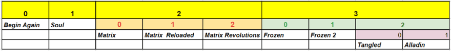

# Programiranje u skriptnim jezicima (PJS)

**Nositelj**: doc. dr. sc. Nikola Tanković  
**Asistenti**:

- Luka Blašković, univ. bacc. inf.
- Alesandro Žužić, univ. bacc. inf.

**Ustanova**: Sveučilište Jurja Dobrile u Puli, Fakultet informatike u Puli

</img>

# [4] Ugniježđene strukture i Napredne funkcije

[comment]: <> (Ažurirati sliku - logojs/js0.png)
</img>

<p style="float: clear">"Baratanje" ugniježđenim strukturama (<b><i>eng. nested structures</i></b>) je jedna od ključnih vještina u programiranju. Bilo to u obliku ugniježđenih petlji, objekata, funkcija, ili JSON objekata. Dohvat podataka s različitih API-eva, obrada podataka, ili pisanje algoritama, sve to zahtijeva dobro poznavanje ugniježđenih struktura. U ovoj skripti naučit ćete pisati ugniježđene strukture u JavaScriptu i naučiti koristiti napredne funkcije i operatore za jednostavniji rad s njima.</p>

<br>

## Sadržaj

<!-- TOC start (generated with https://github.com/derlin/bitdowntoc) -->

- [Programiranje u skriptnim jezicima (PJS)](#programiranje-u-skriptnim-jezicima-pjs)
- [\[4\] Ugniježđene strukture i Napredne funkcije](#4-ugniježđene-strukture-i-napredne-funkcije)
  - [Sadržaj](#sadržaj)
- [1. Uvod u ugniježđene strukture](#1-uvod-u-ugniježđene-strukture)
- [2. Ugniježđene strukture](#2-ugniježđene-strukture)
  - [2.1 Objekti unutar objekata](#21-objekti-unutar-objekata)
    - [2.1.1 Manipulacije podataka unutar ugniježđenih objekata](#211-manipulacije-podataka-unutar-ugniježđenih-objekata)
      - [Izmjena podataka unutar ugniježđenih objekata](#izmjena-podataka-unutar-ugniježđenih-objekata)
      - [Dodavanje novih podataka unutar ugniježđenih objekata](#dodavanje-novih-podataka-unutar-ugniježđenih-objekata)
      - [Brisanje podataka unutar ugniježđenih objekata](#brisanje-podataka-unutar-ugniježđenih-objekata)
  - [2.2 Polja unutar objekata](#22-polja-unutar-objekata)
    - [2.2.1 Iteracija kroz polje unutar objekata](#221-iteracija-kroz-polje-unutar-objekata)
  - [2.3 Objekti unutar polja](#23-objekti-unutar-polja)
    - [Vježba 1](#vježba-1)
    - [Vježba 2](#vježba-2)
  - [2.4 Polja unutar polja](#24-polja-unutar-polja)
    - [2.4.1 Iteracije kroz više dimenzija](#241-iteracije-kroz-više-dimenzija)
    - [2.4.2 Stvaranje višedimenzionalnih pomoću `Array` konstruktora](#242-stvaranje-višedimenzionalnih-pomoću-array-konstruktora)
    - [Vježba 3](#vježba-3)
  - [2.5 Sažetak ugiježđenih struktura](#25-sažetak-ugiježđenih-struktura)
- [Samostalni zadatak za vježbu 6](#samostalni-zadatak-za-vježbu-6)
- [3. Napredne funkcije](#3-napredne-funkcije)

<br>

# 1. Uvod u ugniježđene strukture

Do sad smo naučili da možemo ugniježđivati selekcije i petlje, pa i funkcije. U JavaScriptu međutim, kada pričamo o ugniježđenim strukturama, mislimo na razne složene strukture koje se pretežito sastoje od ugniježđenih objekata i polja. Prema tome, ugniježđene strukture možemo podijeliti u **4 kategorije**:

> 1.  **Objekti unutar objekata** `{{}}`
> 2.  **Polja unutar objekata** `{[]}`
> 3.  **Objekti unutar polja** `[{}]`
> 4.  **Polja unutar polja** `[[]]`

Prije nego odradimo navedene kategorije, prisjetimo se ugniježđenih selekcija, petlji i funkcija.
Primjer ugniježđene selekcije:

```javascript
if (zaposlen) {
  if (placa > 1500) {
    console.log("Kreditno sposoban!");
  } else {
    console.log("Ne diži kredit!");
  }
} else {
  console.log("Ne diži kredit nikako!");
}
```

Primjer ugniježđene petlje:

```javascript
for (let i = 0; i < 3; i++) {
  for (let j = 0; j < 6; j++) {
    console.log(`i je ${i}, a j je ${j}`);
  }
}
```

Rekli smo da možemo ugniježđivati i funkcije. Možda to nije nešto što ćemo često raditi, ali je moguće. Evo primjera:

```javascript
function prvaFunkcija() {
  console.log("Pozdrav iz prve funkcije!");
  function drugaFunkcija() {
    console.log("Pozdrav iz druge funkcije!");
  }
  drugaFunkcija();
}
prvaFunkcija();
```

Recimo da želimo pohraniti podatke o korisniku naše aplikacije: `ime`, `prezime`, `adresa` i `kontakt`.
Pod adresu želimo pohraniti `ulica`, `grad` i `poštanski broj`. Pod kontakt želimo pohraniti `telefon` i `email`.

Prvo ćemo sve pohraniti u jednostavan objekt **bez** ugniježđenih struktura:

```javascript
let korisnik = {
  ime: "Ivo",
  prezime: "Ivić",
  adresa: "Ulica 123, 52100 Pula",
  kontakt: "0911234567",
  email: "ivo@gmail.com",
};
```

Uočite zašto je ovakav zapis nezgrapan. Kako bi dohvatili ulicu, moramo koristiti `split` metodu. Isti problem predstavlja poštanski broj?

Idemo problem riješiti **ugniježđenim objektima**.

```javascript
let korisnik = {
  ime: "Ivo",
  prezime: "Ivić",
  adresa: {
    ulica: "Ulica 123",
    grad: "Pula",
    postanskiBroj: "52100",
  },
  kontakt: {
    telefon: "0911234567",
    email: "ivo@gmail.com",
  },
};
```

Sada možemo jednostavno dohvatiti ulicu, grad, poštanski broj, telefon i email, a naš kôd je pregledniji. Na jednaki način kako dohvaćamo atribute objekata, možemo dohvaćati i atribute ugniježđenih objekata, koristeći `.` operator.

```javascript
console.log(korisnik.adresa.ulica); // Ispisuje "Ulica 123"
console.log(korisnik.adresa.grad); // Ispisuje "Pula"
console.log(korisnik.adresa.postanskiBroj); // Ispisuje "52100"

console.log(korisnik.kontakt.telefon); // Ispisuje "0911234567"
console.log(korisnik.kontakt.email); // Ispisuje "ivo@gmail.com"
```

# 2. Ugniježđene strukture

## 2.1 Objekti unutar objekata

Često ćemo se u programiranju susretati s potrebom za pohranjivanjem složenih podataka i specifikacije nekakve hijerarhijske strukture. Primjerice, kako ćemo pohraniti podatke o korisniku? Korisnik ima ime, prezime, adresu i kontakt. Adresa se sastoji od ulice, grada i poštanskog broja. Kontakt se sastoji od telefona i emaila. Navedeno možemo postići s pomoću ugniježđenih objekata, tj. objekata unutar objekata.

Objekte "ugnježđujemo" tako da stvaramo **objekte unutar objekata**, doslovno. Sintaksa je sljedeća:

```javascript
let objekt1 = {
  svojstvo1: vrijednost1,
  svojstvo2: vrijednost2,
  objekt2: {
    svojstvo3: vrijednost3,
    svojstvo4: vrijednost4,
  },
  objekt3: {
    svojstvo5: vrijednost5,
    svojstvo6: vrijednost6,
  },
};
```

Već smo rekli da kod ugniježđenih objekata za dohvaćanje podataka koristimo već poznate operatore `.` ili `[]`. Primjer:

```javascript
console.log(objekt1.svojstvo1); // Ispisuje vrijednost1
console.log(objekt1.objekt2.svojstvo3); // Ispisuje vrijednost3
console.log(objekt1["objekt2"]["svojstvo3"]); // Ispisuje vrijednost3
```

Zamislimo da radimo backend aplikacije. Gotovo uvijek bit će nam potrebna autentifikacija za korisnika, poveznica na bazu podataka te nekakav server koji će služiti kao podloga našoj aplikaciji. Idemo definirati dummy konfiguracijski objekt za našu aplikaciju. Konfiguracijski objekt se često definira kao objekt u koji ćemo definirati neke postavke tj. parametre naše aplikacije. Primjer:

```javascript
let konfiguracija = {
  server: {
    host: "localhost",
    port: 8080,
  },
  bazaPodataka: {
    url: "mongodb://localhost:27017",
    ime: "mojaBaza",
  },
  sigurnost: {
    tip: "OAuth2",
    tajna: "tajniKljuc",
  },
};

console.log(konfiguracija.server.host); // Ispisuje "localhost
console.log(konfiguracija.bazaPodataka.url); // Ispisuje "mongodb://localhost:27017"
console.log(konfiguracija.sigurnost.tip); // Ispisuje "OAuth2"
```

Podobjekt može biti definiran i izvan objekta `konfiguracija`:

```javascript
let server = {
  // Podobjekt #1
  host: "localhost",
  port: 8080,
};

let bazaPodataka = {
  //Podobjekt #2
  url: "mongodb://localhost:27017",
  ime: "mojaBaza",
};

let sigurnost = {
  //Podobjekt #3
  tip: "OAuth2",
  tajna: "tajniKljuc",
};
// Glavni objekt
let konfiguracija = {
  server: server, // Podobjekt
  bazaPodataka: bazaPodataka, // Podobjekt
  sigurnost: sigurnost, // Podobjekt
};
```

Što ako ispišemo cijeli objekt `konfiguracija`? Rezultat ispisa će biti cijeli objekt, **uključujući i podobjekte**.

```javascript
console.log(konfiguracija); // Ispisuje: {server: {...}, bazaPodataka: {...}, sigurnost: {...}}
```

Detaljni ispis objekta `konfiguracija`:

```javascript
{
  bazaPodataka: {
        url: "mongodb://localhost:27017",
        ime: "mojaBaza"
    },
    server: {
        host: "localhost",
        port: 8080
    },
    sigurnost: {
        tip: "OAuth2",
        tajna: "tajniKljuc"
    }
}
```

### 2.1.1 Manipulacije podataka unutar ugniježđenih objekata

#### Izmjena podataka unutar ugniježđenih objekata

Kako mijenjati podatke unutar ugniježđenih objekata? Na primjer, kako promijeniti `host` servera u našem objektu `konfiguracija`? Na isti način kako dohvaćamo podatke iz ugniježđenih objekata, koristeći `.` operator ili notaciju uglatih zagrada `[]`.

```javascript
konfiguracija.server.host = "192.168.5.5";
console.log(konfiguracija.server.host); // Ispisuje "192.168.5.5"
```

Možemo koristiti i notaciju uglatih zagrada `[]`:

```javascript
konfiguracija["server"]["host"] = "192.168.5.5";
console.log(konfiguracija["server"]["host"]); // Ispisuje "192.168.5.5"
```

#### Dodavanje novih podataka unutar ugniježđenih objekata

Recimo da hoćemo dodati `protocol` podataka u naš objekt `server`. To radimo na isti način kao i kod dodavanja novih podataka u obične objekte.

```javascript
konfiguracija.server.protocol = "http";
console.log(konfiguracija.server.protocol); // Ispisuje "http"
```

Možemo i koristeći notaciju uglatih zagrada `[]`:

```javascript
konfiguracija.server["protocol"] = "http";
```

ili

```javascript
konfiguracija["server"]["protocol"] = "http";
```

Ima li smisla dodavati naknadno svojstva? Ako ne znamo unaprijed koja će svojstva biti potrebna, onda ima smisla. Ako znamo unaprijed, onda je bolje definirati sva svojstva odmah. Primjerice, ako znamo svojstva `server` konfiguracije, možemo odmah napisati:

```javascript
let konfiguracija = {
  server: {
    host: "localhost",
    port: 8080,
    protocol: "http",
  },
};
```

Ako ne znamo, imamo više opcija:

1. Možemo definirati prazan objekt i dodavati svojstva kako ih trebamo.

```javascript
let konfiguracija = {
  server: {},
};

konfiguracija.server.host = "localhost";
konfiguracija.server.port = 8080;
konfiguracija.server.protocol = "http";
```

2. Možemo napraviti isto, ali definirati i koja podsvojstva će imati `server` objekt.

```javascript
let konfiguracija = {
  server: {
    host: "", // Prazni string jer nagađamo da će biti string
    port: null, // Null jer nagađamo da će biti broj
    protocol: "", // Prazni string jer nagađamo da će biti string
  },
};

konfiguracija.server.host = "localhost";
konfiguracija.server.port = 8080;
konfiguracija.server.protocol = "http";
```

#### Brisanje podataka unutar ugniježđenih objekata

Kako obrisati podatke unutar ugniježđenih objekata? Na primjer, tj. kako obrisati `port` servera u našem objektu `konfiguracija`? Koristimo `delete` naredbu.

```javascript
delete konfiguracija.server.port; // vraća true
console.log(konfiguracija.server.port); // Ispisuje "undefined"
```

Naravno, objekte možemo i dublje ugnježđivati, koliko god želimo. U praksi, nećemo ići dublje od 3-4 razine ugnježđivanja, jer postaje nepraktično i teško za održavanje.

## 2.2 Polja unutar objekata

Zamislite da radite neku web trgovinu, morate na neki način pohranjivati podatke o kupcu i narudžbama. Podaci koje želimo pohraniti su: `ime`, `prezime`, `adresa`, `kontakt` i `narudžbe`. Pod adresa želimo pohraniti `ulica`, `grad` i `poštanski broj`. Pod kontakt želimo pohraniti `telefon` i `email`. Kako ćemo pohraniti narudžbe? Narudžba se sastoji od više podataka iste strukture (stavki/proizvoda), dakle moramo koristiti polja!

Prvo ćemo pohraniti osnovne podatke o kupcu:

```javascript
let kupac = {
  ime: "Ivo",
  prezime: "Ivić",
  adresa: "Ulica 123, 52100 Pula",
  kontakt: "0911234567",
  email: "iivic@gmail.com",
};
```

Ideja je da svojstva `adresa` i `kontakt` budu objekti.
Definirat ćemo i objekt `narudzbe` gdje ćemo pohraniti proizvode koje je kupac naručio i ukupnu cijenu narudžbe.

> Novi oblik ugniježđene strukture koji sad moramo koristiti jesu **polja unutar objekata**.

```javascript
let kupac = {
  ime: "Ivo",
  prezime: "Ivić",
  adresa: {
    ulica: "Ulica 123",
    grad: "Pula",
    postanskiBroj: "52100",
  },
  kontakt: {
    telefon: "0911234567",
    email: "iivic@gmail.com",
  },
  narudzbe: {
    proizvodi: ["Mobitel", "Slušalice", "Punjač"],
    ukupnaCijena: 1500,
  },
};
```

Koristili smo polje `proizvodi` unutar objekta `narudzbe` kako bismo pohranili proizvode koje je kupac naručio. Polje `proizvodi` je niz stringova. Kako dohvatiti proizvode koje je kupac naručio?

```javascript
console.log(kupac.narudzbe.proizvodi); // Ispisuje ["Mobitel", "Slušalice", "Punjač"]
```

Kako dohvatiti prvi proizvod iz niza proizvoda?

```javascript
console.log(kupac.narudzbe.proizvodi[0]); // Ispisuje "Mobitel"
```

### 2.2.1 Iteracija kroz polje unutar objekata

Kako iterirati kroz **polje unutar objekata**? Na primjer, kako ispisati sve proizvode koje je kupac naručio?
Možemo koristeći `for` petlju:

```javascript
for (let i = 0; i < kupac.narudzbe.proizvodi.length; i++) {
  console.log(kupac.narudzbe.proizvodi[i]); // Ispisuje svaki proizvod - "Mobitel", "Slušalice", "Punjač"
}
```

ili bolje, koristeći `for-of` petlju:

```javascript
for (let proizvod of kupac.narudzbe.proizvodi) {
  console.log(proizvod); // Ispisuje svaki proizvod - "Mobitel", "Slušalice", "Punjač"
}
```

Ovo je u redu, međutim naši proizvodi u narudžbi će u web trgovini uvijek sadržavati i cijenu i neku naručenu količinu. Kako ćemo to pohraniti? Možemo koristiti **objekte unutar polja**.

## 2.3 Objekti unutar polja

Nastavljamo s prethodnim primjerom. Recimo da je kupac naručio 3 proizvoda: `"Mobitel" 1 kom`, `"Slušalice" 1 kom` i `"Punjač" 2 kom`. Cijene proizvoda su `300`, `20` i `10` eur. Kako pohraniti proizvode?

Idemo proizvode pohraniti kao zasebne objekte, prvo izvan objekta `kupac`, a zatim ih dodati u objekt `kupac`.

```javascript
let proizvod_1 = {
  naziv: "Mobitel",
  kolicina: 1,
  cijena: 300,
};
let proizvod_2 = {
  naziv: "Slušalice",
  kolicina: 1,
  cijena: 20,
};
let proizvod_3 = {
  naziv: "Punjač",
  kolicina: 2,
  cijena: 10,
};
```

Sada ćemo dodati proizvode u objekt `kupac`:

```javascript
kupac.narudzbe.proizvodi.push(proizvod_1);
kupac.narudzbe.proizvodi.push(proizvod_2);
kupac.narudzbe.proizvodi.push(proizvod_3);
```

Objekt `kupac` sada izgleda ovako:

```javascript
let kupac = {
  ime: "Ivo",
  prezime: "Ivić",
  adresa: {
    ulica: "Ulica 123",
    grad: "Pula",
    postanskiBroj: "52100",
  },
  kontakt: {
    telefon: "0911234567",
    email: "iivic@gmail.com",
  },
  narudzbe: {
    proizvodi: [
      // U polje smo dodali objekte proizvoda
      {
        naziv: "Mobitel",
        kolicina: 1,
        cijena: 300,
      },
      {
        naziv: "Slušalice",
        kolicina: 1,
        cijena: 20,
      },
      {
        naziv: "Punjač",
        kolicina: 2,
        cijena: 10,
      },
    ],
    ukupnaCijena: 0,
  },
};
```

> Novi oblik ugniježđene strukture koji smo sad iskoristili jesu **objekti unutar polja**.

Idemo vidjeti kako sada dohvaćamo podatke. Polje `proizvodi` sadrži objekte, pa ćemo morati koristiti `.` operator za dohvaćanje svojstava objekata.

```javascript
console.log(kupac.narudzbe.proizvodi[0].naziv); // Ispisuje "Mobitel"
console.log(kupac.narudzbe.proizvodi[0].kolicina); // Ispisuje 1
console.log(kupac.narudzbe.proizvodi[0].cijena); // Ispisuje 300
```

Kako možemo iterirati kroz proizvode i ispisati ih? Možemo koristiti `for-of` petlju:
Pripazite, `proizvod` je sada objekt, pa ćemo morati koristiti `.` operator za dohvaćanje svojstava objekta.

```javascript
for (let proizvod of kupac.narudzbe.proizvodi) {
  console.log(proizvod.naziv); // Ispisuje naziv proizvoda
  console.log(proizvod.kolicina); // Ispisuje količinu proizvoda
  console.log(proizvod.cijena); // Ispisuje cijenu proizvoda
}
```

Kako izračunati ukupnu cijenu narudžbe? Iterirajmo kroz proizvode i zbrojimo cijene:

```javascript
let ukupnaCijena = 0;
for (let proizvod of kupac.narudzbe.proizvodi) {
  ukupnaCijena += proizvod.kolicina * proizvod.cijena;
}
kupac.narudzbe.ukupnaCijena = ukupnaCijena;
console.log(kupac.narudzbe.ukupnaCijena); // Ispisuje 340
```

Uočite glavni problem: Narudžbe su ustvari objekt (`narudzbe`), gdje se svaka narudžba sastoji od više proizvoda (polje objekata) i ukupne cijene.

- Što ako kupac ima više narudžbi? Gdje to dodajemo i kako?

Rješenje je da svaka narudžba bude zaseban objekt koje ćemo pohranjivati u tkz. **polje objekata**.

Dakle, do sada smo imali objekt `narduzbe` koji sadržava polje objekata `proizvodi`. Narudžbe su množina narudžbi, pa ima smisla da budu polje. Svaka narudžba sastoji se potencijano više stavki (proizvoda), pa ima smisla da svaka narudžba bude objekt.

Dakle, definirajmo jednu narudžbu kao objekt:

```javascript
let narudzba_1 = {
  stavke: [
    // Polje objekata
    {
      naziv: "Mobitel",
      kolicina: 1,
      cijena: 300,
    },
    {
      naziv: "Slušalice",
      kolicina: 1,
      cijena: 20,
    },
    {
      naziv: "Punjač",
      kolicina: 2,
      cijena: 10,
    },
  ],
  ukupnaCijena: 0,
};
```

Zašto ne bi zamijenili svojstvo za ukupnu cijenu s odgovarajućom metodom? Dodat ćemo metodu koja za svaku stavku (proizvod) računa ukupnu cijenu narudžbe.

```javascript
let narudzba_1 = {
  stavke: [
    // Polje objekata
    {
      naziv: "Mobitel",
      kolicina: 1,
      cijena: 300,
    },
    {
      naziv: "Slušalice",
      kolicina: 1,
      cijena: 20,
    },
    {
      naziv: "Punjač",
      kolicina: 2,
      cijena: 10,
    },
  ],
  ukupnaCijena: function () {
    // Vraća ukupnu cijenu narudžbe (340)
    let ukupnaCijena = 0;
    for (let stavka of this.stavke) {
      ukupnaCijena += stavka.kolicina * stavka.cijena;
    }
    return ukupnaCijena;
  },
  valuta: "eur", // Možemo dodati i valutu kao zasebno svojstvo
};
```

Sada ćemo svojstvo `narudzbe` iz objekta `kupac` pretvoriti u polje objekata i u njega dodati našu narudžbu - `narudzba_1`.

```javascript
let kupac = {
  ime: "Ivo",
  prezime: "Ivić",
  adresa: {
    // Objekt unutar objekta `kupac`
    ulica: "Ulica 123",
    grad: "Pula",
    postanskiBroj: "52100",
  },
  kontakt: {
    // Objekt unutar objekta `kupac`
    telefon: "0911234567",
    email: "iivic@gmail.com",
  },
  narudzbe: [
    // Polje objekata unutar objekta `kupac`
  ],
};
```

Kako sad dohvatiti ukupnu cijenu prve narudžbe našeg kupca?

```javascript
console.log(kupac.narudzbe[0].ukupnaCijena()); // 340
```

> Da rezimiramo, u ovom primjeru imali smo **objekt** `narudzbe` koji je postao **polje objekata** `narudzba`.
>
> Svaka narudžba je objekt koji sadržava **polje objekata** `stavke`.
>
> Dodatno, svaka `stavka` je objekt (ima svojstva `naziv`, `kolicina`, `cijena`). Svaka narudžba ima svoju ukupnu cijenu, koja je **metoda objekta** `narudzba`.

Konačno, naš objekt `kupac` sada izgleda ovako:

```javascript
let kupac = {
  ime: "Ivo",
  prezime: "Ivić",
  adresa: {
    ulica: "Ulica 123",
    grad: "Pula",
    postanskiBroj: "52100",
  },
  kontakt: {
    telefon: "0911234567",
    email: "iivic@gmail.com",
  },
  narudzbe: [
    {
      stavke: [
        {
          naziv: "Mobitel",
          kolicina: 1,
          cijena: 300,
        },
        {
          naziv: "Slušalice",
          kolicina: 1,
          cijena: 20,
        },
        {
          naziv: "Punjač",
          kolicina: 2,
          cijena: 10,
        },
      ],
      ukupnaCijena: function () {
        let ukupnaCijena = 0;
        for (let stavka of this.stavke) {
          ukupnaCijena += stavka.kolicina * stavka.cijena;
        }
        return ukupnaCijena;
      },
      valuta: "eur",
    },
  ],
};
```

<details>
  <summary>Objekt kupac - s komentarima</summary>

```javascript
// Glavni objekt
let kupac = {
  ime: "Ivo",
  prezime: "Ivić",
  // Objekt `adresa` unutar objekta `kupac`
  adresa: {
    ulica: "Ulica 123",
    grad: "Pula",
    postanskiBroj: "52100",
  },
  // Objekt `kontakt` unutar objekta `kupac`
  kontakt: {
    telefon: "0911234567",
    email: "iivic@gmail.com",
  },
  // Polje `narudzbe` unutar objekta `kupac`
  narudzbe: [
    // Objekt `narudzba_1` unutar polja `narudzbe`
    {
      // Polje `stavke` unutar objekta `narudzba_1`
      stavke: [
        // 3 objekta `proizvod` unutar polja `stavke`
        {
          naziv: "Mobitel",
          kolicina: 1,
          cijena: 300,
        },
        {
          naziv: "Slušalice",
          kolicina: 1,
          cijena: 20,
        },
        {
          naziv: "Punjač",
          kolicina: 2,
          cijena: 10,
        },
      ],
      // Metoda `ukupnaCijena` unutar objekta `narudzba_1`
      ukupnaCijena: function () {
        let ukupnaCijena = 0;
        for (let stavka of this.stavke) {
          ukupnaCijena += stavka.kolicina * stavka.cijena;
        }
        return ukupnaCijena;
      },
      valuta: "eur",
    },
  ],
};
```

</details>

### Vježba 1

**EduCoder šifra**: `Valli`

Kino Valli je kino u Puli na adresi Giardini 1, 52100 Pula. Kino ima jednu dvoranu kapaciteta 209 sjedećih mjesta i prikazuje filmove gotovo svaki dan. Svoj program prikazuje putem web-a: https://www.kinovalli.net/. Na web stranici možete pronaći Tjedni raspored filmova gdje se prikazuje koji filmovi se prikazuju u kojem terminu (datum i vrijeme). Isti film prikazuje se u više termina u tjednom rasporedu, a svaki film se dodatno sastoji od sekcije gdje se prikazuje naslov filma, trajanje, godina izlaska, kategorija/žanr, izvorno ime, period prikazivanja, IMDb link, kratki opis, režija te više fotografija.

Za rezervaciju karata potrebno je unijeti osobne podatke prilikom registracije: ime, prezime, adresa (ulica, grad) i kontakt (telefon, email). Također, potrebno je za određenu projekciju unijeti broj karata i odabrati sjedala, nakon čega se izračunava ukupna cijena rezervacije. Ovo realizirajte metodom `dodajRezervaciju()`.

Na temelju ugrubo danog opisa poslovnog procesa kina Valli, definirajte objekt `kinoValli` koji će sadržavati sve potrebne podatke za opisani poslovni proces. Za modeliranje ovog objekta koristite ugniježđene strukture objekata i polja.

Prvo definirajte objekte `film` koristeći sljedeće podatke:

> **Film 1:** INTERSTELLAR, 169 min, 2014. god, znanstvena fantastika, Interstellar, 01.10.2014. - 07.10.2014., https://www.imdb.com/title/tt0816692/, režija:
> Christopher Nolan, **Fotografije**: "https://www.kinovalli.net/Interstellar/fakePoveznicaSlika1", "https://www.kinovalli.net/Interstellar/fakePoveznicaSlika2",
> "https://www.kinovalli.net/Interstellar/fakePoveznicaSlika3", **Opis**: "Skupina astronauta putuje u svemir i ulazi u crvotočinu kako bi pronašla novi planet na koji bi se ljudi mogli naseliti."

> **Film 2:** DINA: DRUGI DIO, 166 min, 2023. god, znanstvena fantastika, Dune: Part Two, 29.2.2024. - 12.3.2024., https://www.imdb.com/title/tt15239678/, režija: Denis Villeneuve, **Fotografije**: "https://www.kinovalli.net/Dune2/fakePoveznicaSlika1", "https://www.kinovalli.net/Dune2/fakePoveznicaSlika2", "https://www.kinovalli.net/Dune2/fakePoveznicaSlika3", **Opis**: "Nove pustolovine Paula Atreidesa i Chani, kao i sudbine brojnih drugih likova iz svijeta temeljenog na romanima Franka Herberta."

Nakon toga definirajte objekt `kinoValli` koji će sadržavati sve potrebne podatke za opisani poslovni proces. Potrudite se da objekt bude što precizniji, **jedinstvenog rješenja nema**, ali pokušajte što bolje modelirati opisani poslovni proces.

Jednom kad definirate objekt i metodu `dodajRezervaciju()`, pozovite metodu `dodajRezervaciju()`.

```javascript
let kinoValli = {
  // Vaš kôd ovdje...
};

kinoValli.dodajRezervaciju(...);
```

### Vježba 2

**EduCoder šifra**: `rentaBoat`

Obrt `rentaBoat` bavi se iznajmljivanjem brodica i brodova za razne prigode. Njihova web stranica https://www.rentaboat.net/ glavni je kanal komunikacije s korisnicima. Na web stranici se nalazi ponuda brodova i brodica, gdje se prikazuje koji brodovi su dostupni za najam, u kojem terminu (datum i vrijeme) te cijena najma. Svaki brod/brodica ima svoje karakteristike: naziv, maksimalni kapacitet, tip, godina proizvodnje, maksimalna brzina, snaga motora u KS, dodatna oprema, dnevna cijena najma.

U dodatnu opremu mogu spadati: tuš, hladnjak, GPS, radio, kuhinja, WC, utičnice za struju, tenda, gumenjak, oprema za ribolov, ekosonder.
Tipovi brodica i brodova mogu uključivati: gliser, jahta, brodica za ribolov, gumenjak, jedrilica, brodica s kabinom, mala brodica bez kabine.

Korisnici se moraju registrirati i unijeti osobne podatke, te za registraciju odabrati željeni termin najma (datumi od/do), broj osoba, željenu dodatnu opremu te naravno samu brodicu. Nakon što korisnik unese sve podatke, izračunava se ukupna cijena najma i korisnika se obavještava o uspješnoj rezervaciji.

Na temelju ugrubo danog opisa poslovnog procesa obrta `rentaBoat`, definirajte objekt `rentaBoat` koji će sadržavati sve potrebne podatke za opisani poslovni proces. Za modeliranje ovog objekta koristite ugniježđene strukture objekata i polja.

Prvo definirajte 3 objekta `brod` koristeći sljedeće podatke:

> **Brod 1:** "Gliser", 2015. god, 20 čvorova, 150 KS, 6 osoba, "Tuš", "Hladnjak", "GPS", "Radio", "Tenda", "Oprema za ribolov", "Ekosonder", 250 eur/dan
>
> **Brod 2:** "Jahta", 2018. god, 35 čvorova, 300 KS, 8 osoba, "Tuš", "Hladnjak", "GPS", "Radio", "Kuhinja", "WC", "Utičnice za struju", "Tenda", "Gumenjak", 1000 eur/dan
>
> **Brod 3.** "Jedrilica", 2019. god, 12 čvorova, 50 KS, 4 osobe, "Tuš", "Hladnjak", "GPS", "Radio", "Kuhinja", "WC", "Utičnice za struju", "Gumenjak", "Oprema za ribolov" 300 eur/dan

Nakon toga definirajte objekt `rentaBoat` koji će sadržavati sve potrebne podatke za opisani poslovni proces. Potrudite se da objekt bude što precizniji, **jedinstvenog rješenja nema**, ali pokušajte što bolje modelirati opisani poslovni proces.

Jednom kad napravite objekt `rentaBoat`, definirajte metode `provjeriOpremu()`, `ukupnaCijena()` i `dodajRezervaciju()`. Ideja je da metoda `dodajRezervaciju()` poziva metode `provjeriOpremu()` i `ukupnaCijena()`. Na kraju pozovite metodu `dodajRezervaciju()`.

```javascript
let rentaBoat = {
  // Vaš kôd ovdje...
};
rentaBoat.dodajRezervaciju(...);
```

## 2.4 Polja unutar polja

Ugnježđena polja su polja definirana unutar drugih polja, još se nazivaju multidimenzionalnim poljima (eng. multidimensional arrays). U praksi, multidimenzionalna polja se koriste za pohranu podataka koji su međusobno povezani. Primjerice, ako imamo matricu, onda je to dvodimenzionalno polje.

Multidimenzionalna polja možemo definirati ugnježđivanjem polja definiranih uglatim zagradama `[]`.

Primjer jednodimenzionalnog polja:

```javascript
let = [1, 2, 3, 4, 5];
```

Primjer dvodimenzionalnog polja (2D matrica)

```javascript
let matrica = [
  [1, 2, 3], // Prvi redak
  [4, 5, 6], // Drugi redak
  [7, 8, 9], // Treći redak
];
```

U ovom primjeru imamo matricu dimenzija 3x3. Matrica ima 3 redaka i 3 stupca. Svaki redak je polje koje sadrži 3 elementa. Matrica je dvodimenzionalna jer ima dvije (2) dimenzionalnosti (redak i stupac).

Kako možemo dohvatiti elemente matrice? Koristimo indekse redaka i stupaca.

```javascript
console.log(matrica[0][0]); // Ispisuje 1 (prvi redak, prvi stupac)
console.log(matrica[1][1]); // Ispisuje 5 (drugi redak, drugi stupac)
console.log(matrica[2][0]); // Ispisuje 7 (treći redak, prvi stupac)
```

Možemo dohvatiti i samo cijeli redak matrice koristeći indeks redaka

```javascript
console.log(matrica[0]); // Ispisuje [1, 2, 3] (prvi redak)
console.log(matrica[1]); // Ispisuje [4, 5, 6] (drugi redak)
console.log(matrica[2]); // Ispisuje [7, 8, 9] (treći redak)
```

Modifikacije elemenata višedimenzionalnih polja rade se na isti način kao i kod jednodimenzionalnih polja.

```javascript
matrica[0][0] = 10; // Modificira prvi element matrice

console.log(matrica[0][0]); // Ispisuje 10

console.log(matrica); // Ispisuje [[10, 2, 3], [4, 5, 6], [7, 8, 9]]
```

**Matrice** se u programiranju reprezentiraju višedinimenzionalnim poljima. Ako se pokušate dosjetiti primjera gdje bi se mogli koristiti ovakvi zapisi, na prvu će vam višedimenzionalna polja možda izgledati komplicirano i nepotrebno, ali u praksi su vrlo korisna i često se koriste.

U računarstvu, matrice se koriste za:

- računalnu grafiku (slike, video, 3D modeli i sl.)
- strojno učenje i umjetnu inteligenciju
- modeliranje i simulacije
- kriptografiju
- teorija grafova
- obrada signala
- linearne transformacije

### 2.4.1 Iteracije kroz više dimenzija

Iteracije kroz više dimenzija rade se na isti način kao i kod jednodimenzionalnih polja, samo što koristimo više petlji - odnosno koristimo **ugniježđene petlje**.

Idemo definirati jednu matricu dimenzija 5x5.

```javascript
let matrica = [
  [10, 20, 45, 4, 3],
  [6, 7, 8, 18, 11],
  [30, 12, 70, 14, 5],
  [16, 22, 100, 19, 2],
  [18, 22, 23, 24, 266],
];

console.log(matrica); // [[10,20,45,4,3],[6,7,8,18,11],[30,12,70,14,5],[16,22,100,19,2],[18,22,23,24,266]]
```

Idemo iterirati kroz matricu i ispisati sve elemente.

```javascript
for (let i = 0; i < matrica.length; i++) {
  console.log(matrica[i]); // Ispisuje svaki redak matrice
  /*
                            [10, 20, 45, 4, 3]
                            [6, 7, 8, 18, 11]
                            [30, 12, 70, 14, 5]
                            [16, 22, 100, 19, 2]
                            [18, 22, 23, 24, 266]
  */
}
```

Kod iznad ispisuje 5 puta (5 elemenata), ne ispisuje svaki element matrice (25 elemenata).

Kako su rezultati ispisivanja redaka matrice polja, moramo iterirati ponovo kroz svaki element tih 5 polja.

```javascript
for (let i = 0; i < matrica.length; i++) {
  for (let j = 0; j < matrica[i].length; j++) {
    console.log(matrica[i][j]); // Ispisuje svaki element matrice
    //Ispisuje: 10, 20, 45, 4, 3, 6, 7, 8, 18, 11, 30, 12, 70, 14, 5, 16, 22, 100, 19, 2, 18, 22, 23, 24, 266
  }
}
```

Kako bismo definirali matricu dimenzija 3x3x3, koristimo 3 ugniježđene polje.

```javascript
let matrica3D = [
  [
    // Prvi sloj
    [1, 2, 3],
    [4, 5, 6],
    [7, 8, 9],
  ],
  [
    // Drugi sloj
    [10, 11, 12],
    [13, 14, 15],
    [16, 17, 18],
  ],
  [
    // Treći sloj
    [19, 20, 21],
    [22, 23, 24],
    [25, 26, 27],
  ],
];
```

Iteracija kroz 3D matricu:

```javascript
for (let i = 0; i < matrica3D.length; i++) {
  for (let j = 0; j < matrica3D[i].length; j++) {
    for (let k = 0; k < matrica3D[i][j].length; k++) {
      console.log(matrica3D[i][j][k]); // Ispisuje svaki element 3D matrice
    }
  }
}
```

3D matricama možemo reprezentirati razne stvari, npr. u području fizike i ineženjerstva možemo 3D matricom definirati tkz. **Stress tensor** (tenzor naprezanja) koji se koristi za opisivanje naprezanja u različitim točkama nekog tijela (Cauchy stress tensor).

U računalnoj grafici možemo 3D matricom definirati **voxel grid** gdje svaki element matrice predstavlja jedan voxel (3D piksel) koji sadrži informacije o boji, teksturi, materijalu i sl.

### 2.4.2 Stvaranje višedimenzionalnih pomoću `Array` konstruktora

U višedimenzionalna polja ne moraju biti pohranjeni samo brojevi (premda je to najčešće), već i bilo koji drugi tipovi podataka. U tom slučaju se višedimenzionalna polja više ne nazivaju matricama.

Npr, pohranimo u višedimenzionalno polje stringove.

```javascript
let filmovi = [
  "Begin Again",
  "Soul",
  ["Matrix", "Matix Reloaded", "Matrix Revolutions"], // polje (sadrži samo stringove)
  ["Frozen", "Frozen 2", ["Tangled", "Alladin"]], // 2D polje (jer sadrži stringove i još jedno polje)
];
```

Drugi način je korištenjem `Array` konstruktora.

```javascript
let filmovi = new Array();

filmovi[0] = "Begin Again";
filmovi[1] = "Soul";
filmovi[2] = new Array("Matrix", "Matrix Reloaded", "Matrix Revolutions"); // polje (sadrži samo stringove)
filmovi[3] = new Array("Frozen", "Frozen 2", new Array("Tangled", "Alladin")); // 2D polje (jer sadrži stringove i još jedno polje)
```

Dakle `filmovi[2]` predstavlja jednodimenzionalno polje s tri elementa (filmovi (string)), a `filmovi[3]` predstavlja dvodimenzionalno polje s tri elementa (**filmovi** (string) i polje s dva elementa (**filmovi** string)).

Kako se raspoređuju elementi u višedimenzionalnim poljima? Pogledamo ilustraciju:



> Izvor: https://dev.to/sanchithasr/understanding-nested-arrays-2hf7

Ako želimo dohvatiti film "Tangled" iz polja `filmovi`, koristimo indekse `[3][2][0]`.

```javascript
console.log(filmovi[3][2][0]); // Ispisuje "Tangled"
```

Ako želimo dohvatiti film "Matrix Reloaded" iz polja `filmovi`, koristimo indekse `[2][1]`.

```javascript
console.log(filmovi[2][1]); // Ispisuje "Matrix Reloaded"
```

Polje možemo "izravnati", odnosno svesti višedimenzionalno polje na jednodimenzionalno polje koristeći metodu `Array.flat()`.

Primjerice uzmimo više dimenzionalno polje koje želimo svesti na jednodimenzionalno polje (listu).

```javascript
const arr1 = [0, 1, 2, [3, 4]];

console.log(arr1.flat()); // [0, 1, 2, 3, 4]
```

Metoda `Array.flat()` smanjuje dubinu polja za jedan nivo. Ako želimo smanjiti dubinu polja za više nivoa, unosimo argument `depth`.

```javascript
const arr2 = [0, 1, 2, [3, 4, [5, 6]]];
console.log(arr2.flat()); // [0, 1, 2, 3, 4, [5, 6]]

// ali
console.log(arr2.flat(2)); // [0, 1, 2, 3, 4, 5, 6]
```

> Već smo spomenuli moguće primjene višedimenzionalnih polja te naglasili da se u pravilu koriste za pohranu numeričkih podataka, koji su međusobno povezani odnosno predstavljaju neku **vrstu višedimenzionalne strukture**.

Primjer filmova u praksi nije nešto što želite pohraniti u višedimenzionalno polje, jer se filmovi ne povezuju na način da se koriste višedimenzionalna polja.
Dohvaćanje filmova postaje nezgrapno (više-dimenzionalno indeksiranje), značajno se smanjuje čitljivost koda, a i održavanje postaje teže.

Primjer filmova možemo pohraniti koristeći ranije naučene ugniježđene strukture u kombinaciji s objektima:

Ovako nekako:

```javascript
let filmovi = {
  singleFilms: ["Begin Again", "Soul"],
  matrixSeries: ["Matrix", "Matrix Reloaded", "Matrix Revolutions"],
  disneyAnimations: {
    frozenSeries: ["Frozen", "Frozen 2"],
    classicTales: ["Tangled", "Alladin"],
  },
};
```

Sada možemo dohvatiti filmove na jednostavniji način:

```javascript
console.log(filmovi.disneyAnimations.classicTales[0]); // Ispisuje "Tangled"
console.log(filmovi.matrixSeries[1]); // Ispisuje "Matrix Reloaded"
```

### Vježba 3

**EduCoder šifra**: `matrix`

Definirajte dvodimenzionalno polje (matricu) dimenzija 3x3 koja će sadržavati random brojeve od `1` do `9`. Matricu morate "izgraditi" s pomoću ugniježđenih petlji, ne dopušta se ručno definiranje matrice. Implementirajte funkciju `randomNumbers()` koja vraća random broj između `1` i `9` koristeći `Math.random()` metodu.
Na kraju definirajte funkciju `ispisMatrice(matrix2D)` koja ispisuje sve elemente dvodimenzionalne matrice `matrix2D`.

## 2.5 Sažetak ugiježđenih struktura

Ugniježđene strukture su strukture koje se sastoje od više različitih struktura koje su međusobno povezane. U kontekstu ove skripte, one se odnose na ugniježđene objekte i polja. Ugniježđene strukture koje smo obradili su:

> 1.  **Objekti unutar objekata** `{{}}`
> 2.  **Polja unutar objekata** `{[]}`
> 3.  **Objekti unutar polja** `[{}]`
> 4.  **Polja unutar polja** `[[]]`

U kontekstu web programiranja, naučili smo da često koristimo prve 3 strukture: primjerice za modeliranje raznih entiteta iz stvarnog života. Međutim, višedimenzionalna polja odnosno polja unutar polja su korisna za pohranu drugih struktura podataka, npr. matrica, 3D modela, slika, videa, zvuka, tabličnih podataka i sl.

> 1. **Objekte unutar objekata** koristimo za modeliranje entiteta koji imaju svoje pod-entitete (npr. kupac s podentitetima adresa i kontakt). Kako adresa i kontakt sami po sebi nisu jasni entiteti, koristimo objekte kako bi ih razložili na detaljnije podatke.

```javascript
let kupac = {
  // Glavni objekt `kupac`
  ime: "Ivo",
  prezime: "Ivić",
  adresa: {
    // Podobjekt `adresa` unutar objekta `kupac`
    ulica: "Ulica 123",
    grad: "Pula",
    postanskiBroj: "52100",
  },
  kontakt: {
    // Podobjekt `kontakt` unutar objekta `kupac`
    telefon: "0911234567",
    email: "iivic@gmail.com",
  },
};
```

> 2. **Polja unutar objekata** koristimo za modeliranje entiteta koji imaju više podataka istog tipa (npr. kupac s više narudžbi). Kako narudžbe nisu jasni entiteti, modeliramo ih pomoću objekata kako bi ih razložili na detaljnije podatke, a potom te objekte pohranjujemo u polje.
> 3. Svaku stavku predstavljamo kao **Objekt unutar polja**

```javascript
let narudzbe = [
  {
    // Polje objekata `stavke` unutar objekta `narudzba`
    stavke: [
      {
        // Objekt `stavka` unutar polja `stavke`
        naziv: "Mobitel",
        kolicina: 1,
        cijena: 300,
      },
      {
        // Objekt `stavka` unutar polja `stavke`
        naziv: "Slušalice",
        kolicina: 1,
        cijena: 20,
      },
      {
        // Objekt `stavka` unutar polja `stavke`
        naziv: "Punjač",
        kolicina: 2,
        cijena: 10,
      },
    ],
    // Metoda unutar objekta `narudzba`
    ukupnaCijena: function () {
      let ukupnaCijena = 0;
      for (let stavka of this.stavke) {
        ukupnaCijena += stavka.kolicina * stavka.cijena;
      }
      return ukupnaCijena;
    },
  },
];
console.log(narudzbe[0].ukupnaCijena()); // 340

// Iteracija kroz polje objekata (stavke svake narudžbe)
for (let i = 0; i < narudzbe.length; i++) {
  for (let j = 0; j < narudzbe[i].stavke.length; j++) {
    console.log(narudzbe[i].stavke[j]); // Ispisuje svaku stavku narudžbe
  }
}
```

> 4. **Polja unutar polja** koristimo za modeliranje struktura podataka koje su međusobno povezane (npr. matrica, 3D modeli, slike, videa, zvuka, tablični podaci). U ovom slučaju, **svaki element polja je polje**.

```javascript
let matrica = [
  [10, 20, 45, 4, 3],
  [6, 7, 8, 18, 11],
  [30, 12, 70, 14, 5],
  [16, 22, 100, 19, 2],
  [18, 22, 23, 24, 266],
];
console.log(matrica[4][0]); // Ispisuje 18

// Iteracija kroz dvodimenzionalno polje (matricu)
for (let i = 0; i < matrica.length; i++) {
  for (let j = 0; j < matrica[i].length; j++) {
    console.log(matrica[i][j]); // Ispisuje svaki element matrice
  }
}
```

# Samostalni zadatak za vježbu 6

**EduCoder šifra**: `nestedStructures`

1. Definirajte objekt `student` koji će sadržavati podatke o studentu: ime, prezime, adresa (ulica, grad, poštanski broj), kontakt (telefon, email), ocjene (polje objekata `Ocjena`).

- definirajte konstruktor `Ocjena` koji se sastoji od 2 svojstva: `numerickaOcjena` i `opisnaOcjena`. Konstruktor se mora pozivati samo s argumentom numeričke ocjene, opisna ocjena dodjeljuje se ovisno o numeričkoj ocjeni (npr. 5 - "odličan", 4 - "vrlo dobar", 3 - "dobar", 2 - "dovoljan", 1 - "nedovoljan", default = "nevažeća ocjena"). Primjer poziva konstruktora: `new Ocjena(5)` - stvara objekt `{numerickaOcjena: 5, opisnaOcjena: "odličan"}`.
- Dodajte studentu nekoliko ocjena (npr. 5 ocjena) i izračunajte prosječnu ocjenu studenta zaokruženu na dvije decimale (dodajte metodu `prosjecnaOcjena()` u objekt student).

# 3. Napredne funkcije
