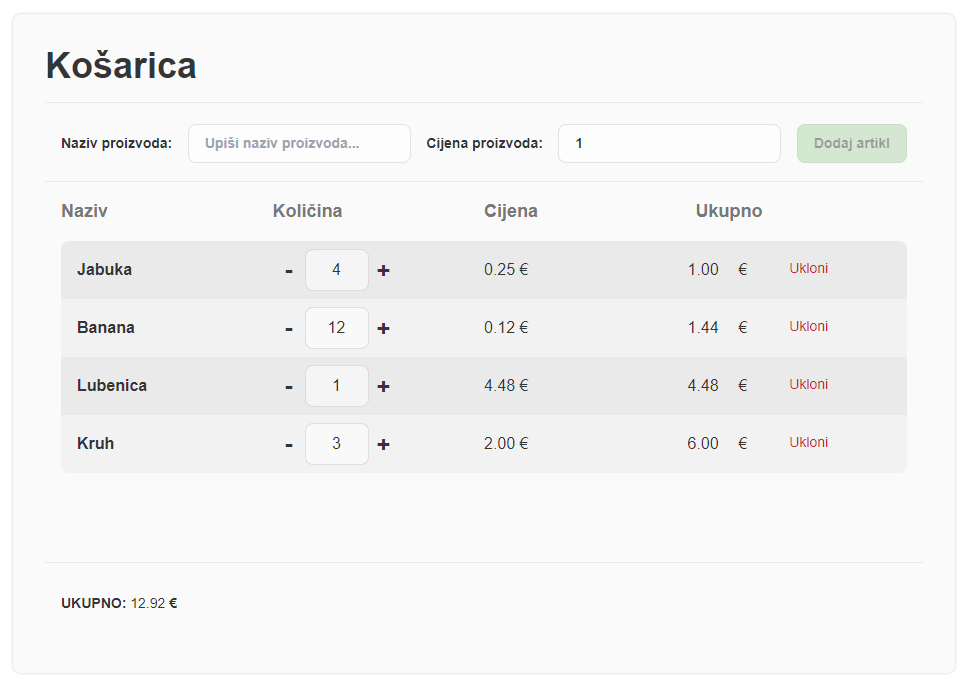

Izvrsno, krenimo s popunjavanjem dijelova tutorijala:

# 1. Uvod u DOM
Nakon stjecanja osnovnog razumijevanja JavaScript varijabli, funkcija, struktura i metoda, sada smo spremni za početak manipulacije Document Object Model (DOM)-om, što uključuje dinamičko upravljanje HTML elementima i njihovim CSS svojstvima.

## Osnovni DOM elementi

`Document` objekt je ključna komponenta u JavaScriptu koja predstavlja cijelu web stranicu u trenutnom pregledniku. On omogućava pristupanje i manipulaciju svim elementima na stranici, kao i njihovim svojstvima i sadržaju. Olakšava dinamičko upravljanje sadržajem stranice, što je ključno za stvaranje interaktivnih i responzivnih korisničkih iskustava.

Ono što do kraja ovog poglavlja želimo postići je napraviti jednostvani pregled artikla u košarici, dodavanje artikla/brisanje artikla i izračun ukupne cijene.




## Dohvaćanje DOM elemenata
Di bi uopće mogli raditi sa DOM elementima prvo ih trebamo dovatiti ako im želimo mjenjati atribute/svojstva i sam sadržaj i vrijednost.

Imamo zadan sljedeći HTML gdje želimo izvući vrijednosti iz pojedinih elemenata.
```html
<p id="mojID">Ja sam paragraf 1</p>
<input type="text" name="ime" id="form_ime" class="mojInput" value="Marko" />
<input type="text" name="prezime" id="form_prezime" class="mojInput" value="Marić" />
<p class="mojaKlasa">Ja sam paragraf 2</p>
<span class="mojaKlasa">Ja sam span</span>
<p>Ja sam paragraf 3</p>
```

Elementi se mogu dohvatiti na sljedeće načine:

| Metoda | Objašnjenje |	Sintaksa |	Primjer |
|--------|-------------|-------------|----------|
| `getElementById(x)` | Vraća prvi element po jedinstvenom ID-u. | `document.getElementById(x)` | `document.getElementById("mojID")`
| `getElementsByTagName(x)` | Vraća sve elemente po HTML tagu. | `document.getElementsByTagName(x)` | `document.getElementsByTagName("p")`
| `getElementsByClassName(x)` | Vraća sve elemente po klasi/klasama ili kombinaciji HTML taga i klase. | `document.getElementsByClassName(x)` | `document.getElementsByClassName("mojaKlasa")`
| `getElementsByName(x)` | Vraća sve elemente po imenu. | `document.getElementsByName(x)` | `document.getElementsByName("ime")`
| `querySelector(x)` | Vraća prvi element koji odgovara određenom selektoru ili grupi selektora. Ako nema pronađenih podudaranja, vraća null. | `document.querySelector(x)` | `document.querySelector("#mojID")`<br>`document.querySelector(".mojaKlasa")`<br>`document.querySelector("p")`<br>`document.querySelector("input[name='ime']")`
| `querySelectorAll(x)` | Vraća sve elemente koji odgovaraju određenom selektoru ili grupi selektora. Ako nema pronađenih podudaranja, vraća null. | `document.querySelectorAll(x)` |  `document.querySelectorAll("#mojID")`<br>`document.querySelectorAll(".mojaKlasa")`<br>`document.querySelectorAll("p")`<br>`document.querySelectorAll("input[name='ime']")`

```javascript
// Dohvaćanje DOM elementa po ID-u
const mojDiv = document.getElementById('mojID');
console.log("Dohvaćen po ID-u: " + mojDiv.innerHTML);

// Dohvaćanje DOM elemenata po tagu
const paragrafi = document.getElementsByTagName('p');
for (let paragraf of paragrafi){
    console.log("Dohvaćen po tagu: " + paragraf.innerHTML);
}

// Dohvaćanje DOM elemenata po klasi
const sveKlase = document.getElementsByClassName('mojaKlasa');
for (let klasa of sveKlase){
    console.log("Dohvaćen po klasi: " + klasa.innerHTML);
}

// Dohvaćanje DOM elemenata po imenu
const svaImena = document.getElementsByName('ime');
for (let ime of svaImena){
    console.log("Dohvaćen po imenu: " + ime.value);
}

// Dohvaćanje DOM elemenata koristeći querySelector
const query1 = document.querySelector('#form_prezime');
console.log("Dohvaćen koristeći querySelector: " + query1.value);
const query2 = document.querySelector('span');
console.log("Dohvaćen koristeći querySelector: " + query2.innerHTML);
const query3 = document.querySelector('.mojaKlasa');
console.log("Dohvaćen koristeći querySelector: " + query3.innerHTML);
const query4 = document.querySelector("input[name='ime']");
console.log("Dohvaćen koristeći querySelector: " + query4.value);

// Dohvaćanje DOM elemenata koristeći querySelectorAll
const queryAll = document.querySelectorAll('p');
for (let query of queryAll){
    console.log("Dohvaćen koristeći querySelectorAll: " + query.innerHTML);
}
```

> Kod `querySelector` uvijek prvo pretražuje po tagu, za pretraživanje po id-u treba koristiti `#`, za pretraživanje po klasi treba koristiti `.`, za pretraživanje po imenu ili drugim atributima prvo treba staviti ime taga pa unutar uglatih zagrada pretragu`[atribut = vrijednost]`

### Primjer 1.
Za zadani HTML kod, treba dohvatiti `<input>` s vrijednošću **Točno**.
```HTML
<div class="moja-forma glavni2">
    <span name="ime">KRIVO</span>
    <span name="prezime">KRIVO</span>
</div>
<span class="moja-forma glavni">
    <span name="ime">KRIVO</span>
    <span name="prezime">KRIVO</span>
</span>
<div class="moja-forma glavni">
    <span name="prezime">KRIVO</span>
    <span name="ime">TOČNO</span>
    <i name="ime">KRIVO</i>
</div>
<div class="druga-forma glavni">
    <span name="prezime">KRIVO</span>
    <span name="ime">KRIVO</span>
</div>
```
Treba dohvatiti prvi `<span>` element s imenom "*ime*" (`<span name="ime"/>`) koji se nalazi unutar `<div>` elementa čija je klasa "*moja-forma glavni*" (`<div class="moja-forma glavni">`)."

Riješenje:
```javascript
const query = document.querySelector("div.moja-forma.glavni span[name='ime']");
console.log(query.innerHTML) 
```

## Svojstva elementa
U prethodnom

## Dodavanje i brisanje DOM elemenata

Dodavanje i brisanje elemenata omogućuje dinamičko mijenjanje stranice na temelju korisničkih akcija ili događaja.

```html
<!DOCTYPE html>
<html lang="en">
<head>
    <meta charset="UTF-8">
    <meta name="viewport" content="width=device-width, initial-scale=1.0">
    <title>Document</title>
</head>
<body>
    <div id="mojDiv">
        <p>Ovo je moj div.</p>
    </div>

    <button onclick="dodajElement()">Dodaj novi paragraf</button>
    <button onclick="obrisiElement()">Obriši paragraf</button>

    <script>
        function dodajElement() {
            const noviParagraf = document.createElement('p');
            noviParagraf.textContent = 'Novi paragraf dodan dinamički!';
            document.body.appendChild(noviParagraf);
        }

        function obrisiElement() {
            const paragrafi = document.getElementsByTagName('p');
            if (paragrafi.length > 0) {
                const zadnjiParagraf = paragrafi[paragrafi.length - 1];
                zadnjiParagraf.remove();
            }
        }
    </script>
</body>
</html>
```

## Manipulacija DOM elementima

Manipulacija DOM elementima omogućuje promjenu sadržaja, stilova i atributa elemenata na stranici.

```html
<!DOCTYPE html>
<html lang="en">
<head>
    <meta charset="UTF-8">
    <meta name="viewport" content="width=device-width, initial-scale=1.0">
    <title>Document</title>
</head>
<body>
    <div id="mojDiv">
        <p>Ovo je moj div.</p>
    </div>

    <button onclick="promijeniStil()">Promijeni stil</button>

    <script>
        function promijeniStil() {
            const mojDiv = document.getElementById('mojDiv');
            mojDiv.style.backgroundColor = 'lightblue';
            mojDiv.style.padding = '10px';
        }
    </script>
</body>
</html>
```

## DOM events

DOM događaji omogućuju JavaScriptu da reagira na korisničke akcije kao što su klikovi, unos teksta ili pokretanje mišem.

```html
<!DOCTYPE html>
<html lang="en">
<head>
    <meta charset="UTF-8">
    <meta name="viewport" content="width=device-width, initial-scale=1.0">
    <title>Document</title>
</head>
<body>
    <button id="mojButton">Klikni me</button>

    <script>
        const mojButton = document.getElementById('mojButton');

        mojButton.addEventListener('click', function() {
            alert('Kliknuli ste na gumb!');
        });
    </script>
</body>
</html>
```