# Programiranje u skriptnim jezicima

**Nositelj**: doc. dr. sc. Nikola Tanković  
**Asistenti**:

- Luka Blašković, univ. bacc. inf.
- Alesandro Žužić, univ. bacc. inf.

**Ustanova**: Sveučilište Jurja Dobrile u Puli, Fakultet informatike u Puli

</img>

# [5] DOM, JSON i Asinkrono programiranje


</img>

<p style="float: clear">Prilikom izrade web aplikacija i stranica, često ćete na neki način manipulirati strukturom dokumenata i njihovim sadržajem. U ovom poglavlju upoznat ćemo se s Document Object Model (DOM) standardom, koji predstavlja aplikacijsko programsko sučelje (API) za kontrolu HTML-a koristeći Document objekt. Važno je razumjeti kako funkcionira DOM budući da se svi poznati JavaScript razvojni okviri temelje na njemu (React, VUE, Angular, jQuery...). Dodatno, upoznat ćemo se s JSON formatom (JavaScript Object Notation) koji se koristi za razmjenu podataka između klijenta i servera te predstavlja jedan od najčešćih, ako ne i najčešće korišteni format za razmjenu podataka. Za sam kraj ćemo proći asinkrono programiranje i time postaviti dobre temelje za uvod u svijet programskog inženjerstva i razvoja web aplikacija.</p>

## Sadržaj

- [Programiranje u skriptnim jezicima](#programiranje-u-skriptnim-jezicima)
- [\[5\] DOM, JSON i Asinkrono programiranje](#5-dom-json-i-asinkrono-programiranje)
  - [Sadržaj](#sadržaj)
- [0. Ponavljanje HTML-a i CSS-a](#0-ponavljanje-html-a-i-css-a)
    - [Primjer upotrebe `id` atributa:](#primjer-upotrebe-id-atributa)
    - [Primjer upotrebe `class` atributa:](#primjer-upotrebe-class-atributa)
    - [Primjer kombiniranja `id` i `class` atributa:](#primjer-kombiniranja-id-i-class-atributa)
    - [CSS (Cascading Style Sheets)](#css-cascading-style-sheets)
- [1. DOM manipulacija](#1-dom-manipulacija)
  - [1.1 Osnovni DOM element](#11-osnovni-dom-element)
  - [1.2 Dohvaćanje DOM elemenata](#12-dohvaćanje-dom-elemenata)
    - [Primjer 1. - dohvaćanje elemenata](#primjer-1---dohvaćanje-elemenata)
  - [1.3 Svojstva DOM elemenata](#13-svojstva-dom-elemenata)
    - [Primjer 2 - Pristupanje sadržaju, `id`-u, `tag`-u, atributima i klasama elementa](#primjer-2---pristupanje-sadržaju-id-u-tag-u-atributima-i-klasama-elementa)
    - [Vježba 1](#vježba-1)
    - [Primjer 3 - Manipulacija klasama](#primjer-3---manipulacija-klasama)
    - [Vježba 2](#vježba-2)
    - [Primjer 4 - Dohvaćanje `child` i `sibling` elemenata.](#primjer-4---dohvaćanje-child-i-sibling-elemenata)
    - [Vježba 3](#vježba-3)
  - [1.4 Dodavanje i brisanje DOM elemenata](#14-dodavanje-i-brisanje-dom-elemenata)
    - [Primjer 5 - kreiranje, dodavanje, brisanje i mjenjanje elemenata](#primjer-5---kreiranje-dodavanje-brisanje-i-mjenjanje-elemenata)
    - [Vježba 4](#vježba-4)
  - [1.4 DOM events](#14-dom-events)
    - [Primjer 6 - `click` event](#primjer-6---click-event)
    - [Vježba 5](#vježba-5)
    - [Primjer 7 - `focus` events](#primjer-7---focus-events)
    - [Vježba 6](#vježba-6)
    - [Primjer 8 - `mouse` events](#primjer-8---mouse-events)
    - [Vježba 7](#vježba-7)
    - [Primjer 9 - `input` event](#primjer-9---input-event)
    - [Vježba 8](#vježba-8)
- [Samostalni zadatak za vježbu 8](#samostalni-zadatak-za-vježbu-8)


<br>

# 0. Ponavljanje HTML-a i CSS-a
U ovoj sekciji ćemo se osvrnuti na osnove HTML-a i CSS-a. **HTML** (HyperText Markup Language) je markup jezik za označavanje struktura web stranica, dok je CSS (Cascading Style Sheets) jezik za stilizaciju tih struktura. Kombinacija ova dva jezika omogućuje nam da oblikujemo i prikažemo sadržaj web stranica na željeni način.

>**HTML (HyperText Markup Language)**

**HTML** je markup jezik (***eng. [markup language](https://en.wikipedia.org/wiki/Markup_language#:~:text=July%202023content%20to%20facilitate%20automated%20processing.)***) koji se koristi za strukturiranje sadržaja web stranica. Sastoji se od HTML elemenata koji se koriste za označavanje dijelova sadržaja. Svaki HTML element sastoji se od otvarajuće oznake (***eng. start tag***), sadržaja elementa (***eng. content***) i zatvarajuće oznake (***eng. end tag***).

```html
<head>
    <title>Moja web stranica</title>
</head>

<body>
    <header>
        <h1>Naslov</h1>
        <nav>
            <ul>
                <li><a href="#">Početna</a></li>
                <li><a href="#">O nama</a></li>
                <li><a href="#">Kontakt</a></li>
            </ul>
        </nav>
    </header>

    <main>
        <article>
            <h2>Članak 1</h2>
            <p>Ovo je prvi članak.</p>
        </article>

        <article>
            <h2>Članak 2</h2>
            <p>Ovo je drugi članak.</p>
        </article>
    </main>

    <footer>
        <p>&copy; 2022 Web Stranica</p>
    </footer>
</body>
```
Osnovna struktura HTML dokumenta često se može podijeliti na `head` i `body` dijelove. `head` dio obično sadrži meta informacije o dokumentu, kao što su naslov stranice, veze prema CSS datotekama, skripte itd. `body` dio sadrži glavni sadržaj stranice, poput zaglavlja (**header**), navigacije (**nav**), članaka (**article**) i podnožja (**footer**). 

>Treba napomenuti da je dolaskom HTML5 standarda uvedeno mnogo novih elemenata i atributa koji omogućuju bolje semantičko označavanje sadržaja web stranica. Semantičko označavanje je važno jer pomaže tražilicama i drugim alatima da bolje razumiju strukturu i značenje sadržaja na web stranici. Svakako je moguće gotovo sve elemente stilizirati pomoću CSS-a i svesti na `div` i `span` elemente, ali korištenje semantičkih elemenata poboljšava pristupačnost i [SEO](https://developers.google.com/search/docs/fundamentals/seo-starter-guide#:~:text=SEO%E2%80%94short%20for%20search%20engine,site%20through%20a%20search%20engine.) (Search Engine Optimization) web stranice.

U najnovijem HTML standardu za vrijeme pisanja ove skripte (svibanj 2024), postoji 142 HTML elementa. U tablici ispod prikazani su neki od najčešće korištenih HTML elemenata, zajedno s njihovim opisima, atributima i primjerima korištenja. Svakako provjerite i [HTML5 specifikaciju](https://www.spiceworks.com/tech/tech-general/articles/what-is-html-five/).

| Naziv elementa | Opis | Atributi | Primjer |
|----------------|------|----------|---------|
| `<html>`       | Korijenski element HTML dokumenta | `lang` | `<html lang="en"> ... </html>` |
| `<head>`       | Sadrži meta-informacije o dokumentu | - | `<head> ... </head>` |
| `<title>`      | Naslov dokumenta, prikazan u naslovnoj traci preglednika | - | `<title>Naslov stranice</title>` |
| `<meta>`       | Definira metapodatke o HTML dokumentu | `charset`, `name`, `content`, `http-equiv` | `<meta charset="UTF-8">` |
| `<link>`       | Povezuje vanjske resurse, poput CSS datoteka | `rel`, `href`, `type` | `<link rel="stylesheet" href="style.css">` |
| `<style>`      | Sadrži CSS stilove za dokument | `type` | `<style> body { background-color: lightblue; } </style>` |
| `<script>`     | Sadrži ili povezuje JavaScript kod | `src`, `type` | `<script src="script.js"></script>` |
| `<body>`       | Glavni sadržaj HTML dokumenta | - | `<body> ... </body>` |
| `<h1>` do `<h6>` | Naslovi različitih razina | - | `<h1>Naslov 1</h1>` |
| `<p>`          | Paragraf teksta | - | `<p>Ovo je paragraf.</p>` |
| `<a>`          | Hiperlink (poveznica) | `href`, `target` | `<a href="https://example.com">Link</a>` |
| ``        | Ugrađena slika | `src`, `alt`, `width`, `height` | `` |
| `<ul>`         | Neuređena lista (bez numeriranja) | - | `<ul><li>Prva stavka</li><li>Druga stavka</li></ul>` |
| `<ol>`         | Uređena lista (numerirana) | - | `<ol><li>Prva stavka numerirano</li><li>Druga stavka numerirano</li></ol>` |
| `<li>`         | Stavka liste | - | `<li>Stavka</li>` |
| `<table>`      | Tablica | - | `<table> ... </table>` |
| `<tr>`         | Redak u tablici | - | `<tr> ... </tr>` |
| `<td>`         | Ćelija u tablici | `colspan`, `rowspan` | `<td colspan="2">Ćelija</td>` |
| `<th>`         | Zaglavlje ćelije u tablici | `colspan`, `rowspan`, `scope` | `<th scope="col">Zaglavlje</th>` |
| `<form>`       | Forma za unos podataka | `action`, `method` | `<form action="/submit" method="post"> ... </form>` |
| `<input>`      | Unos podataka | `type`, `name`, `value`, `placeholder` | `<input type="text" name="ime" placeholder="Unesite ime">` |
| `<button>`     | Gumb | `type` | `<button type="submit">Pošalji</button>` |
| `<div>`        | [Block element](https://www.w3schools.com/html/html_blocks.asp#:~:text=A%20block%2Dlevel%20element%20always,p%3E%20and%20.) za grupiranje sadržaja | - | `<div> ... </div>` |
| `<span>`       | [Inline element](https://www.w3schools.com/html/html_blocks.asp#:~:text=A%20block%2Dlevel%20element%20always,p%3E%20and%20.) za grupiranje sadržaja | - | `<span> ... </span>` |
| `<br>`         | Prelom linije | - | `Tekst<br>Prelomljena linija` |
| `<hr>`         | Horizontalna linija | - | `<hr>` |
| `<b>`          | Podebljani tekst | - | `<b>Podebljano</b>` |
| `<i>`          | Kurziv tekst | - | `<i>Kurziv</i>` |
| `<u>`          | Podvučeni tekst | - | `<u>Podvučeno</u>` |

### Primjer upotrebe `id` atributa:
Atribut `id` koristi se za jedinstveno identificiranje gotovo bilo kojeg HTML elementa na stranici. `id` atribut mora biti **jedinstven unutar cijelog dokumenta**. 

Sintaksa: `<tag id="jedinstveniID">`.

```html
<style>
    #jedinstveniElement {
        color: blue;
        font-size: 20px;
    }
</style>
<body>
    <p id="jedinstveniElement">Ovo je paragraf s jedinstvenim ID atributom.</p>
</body>
</html>
```

### Primjer upotrebe `class` atributa:
Atribut `class` koristi se za grupiranje više elemenata koji dijele iste stilove ili ponašanje. Elementi mogu imati **više klasa odvojenih razmakom**. 

Sintaksa: `<p class="klasa1 klasa2 klasa3 klasaN...">`.

```html
<style>
    .crveniTekst {
        color: red;
    }
    .velikiTekst {
        font-size: 24px;
    }
</style>
<body>
    <p class="crveniTekst">Ovo je paragraf s crvenim tekstom.</p>
    <p class="velikiTekst">Ovo je paragraf s velikim tekstom.</p>
    <p class="crveniTekst velikiTekst">Ovo je paragraf s crvenim i velikim tekstom.</p>
</body>
</html>
```

### Primjer kombiniranja `id` i `class` atributa:
U ovom primjeru koristimo oba atributa kako bismo jedinstveno identificirali jedan element, dok ostala dva grupiramo pomoću klase `podnaslov`.

```html
<style>
    #glavniNaslov {
        color: green;
        font-size: 28px;
    }
    .podnaslov {
        color: gray;
        font-size: 18px;
    }
</style>
<body>
    <h1 id="glavniNaslov">Ovo je glavni naslov s ID atributom.</h1>
    <h2 class="podnaslov">Ovo je podnaslov s class atributom.</h2>
    <h2 class="podnaslov">Ovo je još jedan podnaslov s class atributom.</h2>
</body>
```
### CSS (Cascading Style Sheets)
**CSS** je jezik za stilizaciju HTML elemenata. Omogućuje nam definiranje izgleda i rasporeda elemenata na web stranici. CSS pravila sastoje se od selektora (***[eng. selectors](https://www.w3schools.com/cssref/css_selectors.php)***) i deklaracija svojstava ([***eng. declarations***](https://www.w3schools.com/css/css_syntax.ASP)). 

Sljedeća tablica pokriva osnovna CSS svojstva:

| Naziv svojstva | Opis | Vrijednosti | Primjer |
|----------------|------|-------------|---------|
| `color`        | Boja teksta | Naziv boje, heksadecimalna, RGB, RGBA, HSL, HSLA | `color: red;` |
| `background-color` | Boja pozadine | Naziv boje, heksadecimalna, RGB, RGBA, HSL, HSLA | `background-color: #f4f4f4;` |
| `background-image` | Slika pozadine | URL slike | `background-image: url('slika.jpg');` |
| `background-size` | Veličina slike pozadine | cover, contain, px, % | `background-size: cover;` |
| `font-size`    | Veličina fonta | px, em, rem, %, vw, vh | `font-size: 16px;` |
| `font-family`  | Obitelj fonta | Naziv fonta, lista fontova | `font-family: Arial, sans-serif;` |
| `font-weight`  | Debljina fonta | normal, bold, bolder, lighter, 100-900 | `font-weight: bold;` |
| `text-align`   | Poravnanje teksta | left, right, center, justify | `text-align: center;` |
| `margin`       | Vanjski razmak | px, em, %, auto | `margin: 10px;` |
| `padding`      | Unutarnji razmak | px, em, %, auto | `padding: 10px;` |
| `border`       | Obrub elementa | širina tip stil boje | `border: 1px solid #ccc;` |
| `border-radius` | Zaobljenost rubova | px, %, em | `border-radius: 5px;` |
| `width`        | Širina elementa | px, em, %, vw | `width: 100%;` |
| `height`       | Visina elementa | px, em, %, vh | `height: 50px;` |
| `display`      | Način prikaza | block, inline, inline-block, flex, grid, none | `display: block;` |
| `position`     | Pozicioniranje elementa | static, relative, absolute, fixed, sticky | `position: absolute;` |
| `top`, `right`, `bottom`, `left` | Pozicija elementa | px, %, em | `top: 10px;` |
| `overflow`     | Upravljanje preljevom sadržaja | visible, hidden, scroll, auto | `overflow: hidden;` |
| `z-index`      | Redoslijed prikazivanja elemenata | brojčana vrijednost | `z-index: 10;` |
| `opacity`      | Prozirnost elementa | vrijednost od 0 do 1 | `opacity: 0.5;` |
| `box-shadow`   | Sjenka okvira | x-offset y-offset blur-radius spread-radius boja | `box-shadow: 0 4px 8px rgba(0,0,0,0.1);` |
| `text-shadow`  | Sjenka teksta | x-offset y-offset blur-radius boja | `text-shadow: 1px 1px 2px black;` |
| `flex-direction` | Smjer fleksibilnog kontejnera | row, row-reverse, column, column-reverse | `flex-direction: row;` |
| `justify-content` | Poravnanje stavki duž glavne osi | flex-start, flex-end, center, space-between, space-around | `justify-content: center;` |
| `align-items`  | Poravnanje stavki duž poprečne osi | flex-start, flex-end, center, baseline, stretch | `align-items: center;` |
| `transition`   | Definira glatku animaciju prijelaza između različitih stilova | svojstvo, trajanje, kašnjenje, funkcija | `transition: width 0.3s ease-in-out;` |

Postoje i CSS pseudo-klase (***[Pseudo-classes](https://www.w3schools.com/css/css_pseudo_classes.asp)***) kao što su `:hover`, `:active`, `:focus` i druge koje se mogu nadodati na CSS klase. Mogu se koristiti za primjenu stilova na elemente u određenim stanjima ili uvjetima.

Tablica prikazuje neke od najčešće korištenih CSS pseudo-klasa:

| Pseudo-klasa | Opis | Primjer |
|--------------|------|---------|
| `:hover`     | Primjenjuje stil kada korisnik prelazi mišem preko elementa. | ```css a:hover { color: blue; } ``` |
| `:active`    | Primjenjuje stil kada je element aktiviran (npr. kliknut). | ```css button:active { background-color: green; } ``` |
| `:focus`     | Primjenjuje stil kada je element u fokusu (npr. odabran tipkovnicom). | ```css input:focus { border-color: red; } ``` |
| `:visited`   | Primjenjuje stil na posjećene linkove. | ```css a:visited { color: purple; } ``` |
| `:link`      | Primjenjuje stil na neposjećene linkove. | ```css a:link { color: blue; } ``` |
| `:first-child` | Primjenjuje stil na prvi dijete elementa. | ```css p:first-child { font-weight: bold; } ``` |
| `:last-child` | Primjenjuje stil na zadnji dijete elementa. | ```css p:last-child { font-style: italic; } ``` |
| `:nth-child(n)` | Primjenjuje stil na n-ti dijete elementa. | ```css li:nth-child(2) { color: red; } ``` |
| `:not(selector)` | Primjenjuje stil na sve elemente koji ne odgovaraju zadanom selektoru. | ```css p:not(.highlight) { color: grey; } ``` |
| `:checked`   | Primjenjuje stil na odabrane (checked) elemente kao što su checkbox ili radio button. | ```css input:checked { background-color: yellow; } ``` |
| `:disabled`  | Primjenjuje stil na onemogućene (disabled) elemente. | ```css input:disabled { background-color: lightgrey; } ``` |
| `:enabled`   | Primjenjuje stil na omogućene (enabled) elemente. | ```css input:enabled { background-color: white; } ``` |
| `:empty`     | Primjenjuje stil na elemente koji nemaju djece (prazne elemente). | ```css div:empty { display: none; } ``` |

# 1. DOM manipulacija
Nakon stjecanja osnovnog razumijevanja JavaScript varijabli, funkcija, struktura i metoda, sada smo spremni za početak manipulacije **Document Object Model**, odnosno DOM-om, što uključuje dinamičko upravljanje HTML elementima i njihovim CSS svojstvima.

**Document Object Model (DOM)** je standard koji definira strukturu i način pristupa HTML dokumentima. DOM predstavlja HTML dokument kao stablo objekata, gdje svaki HTML element predstavlja objekt, a svaki atribut i sadržaj elementa predstavlja svojstvo tog objekta.

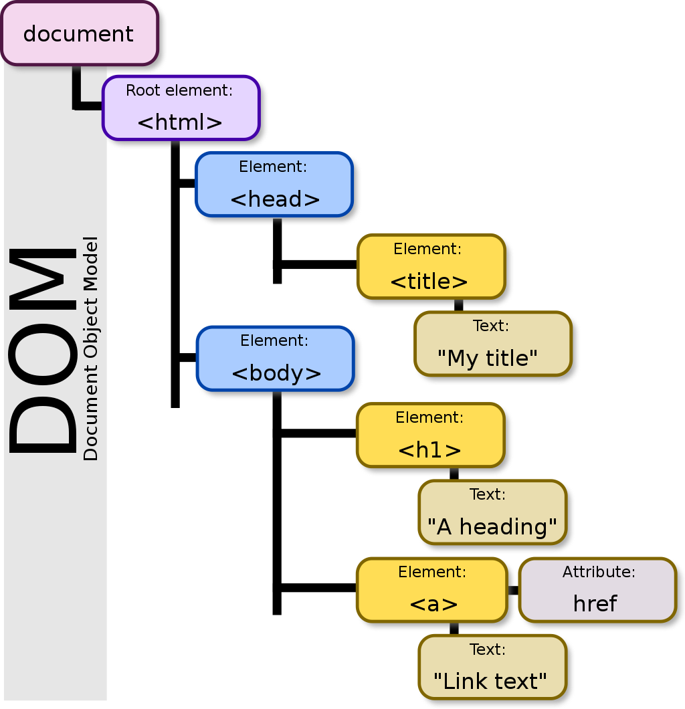</img> 
> Izvor: https://en.wikipedia.org/wiki/Document_Object_Model

## 1.1 Osnovni DOM element

`Document` objekt je ključna komponenta u JavaScriptu koja predstavlja cijelu web stranicu u trenutnom pregledniku. On omogućava pristupanje i manipulaciju svim elementima na stranici, kao i njihovim svojstvima i sadržaju. Olakšava dinamičko upravljanje sadržajem stranice, što je ključno za stvaranje interaktivnih i responzivnih korisničkih iskustava.

Možemo ga zamisliti kao korijenski čvor HTML dokumenta (slika iznad).

`document` objekt možemo referencirati direktno ili preko `window` objekta.

```javascript
// Referenciranje document objekta
let doc = document;

// ili
let doc = window.document;
```

`document` objekt ima brojna svojstva i metode, mi ćemo u ovoj skripti baviti prvenstveno metodama, no to mogu biti i svojstva. Na primjer, `document.title` vraća naslov stranice, a `document.URL` vraća URL stranice.

```javascript
console.log(document.title); // Ispisuje naslov stranice
console.log(document.URL); // Ispisuje URL stranice
```

## 1.2 Dohvaćanje DOM elemenata
Kako bismo uopće mogli raditi sa DOM elementima prvo ih moramo "dohvatiti".

Imamo zadan sljedeći HTML gdje želimo izvući vrijednosti iz pojedinih elemenata.
```html
<p id="mojID">Ja sam paragraf 1</p> <!-- ID -->
<input type="text" name="ime" id="form_ime" class="mojInput" value="Marko" /> <!-- ID, class -->
<input type="text" name="prezime" id="form_prezime" class="mojInput" value="Marić" /> <!-- ID, class -->
<p class="mojaKlasa">Ja sam paragraf 2</p> <!-- class -->
<span class="mojaKlasa">Ja sam span</span> <!-- class -->
<p>Ja sam paragraf 3</p>
```

HTML elementi se mogu dohvatiti na sljedeće načine:

| Metoda | Objašnjenje |	Sintaksa |	Primjer |
|--------|-------------|-------------|----------|
| `getElementById(x)` | Vraća prvi element po jedinstvenom ID-u. | `document.getElementById(x)` | `document.getElementById("mojID")`
| `getElementsByTagName(x)` | Vraća sve elemente po HTML tagu. | `document.getElementsByTagName(x)` | `document.getElementsByTagName("p")`
| `getElementsByClassName(x)` | Vraća sve elemente po klasi/klasama ili kombinaciji HTML taga i klase. | `document.getElementsByClassName(x)` | `document.getElementsByClassName("mojaKlasa")`
| `getElementsByName(x)` | Vraća sve elemente po imenu. | `document.getElementsByName(x)` | `document.getElementsByName("ime")`
| `querySelector(x)` | Vraća **prvi element** koji odgovara određenom selektoru ili grupi selektora. Ako nema pronađenih podudaranja, vraća null. | `document.querySelector(x)` | `document.querySelector("#mojID")`<br>`document.querySelector(".mojaKlasa")`<br>`document.querySelector("p")`<br>`document.querySelector("input[name='ime']")`
| `querySelectorAll(x)` | Vraća **sve elemente** koji odgovaraju određenom selektoru ili grupi selektora. Ako nema pronađenih podudaranja, vraća null. | `document.querySelectorAll(x)` |  `document.querySelectorAll("#mojID")`<br>`document.querySelectorAll(".mojaKlasa")`<br>`document.querySelectorAll("p")`<br>`document.querySelectorAll("input[name='ime']")`

```javascript
// Dohvaćanje prvog DOM elementa po ID-u
const mojDiv = document.getElementById('mojID');
console.log("Dohvaćen po ID-u: " + mojDiv.innerHTML);

// Dohvaćanje DOM elemenata po tagu
const paragrafi = document.getElementsByTagName('p');
for (let paragraf of paragrafi){
    console.log("Dohvaćen po tagu: " + paragraf.innerHTML);
}

// Dohvaćanje DOM elemenata po klasi
const sveKlase = document.getElementsByClassName('mojaKlasa');
for (let klasa of sveKlase){
    console.log("Dohvaćen po klasi: " + klasa.innerHTML);
}

// Dohvaćanje DOM elemenata po imenu
const svaImena = document.getElementsByName('ime');
for (let ime of svaImena){
    console.log("Dohvaćen po imenu: " + ime.value);
}

// Dohvaćanje prvog DOM elemenata koristeći querySelector
const query1 = document.querySelector('#form_prezime');
console.log("Dohvaćen koristeći querySelector: " + query1.value);
const query2 = document.querySelector('span');
console.log("Dohvaćen koristeći querySelector: " + query2.innerHTML);
const query3 = document.querySelector('.mojaKlasa');
console.log("Dohvaćen koristeći querySelector: " + query3.innerHTML);
const query4 = document.querySelector("input[name='ime']");
console.log("Dohvaćen koristeći querySelector: " + query4.value);

// Dohvaćanje DOM elemenata koristeći querySelectorAll
const queryAll = document.querySelectorAll('p');
for (let query of queryAll){
    console.log("Dohvaćen koristeći querySelectorAll: " + query.innerHTML);
}
```

> `querySelector` uvijek prvo pretražuje po `tag`-u, za pretraživanje po `id`-u treba koristiti oznaku `#`.
>  za pretraživanje po klasi treba koristiti `.` dok za pretraživanje po imenu ili drugim atributima prvo treba staviti ime `tag`-a pa unutar uglatih zagrada pretragu `[atribut = vrijednost]`

### Primjer 1. - dohvaćanje elemenata
Za zadani HTML kôd, treba dohvatiti `<input>` s vrijednošću **TOČNO**. Ne smijemo koristiti `id` atribut i naknadno mijenjati HTML.
```html
<div class="moja-forma glavni2">
    <span name="ime">KRIVO</span>
    <span name="prezime">KRIVO</span>
</div>
<span class="moja-forma glavni">
    <span name="ime">KRIVO</span>
    <span name="prezime">KRIVO</span>
</span>
<div class="moja-forma glavni">
    <span name="prezime">KRIVO</span>
    <span name="ime">TOČNO</span>
    <i name="ime">KRIVO</i>
</div>
<div class="druga-forma glavni">
    <span name="prezime">KRIVO</span>
    <span name="ime">KRIVO</span>
</div>
```
Treba dohvatiti prvi `<span>` element s imenom `"ime"`: (`<span name="ime"/>`), a koji se nalazi unutar `<div>` elementa s klasama `"moja-forma glavni"` (`<div class="moja-forma glavni">`)."

>Rješenje:
```javascript
const query = document.querySelector("div.moja-forma.glavni span[name='ime']"); // Pogledati definiciju selektora u tablici
console.log(query.innerHTML) 
```

## 1.3 Svojstva DOM elemenata
DOM Elementi imaju mnogo svojstava, od kojih smo već neka koristili neka za dohvaćanje sadržaja elemenata poput `innerHTML`.

Možemo ih podijeliti u svojstva za: dohvaćanje i postavljanje atributa, dohvaćanje sadržaja, dohvaćanje stilova, dohvaćanje djece i susjeda.

U sljedećoj tablici su prikazana neka od bitnijih svojstava:

| Svojstvo | Objašnjenje | Sintaksa |
|----------|-------------|----------|
| `id` | Vraća ili postavlja vrijednost `id` atributa elementa. | `element.id` | `"mojID"` |
| `tagName` | Vraća ime `tag`-a elementa velikim slovima. | `element.tagName` | `"DIV"` |
| `classList` | Vraća kolekciju klasa elementa. | `element.classList` |
| `className` | Vraća ili postavlja vrijednost `class` atributa elementa. | `element.className` |
| `innerHTML` | Vraća ili mijenja HTML sadržaj unutar elementa. | `element.innerHTML` |
| `outerHTML` | Vraća HTML elementa, uključujući sam element i njegov sadržaj. | `element.outerHTML` |
| `attributes` | Vraća kolekciju svih atributa elementa. | `element.attributes` |
| `style` | Vraća stil atribut elementa. | `element.style` |
| `childElementCount` | Vraća broj direktnie djece elementa. | `element.childElementCount` |
| `children` | Vraća kolekciju direktne djece elementa. | `element.children` |
| `firstElementChild` | Vraća prvo direktno dijete elementa. | `element.firstElementChild` |
| `lastElementChild` | Vraća posljednje direktno dijete elementa. | `element.lastElementChild` |
| `nextElementSibling` | Vraća sljedeći element nakon `element` u roditeljskom elementu. | `element.nextElementSibling` |
| `previousElementSibling` | Vraća element prije `element` u roditeljskom elementu. | `element.previousElementSibling` |

### Primjer 2 - Pristupanje sadržaju, `id`-u, `tag`-u, atributima i klasama elementa
```html
<div class="text-5xl">
    Hi!
</div>
<div id="mojID" class="text-5xl h-16 w-36 overflow-scroll">
    Hello, World!
</div>
```

```javascript
const element = document.getElementById('mojID');

console.log(element.innerHTML); // Output: " Hello, World! "
console.log(element.outerHTML); // Output: "<div id="mojID" class="text-5xl h-16 w-36 overflow-scroll"> Hello, World! </div>"

console.log(element.id); // Output: "mojID"
console.log(element.tagName); // Output: "DIV"

for (const attr of element.attributes) {
  console.log(`attr: ${attr.name} -> ${attr.value}`); 
  // Output: "attr: id -> mojID"
  // Output: "attr: class -> text-5xl h-16 w-36 overflow-scroll"
}
```
Međutim, kolekciju klasa možemo dohvatiti preko `className` ili `classList` svojstva. `className` vraća string svih klasa dok `classList` vraća `DOMTokenList` objekt koji omogućava korištenje `forEach` petlje.
```javascript
// Dohvaćanje klasa preko className
console.log(element.className); // Output: "text-5xl h-16 w-36 overflow-scroll"

// Dohvaćanje klasa preko classList
element.classList.forEach( klasa => {
  console.log(`class: ${klasa}`); 
  // Output: class: -> text-5xl
  // Output: class: -> h-16
  // Output: class: -> w-36
  // Output: class: -> overflow-scroll
})
```

>  `attributes` svojstvo **ne vraća polje objekata već objekt objekata** kao povratnu vrijednost, tako da je za iteraciju najbolje koristiti `for of` petlju. Međutim, `classList` vraća `DOMTokenList` koja omogućava korištenje `forEach` petlje.
> 
> `attributes` vraća `NamedNodeMap` te nema mogućnost korištenja `forEach` petlje.

Elementu možemo direktno mijenjati ili dodati `id` koristeći `id` svojstvo. Možemo dohvatiti prvi `div` element s tekstom `"Hi!"` i dodati mu `id`: `"prviDiv"`.

```javascript
const element = document.querySelector('div')
console.log(element.outerHTML); //Output: "<div class="text-5xl"> Hi! </div>"
element.id = "prviDiv" // Dodavanje ID-a
console.log(element.outerHTML); //Output: "<div class="text-5xl" id="prviDiv"> Hi! </div>"
```

Sadržaj mu možemo promijeniti preko `innerHTML` svojstva.
```javascript
element.innerHTML = " Pozdrav! " //Mjenjanje sadržaja
console.log(element.outerHTML); //Output: "<div class="text-5xl" id="prviDiv"> Pozdrav! </div>"
```

> Mijenjanjem sadržaja preko `outerHTML` svojstva možemo prekrižiti cijeli element pa nije pametno to koristiti. Međutim, za to postoje metode koje ćemo proći u poglavlju `Dodavanje i brisanje DOM elemenata`

### Vježba 1
**EduCoder šifra**: `funte_u_eure`

Pronašli smo idealni web shop u Engleskoj, međutim sve cijene su prikazane u funtama, a stranica nema ugrađenu konverziju valuta. Želimo da nam se automatski prikažu sve cijene u valuti kuna. Idemo malo "hakirati" ovaj web shop.

```html
<div class="item">
    <b>-</b>
    <span> Laptop </span>
    <u>1200</u>
    <span class="symbol">£</span>
</div>
<div class="item">
    <b>-</b>
    <span> PC </span>
    <u>1800</u>
    <span class="symbol">£</span>
</div>
<div class="item">
    <b>-</b>
    <span> Mouse & Keyboard </span>
    <u>200</u>
    <span class="symbol">£</span>
</div>
```
- Napišite funkciju `azurirajSimbol(klasa, noviSimbol)` koja će za danu klasu promijeniti unutarnji sadržaj svih klasa na novi sadržaj.
- Napišite funkciju `azurirajCijenu(tag)` koja će za dani `tag` napraviti konverziju unutarnjeg sadržaja (cijena) svih `tag`-ova iz funta u eure zaokruženo na dvije decimale.
- Devizni tečaj: `1£ = 1.16547€`

✅Rezultat:

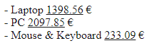

>Rješenje:
```javascript
function azurirajSadrzaj(klasa, noviSimbol) {
  const query = document.querySelectorAll("."+klasa)
  for (let element of query) {
    element.innerHTML=noviSimbol;
  }
}
function azurirajCijenu(tag) {
  const query = document.querySelectorAll(tag)
  for (let element of query) {
    element.innerHTML=(Number.parseFloat(element.innerHTML)*1.16547).toFixed(2);
  }
}
azurirajSadrzaj("symbol", "€");
azurirajCijenu("u");
```
### Primjer 3 - Manipulacija klasama

Ako elementu želimo direktno mijenjati ili dodati `class` onda koristimo `className` svojstvo, ne `classList` svojstvo. Onda možemo dohvatiti element s id-jem "prviDiv" i promijenit mu vriijednost klase na "text-6xl".

```html
<div id="prviDiv" class="text-5xl">
    Hi!
</div>
```

```javascript
const element = document.querySelector('#prviDiv')
console.log(element.outerHTML); //Output: "<div class="text-5xl id="prviDiv""> Hi! </div>"
element.className = "text-6xl"
console.log(element.outerHTML); //Output: "<div class="text-6xl" id="prviDiv"> Hi! </div>"
```

> `className` služi za postavljanje i dohvaćanje cjelog atributa klase odabranog elementa. Za dodavanje dodavanje, brisanje, mjenjanje i provjeru pojedine klase korisi se `classList` svojstvo.

Svojstvo `classList` ima dodatne metode koje nam olakšavaju manipulaciju klasom. 

| Metoda | Objašnjenje | Sintaksa |
|--------|-------------|---------|
| `add(className1, className2, ...)` | Nadodaje jednu ili više CSS klasa elementu. | `element.classList.add(x);` |
| `contains(className)` | Provjerava sadrži li element određenu CSS klasu. | `element.classList.contains(x);` |
| `remove(className1, className2, ...)` | Uklanja jednu ili više CSS klasa iz elementa. | `element.classList.remove(x);` |
| `replace(oldClassName, newClassName)` | Zamjenjuje postojeću CSS klasu s novom CSS klasom. | `element.classList.replace(x, y);` |
| `toggle(className)` | Dodaje CSS klasu ako ju element nema, uklanja ako ju ima. | `element.classList.toggle(x);` |


```html
<div id="mojID" class="text-6xl">
    Hello, World!
</div>
```

```javascript     
const element = document.querySelector('#mojID')
element.classList.add('italic');
console.log(element.className); //Output: "text-6xl italic"

console.log(element.classList.contains('text-6xl')); // Output: true
element.classList.remove('text-6xl');
console.log(element.className); //Output: "italic"

element.classList.replace('italic', 'underline');
console.log(element.className); //Output: "underline"
element.classList.toggle('font-bold')
console.log(element.className); //Output: "underline font-bold"
```

### Vježba 2
**EduCoder šifra**: `tablica`

Pregledavamo staru web stranicu koja prikazuje podatke o knjigama, ali primjećujemo da je prikaz tablice neuredan i teško čitljiv. Kao programeri, imamo mogućnost poboljšati prikaz podataka na drugim stranicama dodavanjem našeg koda za bolje oblikovanje.

Zadan je sljedeći CSS i HTML kôd:
```html
<style>
    .slika {
        overflow: hidden;
        border-radius: 100%;
    }
    .tekst {
        color: black;
        font-size: 18x;
    }
    .tablica {
        width: 100%;
        background-color: white;
    }
    .kvadrat {
        border: 1px solid #dddddd;
        text-align: left;
        padding: 8px;
    }
    .naslov {
        background-color: #00000065;
        font-size: 20px;
    }
    .velik {
        background-color: #4cb05065;
    }
    .broj {
        font-weight: bold;
    }
</style>   
<table class="slika tekst">
    <tr>
        <th>Naslov</th>
        <th>Autor</th>
        <th>Broj stranica</th>
    </tr>
    <tr>
        <td>Uvod u HTML</td>
        <td>Josip Josipović</td>
        <td class="broj">500</td>
    </tr>
    <tr>
        <td>JavaScript Osnove</td>
        <td>Marko Markić</td>
        <td class="broj">7500</td>
    </tr>
    <tr>
        <td>CSS Osnove</td>
        <td>Ana Anić</td>
        <td class="broj">640</td>
    </tr>
</table>
```
Koristeći `querySelector` i `classList` metode dodajte "tablica", "kvadrat" i "naslov" na odgovarajuće elemente, te ćeliji s najvećim brojem stranica dodajte klasu "velik".

✅Rezultat:

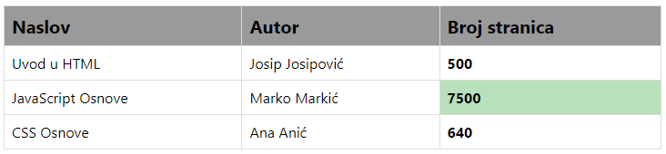

Rješenje:
```javascript
document.querySelector('table').classList.replace('slika', 'tablica');
document.querySelectorAll('th, td').forEach(element => {
    element.classList.add('kvadrat');
});
document.querySelectorAll('th').forEach(element => {
    element.classList.add('naslov');
});

let maxBrojStranica = 0;
let maxCelijaIndex = -1;
let query = document.querySelectorAll('.broj');
query.forEach((celija, index) => {
    const brojStranica = parseInt(celija.innerHTML);
    if (brojStranica > maxBrojStranica) {
        maxBrojStranica = brojStranica;
        maxCelijaIndex = index;
    }
});
query[maxCelijaIndex].classList.add('velik') 
```

### Primjer 4 - Dohvaćanje `child` i `sibling` elemenata.
Naučili smo dohvaćati elemente koristeći `querySelector` i `getElements` metoda. Međutim ponekad nam one nisu dovoljne te želimo samo dohvatiti različite vrste elemenata od jednog elementa. Za takve situacije je najbolje koristiti svojstva: `childElementCount`, `children`, `lastElementChild`, `nextElementSibling`, `previousElementSibling`

```html
<div>
    Hi!
</div>
<div id="mojID">
    <span>Hello</span>
    <span>,</span>
    <span>World!</span>
</div>
<div>
    Bye!
</div>
```

```javascript         
const element = document.querySelector('#mojID')
console.log(element.childElementCount); // Output: 3
for (const child of element.children) {
  console.log(`child: ${child.outerHTML}`); 
  // Output: "child: <span>Hello</span>"
  // Output: "child: <span>,</span>"
  // Output: "child: <span>World</span>"
}
for (let i = 0; i < element.childElementCount; i++) {
  console.log(`child: ${element.children.item(i).outerHTML}`); 
  // Output: "child: <span>Hello</span>"
  // Output: "child: <span>,</span>"
  // Output: "child: <span>World</span>"
}

console.log(element.firstElementChild.outerHTML); // Output: <span>Hello</span>
console.log(element.lastElementChild.outerHTML); // Output: <span>World</span>

console.log(element.nextElementSibling.outerHTML); // Output: "<div class="text-5xl"> Bye! </div>"
console.log(element.previousElementSibling.outerHTML); // Output: "<div class="text-5xl"> Hi! </div>"
```

> `children` svojstvo vraća `HTMLCollection` koja nema `forEach` petlju. Međutim, imamo svojstvo `childElementCount` koje nam vraća broj djece elementa, te omogućava iteraciju kroz djecu koristeći običnu `for` petlju te pristupanje pojedinom djetetu preko indexa metodom `item()`

### Vježba 3
**EduCoder šifra**: `web_scraping`

Radimo na projektu analize podataka, gdje trebamo prikupiti informacije s više web stranica škola. Nažalost, te stranice nemaju svoj API za dohvaćanje podataka. Unatoč tome, još uvijek želimo doći do potrebnih informacija s tih stranica. Kako bismo to postigli, koristit ćemo tehniku web scrapinga.

Zadan je sljedeći HTML kôd:
```html
<div id="studenti">
    <div>
        <b>Ivo</b>
        <b>Ivić</b>
        <u class="email">ivoivic@gmail.com</u>
        <span>3</span>
    </div>
    <div>
        <b>Ana</b>
        <b>Anić</b>
        <span>5</span>
    </div>
    <div>
        <b>Maja</b>
        <b>Majić</b>
        <u class="email">majamajic@gmail.com</u>
        <span>none</span>
    </div>
    <div>
        <b>Marko</b>
        <b>Marić</b>
        <u class="email">markomaric@gmail.com</u>
        <span>1</span>
    </div>
</div>
```
```javascript
function Student(ime, prezime, email, ocjena) {
    this.ime = ime;
    this.prezime = prezime;
    this.email = email;
    this.ocjena = ocjena;
    this.opisnaOcjena = ocjena;
    this.oStudentu = () => console.log(`${this.ime}` `${this.prezime} s emailom ${this.email} ima ocjenu ${this.opisnaOcjena}`)
}
const studenti = [];
```
Napišite funkciju `dodajStudente(id, poljeStudenata)` koja:
- Za svako djete elementa s danim `id`-jem
    - Vadi podatke o *imenu*, *prezimenu*, *emailu* i *ocjeni* koristeći samo `firstElementChild`, `lastElementChild`, `nextElementSibling`, `previousElementSibling` i `classList` metode
    - Ako nedostaje *email*, postavi ga na "nema podatka"
    - Pretvori ocjenu u format: od "odličan" do "nedovoljan" za ocjene od 5 do 1, ili "nema ocjenu" za ostalo
    - Dodaje svakog studenta u polje studenti

Spremite sve studente koji imaju ocjenu u polje `filtriraniStudenti` koristeći `filter()` metodu
- Za svakog studenta koji ima ocjenu, pozovi metodu `oStudentu()`.

Napišite funkciju `prosjekStudenata(poljeStudenata)` koja vraća prosjek studenata:
- spremite u `sumaOcjena` varijablu sumu svih ocjena studenata koristeći `reduce()` metodu
- spremite u `prosjek` varijablu prosjek ocjena zaokruženo na dvije decimale

Konstruktor `Student` možete ažurirat ako je potrebno s dodatnim metodama ili ažurirat metodu `oStudentu()`.

✅Rezultat:
```javascript         
dodajStudente('studenti', studenti);

// Output: "Ivo Ivić s emailom "ivoivic@gmail.com" ima ocjenu dobar"
// Output: "Ana Anić s emailom "nema podatka" ima ocjenu odličan"
// Output: "Marko Marić s emailom "markomaric@gmail.com" ima ocjenu nedovoljan"

console.log(`Prosjek ocjena studenata: ${prosjekStudenata(filtriraniStudenti)}`);

// Output: "Prosjek ocjena studenata: 3.00"
```
   
Rješenje:

```javascript      
function dodajStudente(id, poljeStudenata) {
    const elementiStudenata = document.getElementById(id).children;
    for (let i = 0; i < elementiStudenata.length; i++) {
        const student = elementiStudenata[i];
        const imeElement= student.firstElementChild;
        const ime = imeElement.innerHTML;
        const prezime = imeElement.nextElementSibling.innerHTML;
        const ocjenaElement = student.lastElementChild;
        const ocjena = student.lastElementChild.innerHTML;
        let opisnaOcjena = "nema ocjenu";
        let email = "nema podatka";
        if (ocjenaElement.previousElementSibling.classList.contains('email'))
          email = ocjenaElement.previousElementSibling.innerHTML;
        switch (ocjena) {
            case "5":
                opisnaOcjena = 'odličan';
                break;
            case "4":
                opisnaOcjena = 'vrlo dobar';
                break;
            case "3":
                opisnaOcjena = 'dobar';
                break;
            case "2":
                opisnaOcjena = 'dovoljan';
                break;
            case "1":
                opisnaOcjena = 'nedovoljan';
                break;
            default:
                opisnaOcjena = 'nema ocjenu';
                break;
        }
        poljeStudenata.push(new Student(ime, prezime, email, ocjena, opisnaOcjena));
    }
}

dodajStudente('studenti', studenti);

const filtriraniStudenti = studenti.filter(student => student.opisnaOcjena != "nema ocjenu");
filtriraniStudenti.forEach(student => student.oStudentu());

function prosjekStudenata(poljeStudenata) {
  let sumaOcjena = poljeStudenata.reduce((total, student) => total+=Number.parseInt(student.ocjena), 0);
  let prosjek = (sumaOcjena/poljeStudenata.length).toFixed(2);
  return prosjek;
}

console.log(`Prosjek ocjena studenata: ${prosjekStudenata(filtriraniStudenti)}`);
```

## 1.4 Dodavanje i brisanje DOM elemenata
Dodavanje i brisanje elemenata omogućuje dinamičko mijenjanje stranice temeljem korisničkih akcija ili događaja. Dosad smo naučili kako da dohvaćamo i mjenjamo elemente, međutim dodavanje novih elemenata je dosta nezgodno koristeći svojstvo `innerHTML`. Zato postoje sljedeće metode za dodavanja, umetanje i brisanje HTML-a i elemenata:

| Metoda                   | Objašnjenje                                                  | Sintaksa                                              |
|--------------------------|--------------------------------------------------------------|-------------------------------------------------------|
| `createElement()`        | Stvara novi HTML element.                                   | `document.createElement(tagName)`                    |
| `append()`               | Dodaje element(e) kao posljednje dijete elementa.           | `element.append(child1, child2, ...)`                 |
| `prepend()`              | Dodaje element(e) kao prvo dijete elementa.                 | `element.prepend(child1, child2, ...)` | 
`before()`               | Dodaje element(e) ispred odabranog elementa.                | `element.before(newElement)`                  |
| `after()`                | Dodaje element(e) iza odabranog elementa.                   | `element.after(newElement)`                           |                       |
| `insertAdjacentElement()`| Dodaje novi element u odabrani element, prema zadanoj poziciji.| `element.insertAdjacentElement(position, newElement)` |
| `insertAdjacentHTML()`   | Dodaje HTML tekst u odabrani element, prema zadanoj poziciji.| `element.insertAdjacentHTML(position, html)`          |
| `remove()`               | Uklanja element iz DOM-a.                                   | `element.remove()`                                    |
| `replaceWith()`          | Zamjenjuje odabrani element novim elementom.                | `element.replaceWith(newElement)`                    |

U kodu za `insertAdjacentElement()` i `insertAdjacentHTML()` koristimo atribut `position` koji pokazuje gdje će se sadržaj nadodati, mora biti postavljen na jednu od sljedećih vrijednosti:

- `beforebegin`: Prije elementa
- `afterbegin`: Unutar elementa, prije njegovog prvog djeteta
- `beforeend`: Unutar elementa, nakon njegovog posljednjeg djeteta
- `afterend`: Nakon elementa

### Primjer 5 - kreiranje, dodavanje, brisanje i mjenjanje elemenata

```html
<style>
    #mojID {
        background-color: lightgray;
    }
    .hello-world {
        background-color: darkGray;
    }
</style>
<div id="mojID">
    <div class="hello-world">
        Hello, World!
    </div>
</div>
```
Dodavanje novih elemenata metodama: `append()`, `prepend()`, `before()`, `after()`
```javascript
const mojElement = document.getElementById('mojID');

const divAppend = document.createElement('div')
const divPreppend = document.createElement('div')
const divAfter = document.createElement('div')
const divBefore = document.createElement('div')

divAppend.innerHTML = 'divAppend'
divPreppend.innerHTML = 'divPreppend'
divAfter.innerHTML = 'divAfter'
divBefore.innerHTML = 'divBefore'

mojElement.append(divAppend);
mojElement.prepend(divPreppend);
mojElement.after(divAfter);
mojElement.before(divBefore);
```
Ili sa metodom: `insertAdjacentElement()`
```javascript
const mojElement = document.getElementById('mojID');

const divAppend = document.createElement('div')
const divPreppend = document.createElement('div')
const divAfter = document.createElement('div')
const divBefore = document.createElement('div')

divAppend.innerHTML = 'divAppend'
divPreppend.innerHTML = 'divPreppend'
divAfter.innerHTML = 'divAfter'
divBefore.innerHTML = 'divBefore'

mojElement.insertAdjacentElement("beforebegin", divBefore);
mojElement.insertAdjacentElement("afterbegin", divPreppend);
mojElement.insertAdjacentElement("beforeend", divAppend);
mojElement.insertAdjacentElement("afterend", divAfter);
```
Ili sa metodom: `insertAdjacentHTML()`
```javascript
const mojElement = document.getElementById('mojID');

const divAppend = "<div> divAppend </div>"
const divPreppend = "<div> divPreppend </div>"
const divAfter = "<div> divAfter </div>"
const divBefore = "<div> divBefore </div>"

mojElement.insertAdjacentHTML("beforebegin", divBefore);
mojElement.insertAdjacentHTML("afterbegin", divPreppend);
mojElement.insertAdjacentHTML("beforeend", divAppend);
mojElement.insertAdjacentHTML("afterend", divAfter);
```
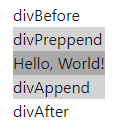

Brisanje prvog `child` elementa, `div`-a s `id`-jem "mojDiv":
```javascript
const elementZaBrisanje = mojElement.firstElementChild;
elementZaBrisanje.remove()
```
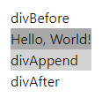

Mjenjanje `div` elementa nakon `div`-a s `id`-jem "mojDiv":
```javascript
const elementZaMjenjanje = mojElement.nextElementSibling;

const newBoldElement = document.createElement('b')
newBoldElement.innerHTML = "newBoldElement"

elementZaMjenjanje.replaceWith(newBoldElement)
```
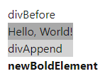

### Vježba 4 
**EduCoder šifra**: `html_from_object`

Često ćemo imati zadatak gdje moramo stvoriti grafički prikaz danih podataka, pogotovo ako su ti podaci dinamički ili se dohvaćaju iz baze podataka. Ako se mijenjaju samo pojedinačne vrijednosti, dovoljno je mijenjati trenutne postojeće HTML elemente. Međutim, u slučaju da se količina podataka mijenja, tj. povećava ili smanjuje, tada je potrebno dodavati/brisati HTML elemente.
Zadan je sljedeći HTML kôd:
```html
<style>
    #kupac {
        margin: 16px;
        padding: 16px;
        border-radius: 8px;
        background: #dedede;
        border: 1px solid darkgray;
        color: black;
        width: 400px;
        position: absolute;
        left: 50%;
        transform: translatex(-50%);
    } 
    h1 {
        font-size: 32px;
        font-weight: bold;
        text-align: center;
    }
    hr {
        border: 1px solid black;
        margin: 12px 0px;
    } 
    table {
        width: 100%;
    }
    th {
        text-align: left;
        border-bottom: 1px solid darkgray;
        padding-bottom: 4px;
    }
</style>
<div id="kupac">
</div>
```
```javascript
let kupac = {
  ime: "Ivo",
  prezime: "Ivić",
  adresa: {
    ulica: "Ulica 123",
    grad: "Pula",
    postanskiBroj: "52100",
  },
  kontakt: {
    telefon: "0911234567",
    email: "iivic@gmail.com",
  },
  narudzbe: [
    {
      stavke: [
        {
          naziv: "Mobitel",
          kolicina: 1,
          cijena: 300,
        },
        {
          naziv: "Slušalice",
          kolicina: 1,
          cijena: 20,
        },
        {
          naziv: "Punjač",
          kolicina: 2,
          cijena: 10,
        },
      ],
      ukupnaCijena: function () {
        return this.stavke.reduce((ukupno, stavka) => ukupno+stavka.kolicina*stavka.cijena,0);
      },
      valuta: "eur",
    },
  ],
};
```

Objekt treba prikazati u obliku HTML-a koristeći metode za dodavanje elemenata.

✅Rezultat:

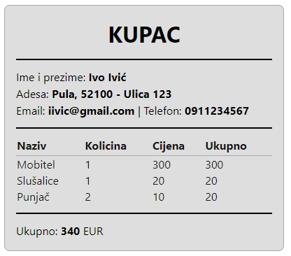

Rješenje: 
```javascript
const divKupac = document.getElementById("kupac");

divKupac.insertAdjacentHTML("beforeend", "<h1>KUPAC</h1>")
divKupac.append(document.createElement("hr"));

const divImePrezime = document.createElement("div");
divImePrezime.innerHTML = `Ime i prezime: <b> ${kupac.ime} ${kupac.prezime} </b`
divKupac.append(divImePrezime);

const divAdresa = document.createElement("div");
divAdresa.innerHTML = `Adesa: <b> ${kupac.adresa.grad}, ${kupac.adresa.postanskiBroj} - ${kupac.adresa.ulica}</b>`
divKupac.append(divAdresa);

const divKontakt = document.createElement("div");
divKontakt.innerHTML = `Email: <b> ${kupac.kontakt.email} </b> | Telefon: <b> ${kupac.kontakt.telefon} </b>`
divKupac.append(divKontakt);

divKupac.append(document.createElement("hr"));

const tableNarudzbe = document.createElement("table");
const tableHeaders = document.createElement("tr");

tableHeaders.insertAdjacentHTML("beforeend", "<th>Naziv</th>")
tableHeaders.insertAdjacentHTML("beforeend", "<th>Kolicina</th>")
tableHeaders.insertAdjacentHTML("beforeend", "<th>Cijena</th>")
tableHeaders.insertAdjacentHTML("beforeend", "<th>Ukupno</th>")

tableNarudzbe.append(tableHeaders);

for (let stavka of kupac.narudzbe[0].stavke) {
  const tableRow = document.createElement("tr");
  tableRow.insertAdjacentHTML("beforeend", `<td>${stavka.naziv}</td>`)
  tableRow.insertAdjacentHTML("beforeend", `<td>${stavka.kolicina}</td>`)
  tableRow.insertAdjacentHTML("beforeend", `<td>${stavka.cijena}</td>`)
  tableRow.insertAdjacentHTML("beforeend", `<td>${stavka.cijena*stavka.kolicina}</td>`)
  tableNarudzbe.append(tableRow);
}

divKupac.append(tableNarudzbe);

divKupac.append(document.createElement("hr"));

const divUkupno = document.createElement("div");
divUkupno.innerHTML = `Ukupno: <b> ${kupac.narudzbe[0].ukupnaCijena()} </b> ${kupac.narudzbe[0].valuta.toUpperCase()}`
divKupac.append(divUkupno);

console.log(divKupac.outerHTML);
```

## 1.4 DOM events

DOM događaji omogućuju JavaScriptu da reagira na korisničke akcije kao što su klikovi, unos teksta ili pokretanje mišem. Događaj se na element dodaje metodom `addEventListener(eventType, callbackFunction)`.
- `callbackFunction` funkcija koju proslijeđujemo metodi, funkcija prima argument `event` koji se odnosi na pozvani događaj. Da bi se moglo pristupati elementu nad kojim se pozvao `event`, koristi se svojstvo `target`

```html
<button id="btn">Klikni me</button>
```
```javascript
const btn = document.getElementById("btn");

btn.addEventListener("click", function (event) {
    console.log(event.target.outerHTML)
});
// Output: "<button id="btn">Klikni me</button>" 
```
`callbackFunction` se može pisati i na sljedeće načine:
```javascript
btn.addEventListener("click", (event) => {
    console.log(event.target.outerHTML)
});
btn.addEventListener("click", event => {
    console.log(event.target.outerHTML)
});
btn.addEventListener("click", event => console.log(event.target.outerHTML));

const ispis = (event) => console.log(event.target.outerHTML);
btn.addEventListener("click", ispis);
// Output: "<button id="btn">Klikni me</button>" x4
```

- `eventType` je tipa `string`, ima ih mnogo, neki od značajnijih su prikazani u sljedećoj tablici:


| Metoda      | Objašnjenje                                      | Sintaksa                                       | Primjer                                   |
|-------------|--------------------------------------------------|------------------------------------------------|-------------------------------------------|
| click       | Poziva se kada se klikne mišem na element.       | `element.addEventListener('click', function() {})` | `button.addEventListener('click', function() { console.log('Kliknuto!'); })` |
dblclick    | Poziva se kada se dvaput klikne na element mišem. | `element.addEventListener('dblclick', function() {})` | `image.addEventListener('dblclick', function() { console.log('Dvaput kliknuto!'); })` |
| focus       | Poziva se kada element dobije fokus.             | `element.addEventListener('focus', function() {})` | `input.addEventListener('focus', function() { console.log('Fokusiranje!'); })` |
| focusin     | Poziva se kada element ili njegovi potomci dobiju fokus. | `element.addEventListener('focusin', function() {})` | `div.addEventListener('focusin', function() { console.log('Fokusiranje!'); })` |
| focusout    | Poziva se kada element ili njegovi potomci izgube fokus. | `element.addEventListener('focusout', function() {})` | `input.addEventListener('focusout', function() { console.log('Izgubio fokus!'); })` |
| blur        | Poziva se kada element izgubi fokus.             | `element.addEventListener('blur', function() {})`  | `input.addEventListener('blur', function() { console.log('Izgubio fokus!'); })` |
| mousedown   | Poziva se kada se pritisne miš na element.       | `element.addEventListener('mousedown', function() {})` | `div.addEventListener('mousedown', function() { console.log('Miš pritisnut!'); })` |
| mouseenter  | Poziva se kada miš uđe u element.                | `element.addEventListener('mouseenter', function() {})` | `div.addEventListener('mouseenter', function() { console.log('Miš unutar elementa!'); })` |
| mouseleave  | Poziva se kada miš napusti element.              | `element.addEventListener('mouseleave', function() {})` | `div.addEventListener('mouseleave', function() { console.log('Miš izvan elementa!'); })` |
| mousemove   | Poziva se kada se miš pomiče preko elementa.    | `element.addEventListener('mousemove', function() {})` | `div.addEventListener('mousemove', function() { console.log('Miš se pomiče!'); })` |
| mouseout    | Poziva se kada miš napusti element ili njegovog potomka. | `element.addEventListener('mouseout', function() {})` | `div.addEventListener('mouseout', function() { console.log('Miš napustio element!'); })` |
| mouseover   | Poziva se kada miš uđe u element ili njegovog potomka. | `element.addEventListener('mouseover', function() {})` | `div.addEventListener('mouseover', function() { console.log('Miš ušao u element!'); })` |
| mouseup     | Poziva se kada se miš otpusti iznad elementa.    | `element.addEventListener('mouseup', function() {})` | `div.addEventListener('mouseup', function() { console.log('Miš otpušten!'); })` |
| input       | Poziva se kada se promijeni vrijednost input elementa. | `element.addEventListener('input', function() {})` | `input.addEventListener('input', function() { console.log('Vrijednost promijenjena!'); })` |

CSS korišten u sljedećim primjerima/zadacima:
```css
<style>
    div {
        padding: 4px 16px;
    }
    input, button {
        background: transparent;
        border: 1px solid gray;
        border-radius: 4px;
        padding: 2px 8px;
        margin: 4px 2px;
        &:hover {
            background: #a9a9a950;
        }
        &:focus {
            background: #4cb05050;
        }
        &:active {
            background: #ffeb3c50;
        }
    }
</style>
```

### Primjer 6 - `click` event
```html
<div>
    <button id="increaseBtn">+</button>
    <input type="number" disabled name="broj" value="0"/>
    <button id="decreaseBtn">-</button>
</div>
```
```javascript
const increaseBtn = document.getElementById("increaseBtn");
const decreaseBtn = document.getElementById("decreaseBtn");
const broj = document.getElementsByName("broj")[0];

increaseBtn.addEventListener("click", () => broj.value++)
decreaseBtn.addEventListener("click", () => broj.value--)
```

### Vježba 5
**EduCoder šifra**: `methods_to_methods`

Zadan je sljedeći kôd:
```html
<div id="forma">
    Ime: <input type="text" name="Ime" placeholder="Ime..." />
    Prezime: <input type="text" name="Prezime" placeholder="Prezime..." />
    Email: <input type="text" name="Email" placeholder="Email..." />
</div>
<div>
    <button id="push">push</button>
    <button id="pop">pop</button>
    <button id="unshift">unshift</button>
    <button id="shift">shift</button>
</div>
<div style="font-size: 24px;"><b>Korisnici:</b></div>
<div id="lista">
</div>
```
```javascript
const inputs = document.getElementsByTagName('input');
const lista = document.getElementById('lista');
const forma = document.getElementById('forma');
const btn_push = document.getElementById('push');
const btn_pop = document.getElementById('pop');
const btn_unshift = document.getElementById('unshift');
const btn_shift = document.getElementById('shift');

let emailPolje = []

function dohvatiVrijednosti() {
    //funckija dohvaća vrijednosti iz inputs i vraća novi formatirani div
    //korsiteći for of ili forEach petlju iterira se kroz inputs (name, value) za svaki input
    //ako je input prazan, default-na vrijednost je "blank"
    return div; 
    /* Primjer div-a:
        <div>
            <b>Ime</b>: Ivan 
            <b>Prezime</b>: Ivić
            <b>Email</b>: iivic@gmail.com 
        </div>
    */
}
function dodajNoviElement(pozicija) {
    //funckija dodaje novi element ovisno o poziciji ("push", "unshift") switch(pozicija)
    //vrijednost element dohvaća pomoću funckije dohvatiVrijednosti()
    //prije dodavanje provjerava da li je email već dodan, ako je
    //onda nakon forme dodaje upozorenje "<div id="upozorenje" style="color: red;">Email već postoji!</div>"
    //inače dodaje novi element u polje i html te miče upozorenje
} 
function ukloniElement(pozicija) {
    //funckija briše element ovisno o poziciji ("pop", "shift") switch(pozicija)
    //prije brisanja provjerava da li element postoji
    //ako postoji briše element iz polja
    //također se miče upozorenje bez obzira postoji li element ili ne
}

//dodati eventListener-e za svaki button
```
✅Rezultat:

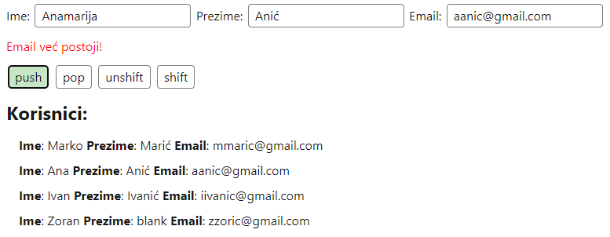

Rješenje:
 
```javascript
const inputs = document.getElementsByTagName('input');
const lista = document.getElementById('lista');
const forma = document.getElementById('forma');
const btn_push = document.getElementById('push');
const btn_pop = document.getElementById('pop');
const btn_unshift = document.getElementById('unshift');
const btn_shift = document.getElementById('shift');

let emailPolje = []

function dohvatiVrijednosti() {
  let div = document.createElement("div");
  for (const input of inputs) {
    div.innerHTML+=`<b>${input.name}</b>: `;
    div.innerHTML+=input.value == "" ? "blank " : (input.value+" ");
  }
  return div;
}

function dodajNoviElement(pozicija) {
  const email = document.getElementsByName('Email')[0].value;
  if (emailPolje.includes(email)) {
    if (document.getElementById("upozorenje") == undefined)
      forma.insertAdjacentHTML("afterend", `<div id="upozorenje" style="color: red;">Email već postoji!</div>`);
  }
  else {
    document.getElementById("upozorenje")?.remove();
    let vrijednost = dohvatiVrijednosti();
    switch(pozicija) {
      case "push": 
        lista.append(vrijednost);
        emailPolje.push(email);
        break;
      case "unshift": 
        lista.prepend(vrijednost);
        emailPolje.unshift(email);
        break;
    }
  }
}

function ukloniElement(pozicija) {
  switch(pozicija) {
    case "shift": 
      if (lista.firstElementChild != undefined)  {
        lista.firstElementChild.remove()
        emailPolje.shift();
      }
      break;
    case "pop": 
      if (lista.lastElementChild != undefined)  {
        lista.lastElementChild.remove()
        emailPolje.pop();
      }
      break;
  }
  document.getElementById("upozorenje")?.remove();
}

btn_push.addEventListener("click", () => dodajNoviElement("push"))
btn_pop.addEventListener("click", () => ukloniElement("pop"))
btn_unshift.addEventListener("click", () => dodajNoviElement("unshift"))
btn_shift.addEventListener("click", () => ukloniElement("shift"))
```

### Primjer 7 - `focus` events
```html
<div id="inputi">
    <b>Ime:</b> <input id="ime" placeholder="Ime ..."/>
    <b>Prezime:</b> <input id="prezime" placeholder="Prezime ..."/>
</div>

<div>
    <b>Broj godina:</b> <input id="brojGodina" type="number" placeholder="Godina ..."/>
</div>

<div>
    <b>Element event:</b> <span id="event"> </span>
</div>
```
```javascript
const inputi = document.getElementById('inputi');
const inputBrojGodina = document.getElementById('brojGodina');

const span = document.getElementById('event');

inputBrojGodina.addEventListener('focus', event => span.textContent = "focus: " + event.target.outerHTML);
inputi.addEventListener('focusin', event => span.textContent = "focusin: " + event.target.outerHTML);
inputi.addEventListener('focusout', event => span.textContent = "focusout: " + event.target.outerHTML);
inputBrojGodina.addEventListener('blur', event => span.textContent = "blur: " + event.target.outerHTML);
```

> `focus` i `blur` se pozivaju samo za trenutni element, ignoriraju potomke, dok se `focusin` i `focusout` pozivaju za element i svakog potomka zasebno.

### Vježba 6
**EduCoder šifra**: `focus`

Zadan je sljedeći kôd:
```html
<div id="inputs">
    Lozinka: <input name="password" type="password"/>
    Ponovi lozinku: <input name="repeatPassword" type="password"/>
</div>
<div id="hint" style="color: green;">
</div>
```
```javascript
const inputs = document.getElementById('inputs');
const hint = document.getElementById('hint');
/* 
Potrebno je dodati dva event listener-a:
 > kada je input fokusiran, ovisno o inputu treba pisat odgovarajući hint
    za Lozinku:
      - Minimalna duljina lozinke mora biti 8
      - Lozinka mora imati barem jedno veliko slovo
      - Lozinka mora imati barem jedan broj
    za Ponovi lozinku:
      - Lozinke moraju biti iste
 > kada se izađe iz fokusa, hint treba biti prazan
*/
```

✅Rezultat:

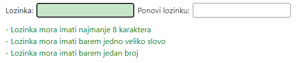

Rješenje:

```javascript
const inputs = document.getElementById('inputs');
const hint = document.getElementById('hint');

inputs.addEventListener("focusin", (event) => {
  switch(event.target.name) {
    case "password":
      hint.innerHTML = `
      - Minimalna duljina lozinke mora biti 8 <br>
      - Lozinka mora imati barem jedno veliko slovo <br>
      - Lozinka mora imati barem jedan broj
      `;
      break;
    case "repeatPassword":
      hint.innerHTML = `
      - Lozinke moraju biti iste
      `;
      break;
  }
})
inputs.addEventListener("focusout", () => {
    hint.innerHTML = ``;
})

```

Zadan je sljedeći kôd:

### Primjer 8 - `mouse` events
```html
<div id="buttons" style="background: lightblue;">
    <button id="btn_1">1</button>
    <button id="btn_2">2</button>
    <button id="btn_3">3</button>
    <button id="btn_4">4</button>
</div>
```
```javascript
const buttons = document.getElementById('buttons');
const btn_1 = document.getElementById('btn_1');
const btn_2 = document.getElementById('btn_2');
const btn_3 = document.getElementById('btn_3');
const btn_4 = document.getElementById('btn_4');
const btnList = [btn_1, btn_2, btn_3, btn_4]

const span = document.getElementById('event');

buttons.addEventListener('mouseover', event => span.textContent = "mouseover: " + event.target.id);
buttons.addEventListener('mouseout', event => span.textContent = "mouseout: " + event.target.id);

buttons.addEventListener('mouseenter', event => console.log("mouseenter: " + event.target.id));
buttons.addEventListener('mouseleave', event => console.log("mouseleave: " + event.target.id));

for (const btn of btnList) {
  btn.addEventListener('mousedown', event => {
    console.log("[1] mousedown: " + event.target.id);
    span.textContent = "mousedown: " + event.target.id
  });
  btn.addEventListener('mouseup', event =>  {
    console.log("[2] mouseup: " + event.target.id);
    span.textContent = "mouseup: " + event.target.id
  });
  btn.addEventListener('click', event => console.log("[3] click: " + event.target.id));
}
```

> `mouseenter` i `mouseleave` se pozivaju samo za trenutni element, ignoriraju potomke, dok se `mouseover` i `mouseout` pozivaju za element i svakog potomka zasebno.

> `click` se uvijek poziva nakon `mousedown` i `mouseup` točno tim redom.

### Vježba 7
**EduCoder šifra**: `gallery`

Zadan je sljedeći kôd:
```html
<style>
.gallery {
  display: flex;
  flex-wrap: wrap;
}

.artwork {
  transition: all 0.2s ease-in-out;
  position: relative;
  height: 200px;
  width: auto;
  border-radius: 4px;
  margin: 10px;
  &:hover {
    scale: 105%;
  }
}

.opis { padding: 16px; }
h1 { font-size: 24px; font-weight: bold; }
h2 { font-size: 20px; }
h3 { font-size: 14px; }
</style>

<div class="gallery">
        
        
    
</div>
<div class="opis">
    <h1></h1>
    <h2></h2>
    <h3></h3>
</div>
```
```javascript
let galerija = [
  {
    id: "artwork1",
    naziv: "Mona Lisa",
    umjetnik: "Leonardo da Vinci",
    godina: 1503
  },
  {
    id: "artwork2",
    naziv: "The Weeping Woman",
    umjetnik: "Pablo Picasso",
    godina: 1937
  },
  {
    id: "artwork3",
    naziv: "The Starry Night",
    umjetnik: "	Vincent van Gogh",
    godina: 1889
  }
]
/* 
Potrebno je dodati dva event listener-a:
 > kada se mišem pređe preko slike
    - treba iz polja galerije iščitati točne podatke i prikazati ih u opisu
 > kada se mišem izađe iz galerije
    - isprazniti opis
*/
```

✅Rezultat:

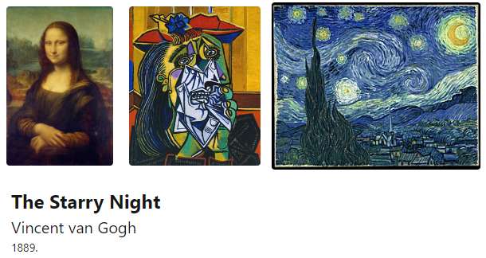

Rješenje:
```javascript
let galerija = [
  {
    id: "artwork1",
    naziv: "Mona Lisa",
    umjetnik: "Leonardo da Vinci",
    godina: 1503
  },
  {
    id: "artwork2",
    naziv: "The Weeping Woman",
    umjetnik: "Pablo Picasso",
    godina: 1937
  },
  {
    id: "artwork3",
    naziv: "The Starry Night",
    umjetnik: "	Vincent van Gogh",
    godina: 1889
  }
]

const gallery = document.getElementsByClassName("gallery")[0];
const opis = document.getElementsByClassName("opis")[0];

gallery.addEventListener("mouseover", event => {
  let id = event.target.id;
  if (id == "") return;
  let artwork = galerija.find(g => g.id == id);
  opis.children[0].innerHTML =  artwork.naziv;
  opis.children[1].innerHTML =  artwork.umjetnik;
  opis.children[2].innerHTML =  artwork.godina+".";
})
gallery.addEventListener("mouseleave", event => {
  opis.children[0].innerHTML = "";
  opis.children[1].innerHTML = "";
  opis.children[2].innerHTML = "";
})
```

### Primjer 9 - `input` event
```html
<div>
    Lozinka: <input id="password" type="password"/>
    Ponovi lozinku: <input id="repeatPassword" type="password"/>
    Lozinke iste: <b id="same"></b>
</div>
```
```javascript
const password = document.getElementById("password");
const repeatPassword = document.getElementById("repeatPassword");
const same =  document.getElementById("same");

password.addEventListener("input", event => {
  same.innerHTML = event.target.value == repeatPassword.value;
});
repeatPassword.addEventListener("input", event => {
  same.innerHTML = event.target.value == password.value;
});
```

### Vježba 8
**EduCoder šifra**: `recommend`

Kreiramo aplikaciju za praćenje unosa u polje za pretraživanje. Korisnik će moći upisati pojam u polje za pretraživanje, a aplikacija će dinamički filtrirati rezultate kako korisnik tipka.
- Implementirajte funckiju `showResults(searchTerm)` koja će filtrirati rezultate na temelju unesenog teksta
- Klikom na rezultat popunjava se input i rezultati se izbrišu

Zadan je sljedeći kôd:
```html
<style>
    #searchInput {
        width: 100%;
        margin-bottom: 20px;
    }
    #searchResults {
        border: 1px solid #ccc;
        border-radius: 4px;
        padding: 10px;
    }
    #searchResults div {
        margin-bottom: 5px;
        cursor: pointer;
        &:hover {
            background-color: #f0f0f0;
        }
    }
</style>

<div>
    <input type="text" id="searchInput" placeholder="Search...">
    <div id="searchResults"></div>
</div>
```
```javascript
const inputField = document.getElementById('searchInput');
const resultsContainer = document.getElementById('searchResults');

const data = [
    'JavaScript',
    'HTML',
    'CSS',
    'React',
    'Node.js', 
    'Express.js',
    'MongoDB',
    'Vue.js',
    'Angular',
    'TypeScript'
];

function showResults(searchTerm) {

}

//eventListener
```

✅Rezultat:

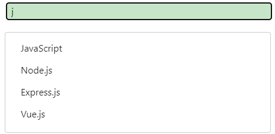

Rješenje:
```javascript
const inputField = document.getElementById('searchInput');
const resultsContainer = document.getElementById('searchResults');

const data = [
    'JavaScript',
    'HTML',
    'CSS',
    'React',
    'Node.js',
    'Express.js',
    'MongoDB',
    'Vue.js',
    'Angular',
    'TypeScript'
];

function showResults(searchTerm) {
    const filteredData = data.filter(item => item.toLowerCase().includes(searchTerm.toLowerCase()));

    resultsContainer.innerHTML = '';

    filteredData.forEach(item => {
        const resultItem = document.createElement('div');
        resultItem.textContent = item;
        resultItem.addEventListener("click", event => {
          inputField.value = event.target.textContent;
          resultsContainer.innerHTML = '';
        })
        resultsContainer.appendChild(resultItem);
    });
}

inputField.addEventListener('input', event => {
    const searchTerm = event.target.value;
    showResults(searchTerm);
});
```

# Samostalni zadatak za vježbu 8

**EduCoder šifra**: `kosarica`

Aplikacija omogućuje korisniku dodavanje proizvoda u košaricu, promjenu količine proizvoda te uklanjanje proizvoda iz košarice.

Sučelje aplikacije sastoji se od polja za unos naziva i cijene proizvoda te gumba za dodavanje proizvoda u košaricu. Također, prikazuje se lista proizvoda u košarici s informacijama o nazivu, količini, cijeni po komadu te ukupnoj cijeni za taj proizvod.

Kada korisnik unese naziv i cijenu proizvoda te klikne na gumb `Dodaj artikl`, proizvod se dodaje u košaricu. 
 - Ako proizvod nema ime, dugme se ne može kliknuti, zatamnjeno je/onemogućeno
 - Ako se proizvod s istim imenom već nalazi u košarici, količina se povećava za `1`
 - Ako je novi, dodaje se na listu
 - Cijena proizvoda ne može ići ispod `0`

Korisnik može mijenjati količinu proizvoda u košarici koristeći gumbe `+` i `-` pored svakog proizvoda. Također, postoji opcija za uklanjanje proizvoda iz košarice klikom na gumb `Ukloni`.

Nakon svake promjene u košarici, ukupna cijena se automatski ažurira kako bi korisnik imao uvid u trenutni trošak.

Jedan primjer implementacije:
- Napravi se konstruktor `Proizvod(naziv, kolicina, cijena)` koji ima atribute `naziv`, `kolicina`, `cijena` i metodu `ukupnaCijena()` koja vraća ukupnu cijenu proizvoda zaokruženu na dvije decimale.

- Napraviti se objekt `kosarica` koja sadrži 
    - atribut `proizvodi` - lista proizvoda
    - metodu `dodajProizvod(proizvod)` - dodaje proizvod u HTML i polje `proizvodi`
    - metodu `dodajFunkcionalnosti(naziv)` - dodaje funkcionalnosti (`eventListener`-i) proizvodu:
        - povećanje količine
        - smanjenje količine
        - brisanje proizvoda
    - metodu `azurirajUkupnuCijenu()` - koristeći `reduce` nad poljem računa ukupnu cijenu svih proizvoda zaokruženu na dvije decimale

Primjer:

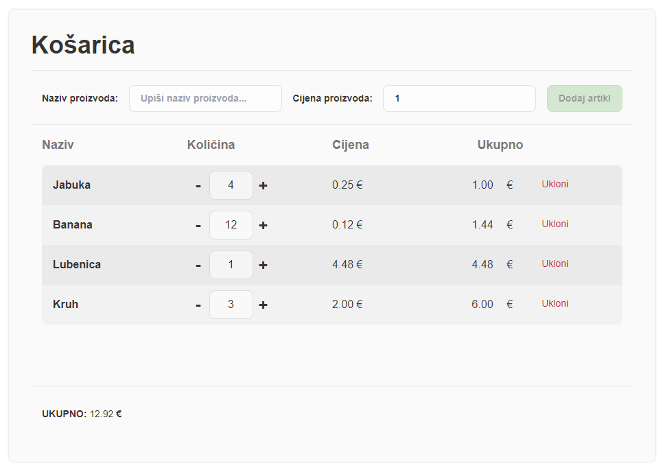

CSS i HTML korišten na slici:
```html
<style>
    body {
        padding: 64px;
        font-family: Sans-Serif;
    }
    .main {
        display: flex;
        width: 100%;
        height: 100%;
        justify-content: center;
    }
    .card {
        overflow: hidden;
        width: 100%;
        padding: 32px;
        display: flex;
        flex-direction: column;
        background-color: rgb(205, 205, 205, 0.1);
        border-radius: 8px;
        color: #353535;  
        box-shadow: 0px 0px 3px rgba(0, 0, 0, 0.2);
    }
    input, button {
        transition: all 0.2s ease-in-out;
        padding: 8px 16px;
        background: rgba(255, 255, 255, 0.5);
        outline: none;
        border: 1px solid rgba(0, 0, 0, 0.1);  
        border-radius: 8px;
        &:hover {
            background: rgba(255, 255, 255, 1);
            border: 1px solid rgba(0, 0, 0, 0.25);
        }
        &:focus {
            background: rgba(255, 255, 255, 1);
            border: 1px solid rgba(0, 0, 0, 0.25);
        }
    }
    button {
        background-color: #a5d6a7;
        &:hover {
            background: #83c683;
            cursor: pointer;
        }
    }
    form {
        overflow-y: hidden;
        min-height: 48px;
        overflow-x: auto;
        padding: 0px 16px;
        display: flex;
        margin-top: 16px;
        gap: 8px;
        justify-content: space-between;
        align-items: center;
        font-size: 14px;
        font-weight: bold;
    }
    .content {
        padding: 16px 16px;
        height: 100%;
        display: flex;
        flex-direction: column;
        overflow-y: auto;
    }
    .flex {
        width: 100%;
        display: inline-grid;
        grid-template-columns: repeat(4, minmax(0, 1fr));
    }
    .item-list {
        overflow-y: auto;
        overflow-x: hidden;
        padding: none !important;
        border-radius: 8px;
        margin-top: 16px;
    }
    .item {
        background-color: rgba(169, 169, 169, 0.2);
        padding: 8px 16px;
        align-items: center
    }
    .item:nth-child(2n) {
        background-color: rgba(169, 169, 169, 0.1);
    }
    .item-kolicina {
        width: 64px;
        text-align: center;
        margin-left: 8px;
        margin-right: 4px;
    }
    .item-kolicina-button {
        padding: 0px 4px;
        font-size: 24;
    }
    .item-kolicina-button:hover {
        padding: 0px 4px;
        color: #1f87e8;
        cursor: pointer;
    }
    .item-ukloni {
        color: #d81b43;
        font-size: 14;
        &:hover {
            text-decoration: underline;
            cursor: pointer;
        }
    }
    #ukupno {
        font-weight: normal;
    }
    .disabled {
        opacity: 0.5;
        cursor: not-allowed !important;
    }
</style> 
<div class="main">
    <div class="card">
        
        <h1 class="text-4xl mb-4 font-bold">Košarica</h1>
        
        <hr />
        
        <form>
            <label for="naziv_proizvoda">Naziv proizvoda:</label>
            <input type="text" name="naziv_proizvoda" id="naziv_proizvoda" placeholder="Upiši naziv proizvoda..." />
            <label for="cijena_proizvoda">Cijena proizvoda:</label>
            <input type="number" value="1" min="0" name="cijena_proizvoda" id="cijena_proizvoda" placeholder="Upiši cijenu proizvoda..." />
            <button disabled class="whitespace-nowrap disabled" type="button" name="dodaj_button" id="dodaj_button">Dodaj artikl</button>
        </form>
        
        <hr /> 

        <div class="content">
            <div class="flex" style="font-size: 18; color: #787878;">
                <b> Naziv </b>
                <b> Količina </b>
                <b> Cijena </b>
                <b> Ukupno </b>
            </div>
            
            <div id="item_list" class="item-list">
                <div class="flex item" id="item_Jabuka"><b>        
                        Jabuka 
                    </b>
                    <div style="display: flex; align-items: center">
                        <b class="item-kolicina-button item-kolicina-minus" id="item_kolicina_minus_Jabuka">-</b>
                        <input name="kolicina" id="item_kolicina_Jabuka" class="item-kolicina" value="4" disabled="">
                        <b class="item-kolicina-button item-kolicina-plus" id="item_kolicina_plus_Jabuka">+</b>
                    </div>
                    <div>
                        0.25 €
                    </div>
                    <div class="flex">
                        <span id="item_ukupnaCijena_Jabuka">1.00</span> € 
                        <div class="item-ukloni" id="item_ukloni_Jabuka">
                        Ukloni
                        <div>
                    </div>
                </div>
            </div>
        </div>
        
        <hr /> 
        <form> 
            <div> UKUPNO: <span id="ukupno"></span> € </div>
        </form>
        
    </div>     
</div>
```