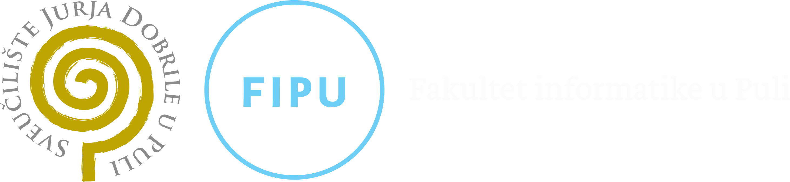

# Materijali iz kolegija: Programiranje u skriptnim jezicima ([PJS - 253581](https://fipu.unipu.hr/fipu/predmet/pusj))

  <a href="https://developer.mozilla.org/en-US/docs/Web/JavaScript" target="_blank">  
  <a href="https://developer.mozilla.org/en-US/docs/Web/HTML" target="_blank">  
    

**Nositelj**: [doc. dr. sc. Nikola Tanković](https://fipu.unipu.hr/fipu/nikola.tankovic)  
**Asistent**: [Luka Blašković, mag. inf.](https://fipu.unipu.hr/fipu/luka.blaskovic)  
**Asistent**: [Alesandro Žužić, mag. inf.](https://fipu.unipu.hr/fipu/alesandro.zuzic)

**Ustanova**: [Sveučilište Jurja Dobrile u Puli](https://www.unipu.hr/), [Fakultet informatike u Puli](https://fipu.unipu.hr/)

<picture>
  <source media="(prefers-color-scheme: dark)" srcset="images/FIPU_UNIPU_white.png">
  <source media="(prefers-color-scheme: light)" srcset="images/FIPU_UNIPU.png">
  
</picture>

---

Kolegij slušaju:
- studenti 1. godine [Prijediplomskog sveučilišnog studija Informatika](https://fipu.unipu.hr/fipu/studijski_programi/preddiplomski_sveucilisni_studij_informatika) u 2. semestru, na [Fakultetu informatike u Puli](https://fipu.unipu.hr/fipu)

## YouTube 📺

1. [Uvod u JavaScript i EduCoder](https://youtu.be/OcavyHkM9BI) ([PJS1](https://github.com/lukablaskovic/FIPU-PJS/tree/main/1.%20Javascript%20osnove))
2. [Funkcije u JavaScriptu](https://youtu.be/deo6iU61qiQ) ([PJS2](https://github.com/lukablaskovic/FIPU-PJS/tree/main/2.%20Funkcije%2C%20doseg%20varijabli%20i%20kontrolne%20strukture))
3. [Kontrolne strukture: Selekcije i Iteracije](https://youtu.be/Ovg4qDGPSpI) ([PJS2](https://github.com/lukablaskovic/FIPU-PJS/tree/main/2.%20Funkcije%2C%20doseg%20varijabli%20i%20kontrolne%20strukture))
4. [Uvod u Objekte](https://youtu.be/QUHbjNMLuAw) ([PJS3](https://github.com/lukablaskovic/FIPU-PJS/tree/main/3.%20Strukture%20podataka%20-%20objekti%20i%20polja))
5. [Ugrađeni objekti](https://youtu.be/wtFEGoAgXJ8) ([PJS3](https://github.com/lukablaskovic/FIPU-PJS/tree/main/3.%20Strukture%20podataka%20-%20objekti%20i%20polja))
6. [Polja - Array objekt](https://youtu.be/mHpf_5I2xAM) ([PJS3](https://github.com/lukablaskovic/FIPU-PJS/tree/main/3.%20Strukture%20podataka%20-%20objekti%20i%20polja))
7. [Ugniježđene Strukture](https://youtu.be/d4GvcASsfBU) ([PJS4](https://github.com/lukablaskovic/FIPU-PJS/tree/main/4.%20Ugnije%C5%BE%C4%91ene%20strukture%20i%20napredne%20funkcije))
8. [Napredne Funkcije](https://youtu.be/owJpiul4G6w) ([PJS4](https://github.com/lukablaskovic/FIPU-PJS/tree/main/4.%20Ugnije%C5%BE%C4%91ene%20strukture%20i%20napredne%20funkcije))
9. [DOM Manipulacija](https://youtu.be/YN7Ic2R5En4) ([PJS5](https://github.com/lukablaskovic/FIPU-PJS/tree/main/5.%20DOM%2C%20JSON%20i%20Asinkrono%20programiranje))
10. [JSON i Asinkrono programiranje](https://youtu.be/PFCZQutx7Ms) ([PJS5](https://github.com/lukablaskovic/FIPU-PJS/tree/main/5.%20DOM%2C%20JSON%20i%20Asinkrono%20programiranje))
